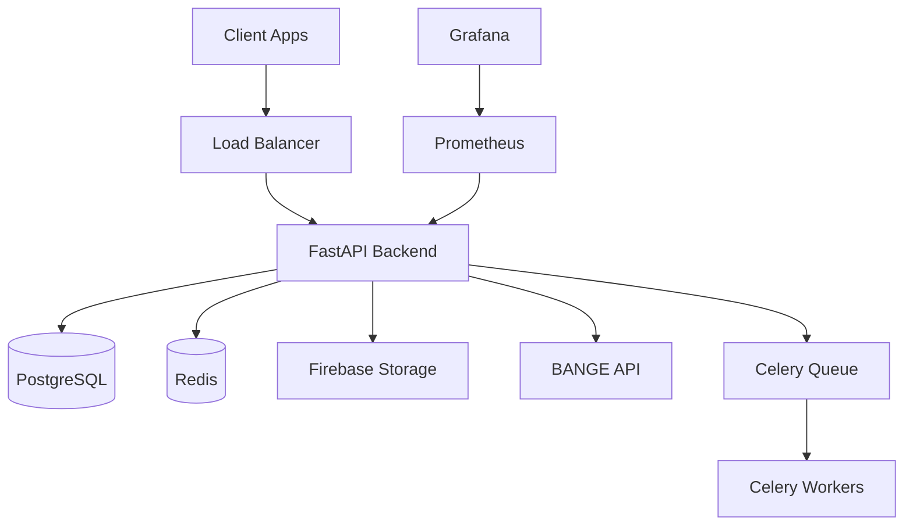
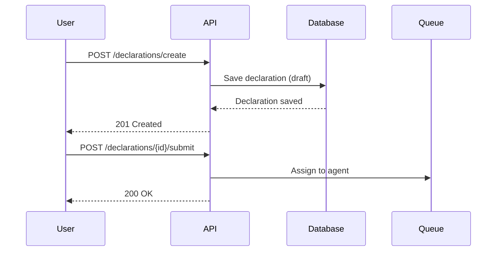

# SOP 6 : DOCUMENTATION STANDARDS

**Fréquence** : Continue (avec chaque feature/bug fix)  
**Durée** : 10-30 min par feature  
**Responsable** : Agent DOC (support : tous agents)

---

## OBJECTIF

Maintenir documentation complète, à jour et accessible pour :
- ✅ Onboarding nouveaux devs (<1 jour)
- ✅ Support debugging (trouver info <5 min)
- ✅ API usage (developers externes)
- ✅ Operations (runbooks incidents)

---

## TYPES DOCUMENTATION

### 1. README Project
**Fichier** : `README.md`  
**Audience** : Developers nouveaux  
**Update** : À chaque changement setup

**Contenu minimal** :
```markdown
# TaxasGE Backend

Backend API pour la plateforme TaxasGE de déclarations fiscales.

## 🚀 Quick Start

### Prerequisites
- Python 3.11+
- PostgreSQL 15+
- Redis 7+
- Docker (optional)

### Local Setup
```bash
# Clone repository
git clone https://github.com/taxasge/backend.git
cd backend

# Create virtual environment
python -m venv venv
source venv/bin/activate  # On Windows: venv\Scripts\activate

# Install dependencies
pip install -r requirements.txt

# Setup environment variables
cp .env.example .env
# Edit .env with your config

# Run database migrations
alembic upgrade head

# Start server
uvicorn main:app --reload
```

API available at: http://localhost:8000
Swagger docs: http://localhost:8000/docs

## 📂 Project Structure
```
backend/
├── app/
│   ├── api/          # API endpoints
│   ├── models/       # Pydantic models
│   ├── services/     # Business logic
│   ├── database/     # Database repositories
│   └── utils/        # Utilities
├── tests/            # Tests (pytest)
├── alembic/          # Database migrations
├── docs/             # Documentation
└── scripts/          # Helper scripts
```

## 🧪 Testing
```bash
# Run all tests
pytest

# Run with coverage
pytest --cov=app --cov-report=html

# Run specific test file
pytest tests/test_auth.py -v
```

## 🚀 Deployment
See [DEPLOYMENT.md](docs/DEPLOYMENT.md)

## 📚 Documentation
- [API Documentation](https://api.taxasge.com/docs)
- [Architecture](docs/ARCHITECTURE.md)
- [Development Guide](docs/DEVELOPMENT.md)
- [Deployment Guide](docs/DEPLOYMENT.md)

## 🤝 Contributing
See [CONTRIBUTING.md](CONTRIBUTING.md)

## 📝 License
MIT License
```

---

### 2. API Documentation (Swagger/OpenAPI)
**Fichier** : Généré automatiquement via FastAPI  
**URL** : https://api.taxasge.com/docs  
**Update** : Automatique (docstrings)

**Best Practices** :

#### Documenter Endpoint
```python
from fastapi import APIRouter, HTTPException, status
from pydantic import BaseModel, Field

router = APIRouter(prefix="/api/v1/declarations", tags=["Declarations"])

class DeclarationCreate(BaseModel):
    """
    Payload pour créer une déclaration fiscale.
    """
    service_id: str = Field(
        ...,
        description="ID du service fiscal (UUID)",
        example="550e8400-e29b-41d4-a716-446655440000"
    )
    data: dict = Field(
        ...,
        description="Données spécifiques au service",
        example={"revenue": 5000000}
    )

class DeclarationResponse(BaseModel):
    """
    Réponse contenant la déclaration créée.
    """
    id: str = Field(..., description="ID de la déclaration")
    reference: str = Field(..., description="Référence unique (ex: DECL-2025-000123)")
    status: str = Field(..., description="Statut (draft, submitted, etc.)")
    amount: int = Field(..., description="Montant calculé (XAF)")

@router.post(
    "/create",
    response_model=DeclarationResponse,
    status_code=status.HTTP_201_CREATED,
    summary="Créer une déclaration fiscale",
    description="""
    Crée une nouvelle déclaration fiscale en statut 'draft'.
    
    Le montant est calculé automatiquement selon le service fiscal sélectionné.
    
    **Workflow** :
    1. Créer déclaration (draft)
    2. Upload documents
    3. Submit déclaration
    4. Agent valide
    5. User paie
    
    **Permissions** : Requires authentication (citizen ou business)
    """,
    responses={
        201: {
            "description": "Déclaration créée avec succès",
            "content": {
                "application/json": {
                    "example": {
                        "id": "uuid",
                        "reference": "DECL-2025-000123",
                        "status": "draft",
                        "amount": 250000
                    }
                }
            }
        },
        400: {
            "description": "Données invalides",
            "content": {
                "application/json": {
                    "example": {
                        "detail": "Service fiscal introuvable"
                    }
                }
            }
        },
        401: {"description": "Non authentifié"},
        422: {"description": "Validation error"}
    }
)
async def create_declaration(
    payload: DeclarationCreate,
    current_user: User = Depends(get_current_user)
):
    """
    Crée une déclaration fiscale.
    
    Args:
        payload: Données de la déclaration
        current_user: User authentifié (injecté)
    
    Returns:
        DeclarationResponse: Déclaration créée
    
    Raises:
        HTTPException 400: Service fiscal introuvable
        HTTPException 422: Données invalides
    """
    # Implementation...
    pass
```

**Résultat Swagger** :
- Summary affiché dans la liste endpoints
- Description détaillée avec markdown
- Request body avec exemple
- Response codes documentés
- Try it out fonctionnel

---

### 3. Code Documentation (Docstrings)
**Standard** : Google Style Docstrings  
**Update** : Chaque fonction/classe

**Examples** :

#### Function Docstring
```python
def calculate_tax_amount(revenue: int, service: FiscalService) -> int:
    """
    Calcule le montant de taxe selon le revenu et le service fiscal.
    
    Le calcul est basé sur la formule :
    montant = base_amount + (revenue * rate)
    
    Args:
        revenue: Revenu annuel déclaré (XAF)
        service: Service fiscal sélectionné
    
    Returns:
        int: Montant de taxe calculé (XAF)
    
    Raises:
        ValueError: Si revenue négatif
        ValueError: Si service.rate invalide (<0 ou >100)
    
    Example:
        >>> service = FiscalService(base_amount=50000, rate=5.0)
        >>> calculate_tax_amount(1000000, service)
        100000  # 50000 + (1000000 * 0.05)
    """
    if revenue < 0:
        raise ValueError("Revenue cannot be negative")
    
    if not 0 <= service.rate <= 100:
        raise ValueError("Rate must be between 0 and 100")
    
    return service.base_amount + int(revenue * service.rate / 100)
```

#### Class Docstring
```python
class DeclarationService:
    """
    Service gérant la logique métier des déclarations fiscales.
    
    Ce service orchestre :
    - Création déclarations (draft)
    - Validation données
    - Calcul montants
    - Soumission pour validation agent
    
    Attributes:
        repository: Repository pour accès database
        notification_service: Service notifications
    
    Example:
        >>> service = DeclarationService(repo, notif_service)
        >>> declaration = await service.create_declaration(user_id, payload)
    """
    
    def __init__(
        self,
        repository: DeclarationRepository,
        notification_service: NotificationService
    ):
        """
        Initialise le service.
        
        Args:
            repository: Repository déclarations
            notification_service: Service pour notifications
        """
        self.repository = repository
        self.notification_service = notification_service
```

---

### 4. Architecture Documentation
**Fichier** : `docs/ARCHITECTURE.md`  
**Audience** : Developers, Tech Lead  
**Update** : Changements structurels majeurs

**Contenu** :
```markdown
# Architecture Backend TaxasGE

## High-Level Architecture



## Modules

### AUTH Module
**Purpose** : Authentication & Authorization

**Endpoints** :
- POST /auth/register
- POST /auth/login
- POST /auth/refresh

**Dependencies** :
- JWT tokens (PyJWT)
- Password hashing (bcrypt)
- Database (users table)

### DECLARATIONS Module
**Purpose** : Gestion déclarations fiscales

**Workflow** :
1. User crée déclaration (draft)
2. User upload documents
3. User submit déclaration
4. Agent valide/rejete
5. User paie (webhook BANGE)

**Endpoints** : 8 endpoints (voir Swagger)

### PAYMENTS Module
**Purpose** : Gestion paiements & webhooks

**Integration** : BANGE API (mobile money)

**Webhook Flow** :
```
BANGE → POST /webhooks/bange → Validate signature → Update payment → Notify user
```

## Database Schema

### Key Tables
- `users` : Users (citizens, businesses, agents, admins)
- `declarations` : Déclarations fiscales
- `documents` : Documents uploadés (liens Firebase)
- `payments` : Paiements
- `webhook_events` : Logs webhooks BANGE

### Indexes
```sql
CREATE INDEX idx_declarations_user_id ON declarations(user_id);
CREATE INDEX idx_declarations_status ON declarations(status);
CREATE INDEX idx_payments_declaration_id ON payments(declaration_id);
```

## Security

### Authentication
- JWT tokens (access: 30min, refresh: 7 days)
- bcrypt password hashing (12 rounds)

### Authorization (RBAC)
- Roles : citizen, business, agent, admin
- Decorators : `@require_auth()`, `@require_role("admin")`

### Input Validation
- Pydantic models (all endpoints)
- SQL injection prevention (parameterized queries)
- XSS prevention (sanitize inputs)

## Performance

### Caching (Redis)
- Fiscal services list (24h TTL)
- User sessions (JWT verification)

### Database Optimization
- Indexes on foreign keys
- Connection pooling (20 connections)
- Query optimization (no N+1 queries)

### Rate Limiting
- 100 req/min per user (authenticated)
- 20 req/min per IP (unauthenticated)

## Monitoring

### Metrics (Prometheus)
- HTTP requests (latency, errors)
- Database queries
- Business metrics (declarations, revenue)

### Alerts (PagerDuty)
- API down (SEV-1)
- High error rate >5% (SEV-1)
- High latency P95 >1s (SEV-2)

## Deployment

### Environments
- Development : http://localhost:8000
- Staging : https://api-staging.taxasge.com
- Production : https://api.taxasge.com

### CI/CD
- GitHub Actions (tests, build, deploy)
- Docker images
- Kubernetes (GKE)

### Blue-Green Deployment
- Zero downtime
- Instant rollback capability
```

---

### 5. Development Guide
**Fichier** : `docs/DEVELOPMENT.md`  
**Audience** : Developers  
**Update** : Ajout conventions/tools

**Contenu** :
```markdown
# Development Guide

## Setup Development Environment

See [README.md](../README.md#quick-start)

## Code Style

### Python
- **Formatter** : black (line length 88)
- **Linter** : flake8
- **Type checker** : mypy
- **Import sorting** : isort

```bash
# Format code
black app/

# Lint
flake8 app/

# Type check
mypy app/

# Sort imports
isort app/
```

### Naming Conventions
- **Files** : snake_case (`user_service.py`)
- **Classes** : PascalCase (`UserService`)
- **Functions** : snake_case (`get_user()`)
- **Constants** : UPPER_CASE (`MAX_RETRIES`)
- **Private** : _leading_underscore (`_internal_method()`)

## Testing

### Structure
```
tests/
├── unit/           # Tests unitaires (services, utils)
├── integration/    # Tests intégration (endpoints + DB)
├── e2e/           # Tests end-to-end (workflows complets)
└── fixtures/      # Fixtures pytest réutilisables
```

### Writing Tests
```python
import pytest
from httpx import AsyncClient

@pytest.mark.asyncio
async def test_create_declaration(client: AsyncClient, user_token: str):
    """Test création déclaration avec user authentifié."""
    response = await client.post(
        "/api/v1/declarations/create",
        headers={"Authorization": f"Bearer {user_token}"},
        json={
            "service_id": "uuid",
            "data": {"revenue": 5000000}
        }
    )
    
    assert response.status_code == 201
    data = response.json()
    assert data["status"] == "draft"
    assert data["amount"] > 0
```

### Running Tests
```bash
# All tests
pytest

# Specific file
pytest tests/test_auth.py

# Specific test
pytest tests/test_auth.py::test_login_success

# With coverage
pytest --cov=app --cov-report=html

# Parallel (faster)
pytest -n auto
```

## Database Migrations

### Create Migration
```bash
# Auto-generate from models
alembic revision --autogenerate -m "Add webhook_events table"

# Manual migration
alembic revision -m "Add index on declarations"
```

### Apply Migration
```bash
# Upgrade to latest
alembic upgrade head

# Downgrade one version
alembic downgrade -1

# Show current version
alembic current
```

## Git Workflow

### Branch Naming
- `feature/endpoint-name` : New feature
- `bugfix/bug-description` : Bug fix
- `hotfix/critical-bug` : Urgent production fix
- `refactor/module-name` : Code refactoring

### Commit Messages
```
feat: Add POST /declarations/create endpoint
fix: Fix webhook signature validation (BUG-123)
refactor: Extract calculation logic to service
docs: Update API documentation
test: Add tests for payment workflow
chore: Update dependencies
```

### Pull Request Process
1. Create feature branch from `develop`
2. Implement feature + tests
3. Push and create PR
4. Code review (1 approval required)
5. Merge to `develop`
6. Auto-deploy to staging
7. QA validation
8. PR `develop` → `main` for production

## Debugging

### Local Debugging
```python
# Add breakpoint
import pdb; pdb.set_trace()

# Or with ipdb (better)
import ipdb; ipdb.set_trace()
```

### Remote Debugging (Staging)
```bash
# View logs
kubectl logs -l app=backend -n taxasge-staging --tail=100

# Follow logs
kubectl logs -l app=backend -n taxasge-staging -f

# Exec into pod
kubectl exec -it backend-pod -n taxasge-staging -- /bin/bash
```

## Common Tasks

### Add New Endpoint
1. Define Pydantic models (`app/models/`)
2. Implement endpoint (`app/api/v1/`)
3. Add service logic (`app/services/`)
4. Add repository methods (`app/database/repositories/`)
5. Write tests (`tests/`)
6. Update Swagger docstrings

### Add Database Table
1. Update SQLAlchemy models (`app/database/models.py`)
2. Create migration (`alembic revision --autogenerate`)
3. Review migration file
4. Test migration locally
5. Apply to staging
6. Deploy to production

### Add External API Integration
1. Create client class (`app/clients/`)
2. Add configuration (`app/config.py`)
3. Implement methods with error handling
4. Add tests with mocks (`tests/`)
5. Document in architecture
```

---

### 6. Deployment Documentation
**Fichier** : `docs/DEPLOYMENT.md`  
**Audience** : Ops, DevOps  
**Update** : Changements infrastructure

Voir [SOP 4 - Deployment](#) pour contenu détaillé.

---

### 7. Runbooks (Incidents)
**Fichier** : `docs/runbooks/INCIDENT_XYZ.md`  
**Audience** : On-Call Engineers  
**Update** : Après chaque incident

**Template Runbook** :
```markdown
# Runbook : API Down

## Symptoms
- PagerDuty alert "API Down"
- All endpoints returning 500/503
- Grafana showing 0 requests/sec

## Detection
- Kubernetes liveness probe failing
- Prometheus alert triggered
- User reports (support tickets)

## Triage
**Check** :
1. Pod status : `kubectl get pods -n taxasge-production`
2. Recent deployments : `kubectl rollout history deployment/backend`
3. Logs : `kubectl logs -l app=backend --tail=100`

**Common Causes** :
- Database connection lost
- Memory leak (OOMKilled)
- Bad deployment (recent changes)
- External dependency down (BANGE, Firebase)

## Investigation Steps

### 1. Check Pods
```bash
kubectl get pods -n taxasge-production

# If CrashLoopBackOff
kubectl describe pod <pod-name>
kubectl logs <pod-name> --previous  # Last crashed pod logs
```

### 2. Check Database
```bash
# Test connection
psql $DATABASE_URL -c "SELECT 1"

# Check connections
psql $DATABASE_URL -c "SELECT count(*) FROM pg_stat_activity"
```

### 3. Check External APIs
```bash
# BANGE API
curl https://api.bange.com/health

# Firebase (check Cloud Console)
```

## Resolution

### If Database Connection Lost
```bash
# Restart pods
kubectl rollout restart deployment/backend -n taxasge-production

# If persistent, check Cloud SQL status
gcloud sql instances describe taxasge-prod

# Escalate to GCP support if needed
```

### If Bad Deployment
```bash
# Rollback immediately
kubectl rollout undo deployment/backend -n taxasge-production

# Verify rollback
kubectl rollout status deployment/backend
curl https://api.taxasge.com/health
```

### If Memory Leak (OOMKilled)
```bash
# Increase memory limit temporarily
kubectl set resources deployment/backend \
  --limits=memory=4Gi \
  -n taxasge-production

# Investigate root cause (after stabilization)
# Create bug ticket for memory leak
```

## Verification
```bash
# Health check
curl https://api.taxasge.com/health
# → 200 OK

# Test critical endpoint
curl https://api.taxasge.com/api/v1/fiscal-services?limit=1
# → 200 OK

# Check metrics (Grafana)
# → Requests/sec back to normal
# → Error rate <1%
```

## Post-Incident
- Update incident ticket (resolution, root cause)
- Schedule post-mortem (if SEV-1/SEV-2)
- Create bug tickets for fixes
- Update this runbook if needed

## Escalation
If not resolved in 30 min → Escalate to:
1. CTO (@cto-slack)
2. Lead Dev (@lead-dev)
3. GCP Support (if infrastructure issue)
```

---

## DOCUMENTATION WORKFLOW

### 1. NEW FEATURE
```markdown
Developer implements feature:
- [ ] Code docstrings (functions, classes)
- [ ] Swagger descriptions (endpoints)
- [ ] Update README (if setup changes)
- [ ] Add examples in docs/

Agent DOC reviews:
- [ ] Clarity (non-technical can understand?)
- [ ] Completeness (all cases documented?)
- [ ] Correctness (accurate information?)
- [ ] Examples (working code examples?)
```

### 2. BUG FIX
```markdown
Developer fixes bug:
- [ ] Update relevant runbook (if incident-related)
- [ ] Add comment in code (why bug occurred)
- [ ] Update CHANGELOG.md

Agent DOC reviews:
- [ ] Lessons learned documented
- [ ] Prevention steps added
```

### 3. REFACTORING
```markdown
Developer refactors code:
- [ ] Update docstrings (if signatures changed)
- [ ] Update architecture docs (if structure changed)
- [ ] Update examples (if usage changed)

Agent DOC reviews:
- [ ] Documentation matches new structure
- [ ] Migration guide (if breaking changes)
```

---

## DOCUMENTATION TOOLS

### Swagger UI (Auto-generated)
```python
# Already integrated in FastAPI
# Access: http://localhost:8000/docs

# Customize
from fastapi import FastAPI

app = FastAPI(
    title="TaxasGE Backend API",
    description="API for tax declarations management",
    version="1.0.0",
    docs_url="/docs",
    redoc_url="/redoc"
)
```

### Mermaid Diagrams (in Markdown)
```markdown

```

### MkDocs (Optional - if want dedicated docs site)
```bash
# Install
pip install mkdocs mkdocs-material

# Create site
mkdocs new .

# Serve locally
mkdocs serve
# → http://localhost:8000

# Build static site
mkdocs build
# → site/ directory
```

---

## DOCUMENTATION CHECKLIST

**Before Merge PR** :
```markdown
- [ ] Code docstrings added (all public functions/classes)
- [ ] Swagger descriptions complete (endpoints)
- [ ] Examples provided (request/response)
- [ ] CHANGELOG.md updated
- [ ] README.md updated (if setup changed)
- [ ] Architecture docs updated (if structure changed)
- [ ] Tests documented (comments in tests)
```

**Before Release** :
```markdown
- [ ] Release notes prepared
- [ ] API documentation verified (Swagger)
- [ ] Deployment docs updated (if process changed)
- [ ] Runbooks updated (if new alerts/incidents)
- [ ] CHANGELOG.md finalized
```

---

## ANTI-PATTERNS

❌ **Documentation après feature** → Jamais fait
✅ Solution : Documentation PENDANT development (même PR)

❌ **Documentation obsolète** → Confusion, bugs
✅ Solution : Review docs avec chaque PR

❌ **Jargon technique partout** → New devs lost
✅ Solution : Clear, simple language + examples

❌ **Pas d'examples** → Hard to understand
✅ Solution : Always provide working examples

❌ **Documentation cachée** → Personne ne trouve
✅ Solution : Centralized docs/ folder + README links

---

## METRICS & KPIs

| Métrique | Target | Mesure |
|----------|--------|--------|
| Onboarding time (new dev) | <1 day | Survey |
| Time to find info | <5 min | Survey |
| API docs coverage | 100% endpoints | Auto-check |
| Runbooks up-to-date | 100% | Review quarterly |
| Documentation PRs | 1 per feature PR | GitHub stats |

---

**Version** : 1.0  
**Dernière mise à jour** : 2025-10-20  
**Propriétaire** : Agent DOC
