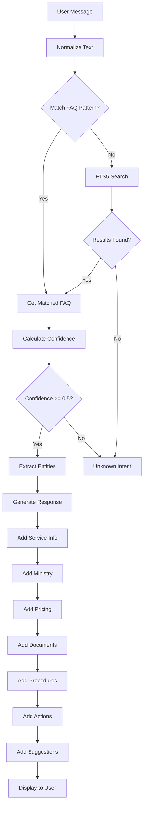
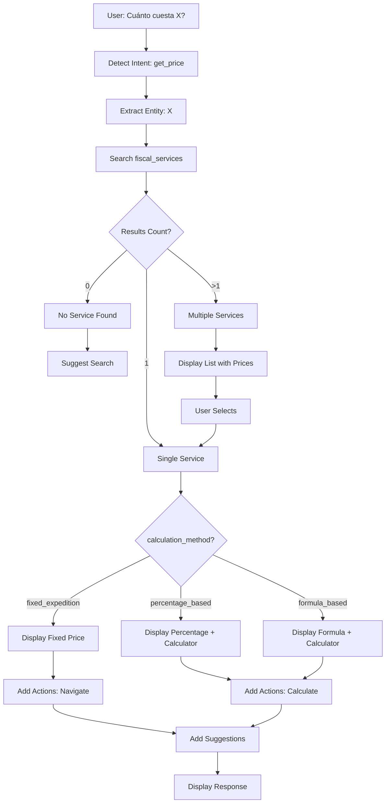
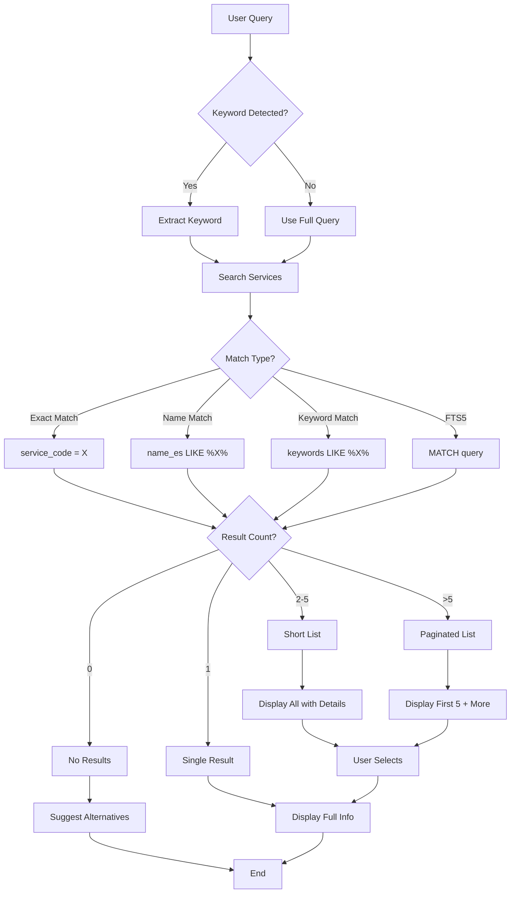

# Plan Détaillé de Distribution des 60 FAQs et Gestion des Intentions - TaxasGE Chatbot

**Date**: 2025-11-07
**Version**: 2.0
**Statut**: Plan Complet Détaillé pour Implémentation

---

## 📊 TABLE DES MATIÈRES

1. [Vue d'Ensemble](#i-vue-densemble)
2. [Distribution des 60 FAQs](#ii-distribution-détaillée-des-60-faqs)
3. [Service FAQs (30)](#iii-service-faqs-30-détail-complet)
4. [Category FAQs (15)](#iv-category-faqs-15-détail-complet)
5. [Procedural FAQs (15)](#v-procedural-faqs-15-détail-complet)
6. [Gestion des Intentions](#vi-gestion-des-intentions-détaillée)
7. [Workflows par Intention](#vii-workflows-par-intention)
8. [Matrices de Mapping](#viii-matrices-de-mapping)

---

## I. VUE D'ENSEMBLE

### 1.1 Distribution Globale

```
Total: 60 FAQs
├── Service FAQs: 30 (50%)
│   ├── SERVICIO CONSULAR: 10 FAQs
│   ├── PYMES: 6 FAQs
│   ├── AVIATION: 12 FAQs
│   └── AUTRES: 2 FAQs
│
├── Category FAQs: 15 (25%)
│   ├── Par Ministère: 5 FAQs
│   ├── Par Type de Service: 5 FAQs
│   └── Par Thématique: 5 FAQs
│
└── Procedural FAQs: 15 (25%)
    ├── Paiement: 3 FAQs
    ├── Suivi: 3 FAQs
    ├── Contact: 3 FAQs
    ├── Documents: 3 FAQs
    └── Général: 3 FAQs
```

### 1.2 Répartition par Intention

| Intention | Service FAQs | Category FAQs | Procedural FAQs | Total |
|-----------|--------------|---------------|-----------------|-------|
| **get_general_info** | 30 | 15 | 8 | 53 |
| **get_price** | 0 | 0 | 2 | 2 |
| **get_procedure** | 0 | 0 | 2 | 2 |
| **get_documents** | 0 | 0 | 2 | 2 |
| **greeting** | 0 | 0 | 1 | 1 |
| **TOTAL** | 30 | 15 | 15 | **60** |

### 1.3 Priorités

| Priorité | Nombre | Description |
|----------|---------|-------------|
| **10** (Très haute) | 5 | Services critiques (pasaporte, legalización) |
| **8** (Haute) | 15 | Services fréquents |
| **6** (Moyenne) | 25 | Services standards |
| **4** (Basse) | 15 | Services spécialisés |

---

## II. DISTRIBUTION DÉTAILLÉE DES 60 FAQS

### 2.1 Service FAQs (30) - Par Catégorie

#### A. SERVICIO CONSULAR (10 FAQs)

| # | ID | Service Code | Nom du Service | Priorité |
|---|----|--------------|--------------------|----------|
| 1 | faq-service-T-005 | T-005 | Adquisición impreso de pasaporte | 10 |
| 2 | faq-service-T-006 | T-006 | Renovación de Pasaporte | 10 |
| 3 | faq-service-T-012 | T-012 | Adquisición impreso de pasaporte (2) | 8 |
| 4 | faq-service-T-013 | T-013 | Renovación de Pasaporte (2) | 8 |
| 5 | faq-service-T-014 | T-014 | Expedición Carnet Consular | 8 |
| 6 | faq-service-T-001 | T-001 | Legalización de Documentos | 9 |
| 7 | faq-service-T-002 | T-002 | Legalización Escritos Notariados | 8 |
| 8 | faq-service-T-003 | T-003 | Legalización Diplomas/Títulos | 8 |
| 9 | faq-service-T-004 | T-004 | Legalización Documentos Mercantiles | 7 |
| 10 | faq-service-T-009 | T-009 | Legalización Escritos notariados | 7 |

#### B. PYMES (6 FAQs)

| # | ID | Service Code | Nom du Service | Priorité |
|---|----|--------------|--------------------|----------|
| 11 | faq-service-T-201 | T-201 | Micro empresa | 7 |
| 12 | faq-service-T-202 | T-202 | Pequeña empresa | 7 |
| 13 | faq-service-T-203 | T-203 | Mediana empresa | 7 |
| 14 | faq-service-T-204 | T-204 | Micro empresa (inscripción) | 6 |
| 15 | faq-service-T-205 | T-205 | Pequeña empresa (inscripción) | 6 |
| 16 | faq-service-T-206 | T-206 | Mediana empresa (inscripción) | 6 |

#### C. AVIATION - Toneladas Métricas (12 FAQs)

| # | ID | Service Code | Nom du Service | Priorité |
|---|----|--------------|--------------------|----------|
| 17 | faq-service-T-015 | T-015 | De 1 hasta 25 Toneladas métricas | 4 |
| 18 | faq-service-T-016 | T-016 | De 26 hasta 75 Tm | 4 |
| 19 | faq-service-T-017 | T-017 | De 76 hasta 150 Tm | 4 |
| 20 | faq-service-T-018 | T-018 | De 151 hasta 300 Tm | 4 |
| 21 | faq-service-T-019 | T-019 | Más de 300 Tm | 4 |
| 22 | faq-service-T-020 | T-020 | Aeronaves privadas de turismo | 5 |
| 23 | faq-service-T-021 | T-021 | Los helicópteros | 5 |
| 24 | faq-service-T-022 | T-022 | De 1 hasta 4 Toneladas métricas | 4 |
| 25 | faq-service-T-023 | T-023 | De 5 hasta 14 Tm | 4 |
| 26 | faq-service-T-024 | T-024 | De 15 hasta 25 Tm | 4 |
| 27 | faq-service-T-025 | T-025 | De 26 hasta 75 Tm | 4 |
| 28 | faq-service-T-026 | T-026 | De 76 hasta 150 Tm | 4 |

#### D. AUTRES (2 FAQs)

| # | ID | Service Code | Nom du Service | Priorité |
|---|----|--------------|--------------------|----------|
| 29 | faq-service-T-010 | T-010 | Legalización Diplomas académicos | 7 |
| 30 | faq-service-T-011 | T-011 | Legalización Documentos Mercantiles | 7 |

### 2.2 Category FAQs (15) - Par Thématique

| # | ID | Catégorie/Thème | Keywords | Priorité |
|---|----|--------------------|----------|----------|
| 31 | faq-cat-servicio-consular | SERVICIO CONSULAR | consulado, embajada, consular | 9 |
| 32 | faq-cat-pymes | PYMES | empresa, negocio, pyme | 8 |
| 33 | faq-cat-aviation | AVIATION | aeronave, avión, vuelo | 6 |
| 34 | faq-cat-legalizacion | LEGALIZACIÓN | legalizar, apostillar, autenticar | 9 |
| 35 | faq-cat-pasaportes | PASAPORTES | pasaporte, viaje, viajar | 10 |
| 36 | faq-cat-asuntos-exteriores | ASUNTOS EXTERIORES | ministerio exteriores, cancillería | 8 |
| 37 | faq-cat-comercio | COMERCIO | comercio, comercial, negocio | 7 |
| 38 | faq-cat-documentos | DOCUMENTOS GENERALES | documento, certificado, constancia | 7 |
| 39 | faq-cat-tarifas | TARIFAS | precio, costo, tarifa, tasa | 8 |
| 40 | faq-cat-tramites | TRÁMITES | trámite, procedimiento, gestión | 7 |
| 41 | faq-cat-empresas | EMPRESAS | empresa, sociedad, compañía | 7 |
| 42 | faq-cat-identidad | IDENTIDAD | identidad, dni, cédula | 8 |
| 43 | faq-cat-registro | REGISTRO | registro, inscripción, inscribir | 7 |
| 44 | faq-cat-certificados | CERTIFICADOS | certificado, constancia, certificación | 7 |
| 45 | faq-cat-permisos | PERMISOS | permiso, autorización, licencia | 7 |

### 2.3 Procedural FAQs (15) - Par Fonction

#### A. Paiement (3 FAQs)

| # | ID | Question | Priorité |
|---|----|------------------------------------|----------|
| 46 | faq-proc-payment-methods | ¿Cómo puedo pagar? | 9 |
| 47 | faq-proc-payment-locations | ¿Dónde puedo pagar? | 9 |
| 48 | faq-proc-payment-receipt | ¿Cómo obtengo el recibo? | 8 |

#### B. Suivi (3 FAQs)

| # | ID | Question | Priorité |
|---|----|------------------------------------|----------|
| 49 | faq-proc-tracking | ¿Cómo sigo mi trámite? | 9 |
| 50 | faq-proc-status | ¿Cuánto tiempo toma? | 9 |
| 51 | faq-proc-delays | ¿Qué pasa si hay retraso? | 7 |

#### C. Contact (3 FAQs)

| # | ID | Question | Priorité |
|---|----|------------------------------------|----------|
| 52 | faq-proc-office-hours | ¿Cuál es el horario? | 9 |
| 53 | faq-proc-contact-ministry | ¿Cómo contacto al ministerio? | 8 |
| 54 | faq-proc-locations | ¿Dónde están las oficinas? | 8 |

#### D. Documents (3 FAQs)

| # | ID | Question | Priorité |
|---|----|------------------------------------|----------|
| 55 | faq-proc-common-docs | ¿Qué documentos son comunes? | 8 |
| 56 | faq-proc-doc-validity | ¿Cuánto tiempo son válidos? | 7 |
| 57 | faq-proc-doc-copies | ¿Necesito copias o originales? | 8 |

#### E. Général (3 FAQs)

| # | ID | Question | Priorité |
|---|----|------------------------------------|----------|
| 58 | faq-proc-greeting | Saludo inicial | 10 |
| 59 | faq-proc-help | ¿Cómo puedo ayudarte? | 9 |
| 60 | faq-proc-calculator | ¿Cómo uso la calculadora? | 8 |

---

## III. SERVICE FAQS (30) - DÉTAIL COMPLET

### 3.1 Exemple Détaillé: FAQ #1 - Pasaporte T-005

```json
{
  "id": "faq-service-T-005",
  "question_pattern": "(pasaporte|passport|passeport|adquisición pasaporte|nuevo pasaporte|obtener pasaporte|tramitar pasaporte|solicitar pasaporte)",
  "intent": "get_general_info",
  "response_es": "📋 **Adquisición impreso de pasaporte y su expedición**\n\n🏛️ **Ministerio responsable:**\nMINISTERIO DE ASUNTOS EXTERIORES Y COOPERACIÓN\n\n💰 **Tarifas:**\n• Expedición: 7.500 XAF\n\n📄 **Documentos Requeridos - Expedición:**\n1. Documento de identidad\n2. Fotografía\n\n📝 **Procedimientos - Expedición y Renovación:**\n1. Presentar documentación\n2. Completar formulario\n3. Pagar tasa\n4. Recoger pasaporte\n\nDuración estimada: —\nLocalización: —\nHoras de apertura: Lun-Ven : 08h - 16h",
  "response_fr": null,
  "response_en": null,
  "follow_up_suggestions": "[\"Renovación de pasaporte\", \"Documentos requeridos\", \"Buscar otro servicio\"]",
  "actions": "{\"type\": \"navigate\", \"screen\": \"ServiceDetail\", \"params\": {\"serviceId\": 12}}",
  "keywords": "[\"pasaporte\", \"passport\", \"passeport\", \"adquisicion\", \"expedicion\", \"documento identidad\", \"fotografia\", \"t-005\", \"consular\"]",
  "priority": 10
}
```

### 3.2 Template pour Service FAQ (Prix Fixes)

**Variables dynamiques:**
- `{service_code}` - Code du service (ex: T-005)
- `{name_es}` - Nom en espagnol
- `{ministry_name_es}` - Nom du ministère
- `{tasa_expedicion}` - Prix expédition
- `{tasa_renovacion}` - Prix rénovation (si > 0)
- `{documents[]}` - Liste des documents (split par virgule)
- `{procedure_steps[]}` - Liste des étapes de procédure

**Pattern Regex Construction:**
```typescript
// Exemple pour T-005 Pasaporte
const patterns = [
  service.service_code.toLowerCase(), // "t-005"
  ...service.name_es.toLowerCase().split(/\s+/), // ["adquisición", "impreso", "pasaporte", ...]
  ...extractKeywords(service.documents), // ["documento", "identidad", "fotografía"]
  ...synonyms // ["passport", "passeport", "nuevo pasaporte", ...]
];

const question_pattern = `(${patterns.join("|")})`;
// Result: "(pasaporte|passport|passeport|adquisición pasaporte|...)"
```

### 3.3 Exemple Détaillé: FAQ #11 - Micro Empresa T-201

```json
{
  "id": "faq-service-T-201",
  "question_pattern": "(micro empresa|microempresa|pequeño negocio|pyme micro|t-201|promoción pyme)",
  "intent": "get_general_info",
  "response_es": "📋 **Micro empresa**\n\n🏛️ **Ministerio responsable:**\nMINISTERIO DE COMERCIO PROMOCIÓN DE PEQUEÑAS Y MEDIANAS EMPRESAS\n\n💰 **Tarifas:**\n• Expedición: 3.000 XAF\n\n📄 **Documentos Requeridos - Expedición:**\n1. [Documento específico del servicio]\n\n📝 **Procedimientos - Expedición y Renovación:**\n1. [Pasos específicos]\n\nDuración estimada: —\nLocalización: —\nHoras de apertura: Lun-Ven : 08h - 16h",
  "response_fr": null,
  "response_en": null,
  "follow_up_suggestions": "[\"Pequeña empresa\", \"Mediana empresa\", \"Buscar otro servicio\"]",
  "actions": "{\"type\": \"navigate\", \"screen\": \"ServiceDetail\", \"params\": {\"serviceId\": 831}}",
  "keywords": "[\"micro\", \"empresa\", \"pyme\", \"negocio\", \"comercio\", \"t-201\"]",
  "priority": 7
}
```

### 3.4 Exemple Détaillé: FAQ #17 - Aviation T-015

```json
{
  "id": "faq-service-T-015",
  "question_pattern": "(toneladas métricas|aeronave|avión|tráfico internacional|1 hasta 25 tm|t-015)",
  "intent": "get_general_info",
  "response_es": "📋 **De 1 hasta 25 Toneladas métricas**\n\n🏛️ **Ministerio responsable:**\n[Ministerio Aviation]\n\n💰 **Tarifas:**\n• Expedición: 3,50 XAF\n\n📄 **Documentos Requeridos - Expedición:**\n1. [Documentación]\n\n📝 **Procedimientos - Expedición y Renovación:**\n1. Presentar documentación\n2. Verificar peso\n3. Pagar tarifa\n\nDuración estimada: —\nLocalización: —\nHoras de apertura: Lun-Ven : 08h - 16h",
  "response_fr": null,
  "response_en": null,
  "follow_up_suggestions": "[\"Otras tarifas aviation\", \"Calculadora\", \"Buscar servicio\"]",
  "actions": "{\"type\": \"navigate\", \"screen\": \"ServiceDetail\", \"params\": {\"serviceId\": [ID]}}",
  "keywords": "[\"toneladas\", \"metricas\", \"tm\", \"aeronave\", \"avion\", \"aviation\", \"t-015\"]",
  "priority": 4
}
```

---

## IV. CATEGORY FAQS (15) - DÉTAIL COMPLET

### 4.1 Exemple Détaillé: FAQ #31 - SERVICIO CONSULAR

```json
{
  "id": "faq-cat-servicio-consular",
  "question_pattern": "(servicio consular|servicios consulares|consulado|embajada|asuntos consulares|trámites consulares)",
  "intent": "get_general_info",
  "response_es": "📂 **SERVICIO CONSULAR**\n\n🏛️ **Ministerio de Asuntos Exteriores y Cooperación**\n\n**Servicios disponibles:**\n\n🔹 **Pasaportes:**\n• Adquisición pasaporte - 7.500 XAF\n• Renovación pasaporte - 5.000 XAF\n• Duplicado por extravío - [Precio]\n\n🔹 **Legalización:**\n• Legalización documentos - 2.000 XAF\n• Legalización escritos notariados - 2.000 XAF\n• Legalización diplomas - 2.000 XAF\n• Legalización documentos mercantiles - 10.000 XAF\n\n🔹 **Otros:**\n• Expedición carnet consular - 5.000 XAF\n\n¿Qué servicio te interesa?",
  "response_fr": null,
  "response_en": null,
  "follow_up_suggestions": "[\"Info sobre pasaporte\", \"Legalización de documentos\", \"Ver todos los servicios\"]",
  "actions": "{\"type\": \"suggestions\", \"items\": [{\"text\": \"Pasaporte\", \"action\": \"navigate\", \"screen\": \"ServiceDetail\", \"params\": {\"serviceId\": 12}}, {\"text\": \"Legalización\", \"action\": \"navigate\", \"screen\": \"ServiceDetail\", \"params\": {\"serviceId\": 8}}]}",
  "keywords": "[\"servicio\", \"consular\", \"consulado\", \"embajada\", \"asuntos\", \"exteriores\", \"pasaporte\", \"legalizacion\"]",
  "priority": 9
}
```

### 4.2 Exemple Détaillé: FAQ #32 - PYMES

```json
{
  "id": "faq-cat-pymes",
  "question_pattern": "(pymes|pyme|pequeñas medianas empresas|empresa|negocio|emprendimiento|promoción empresas)",
  "intent": "get_general_info",
  "response_es": "📂 **PROMOCIÓN DE PEQUEÑAS Y MEDIANAS EMPRESAS (PYMES)**\n\n🏛️ **Ministerio de Comercio Promoción de Pequeñas y Medianas Empresas**\n\n**Servicios disponibles:**\n\n🔹 **Registro de Empresas:**\n• Micro empresa - 3.000 XAF\n• Pequeña empresa - 5.000 XAF\n• Mediana empresa - 10.000 XAF\n\n🔹 **Inscripción:**\n• Micro empresa (inscripción) - 2.000 XAF\n• Pequeña empresa (inscripción) - 4.000 XAF\n• Mediana empresa (inscripción) - 8.000 XAF\n\n📋 **Clasificación:**\n• Micro: Hasta 10 empleados\n• Pequeña: 11-50 empleados\n• Mediana: 51-250 empleados\n\n¿Qué tipo de empresa quieres registrar?",
  "response_fr": null,
  "response_en": null,
  "follow_up_suggestions": "[\"Micro empresa\", \"Pequeña empresa\", \"Mediana empresa\"]",
  "actions": "{\"type\": \"suggestions\", \"items\": [{\"text\": \"Micro empresa\", \"action\": \"navigate\", \"screen\": \"ServiceDetail\", \"params\": {\"serviceId\": 831}}, {\"text\": \"Pequeña empresa\", \"action\": \"navigate\", \"screen\": \"ServiceDetail\", \"params\": {\"serviceId\": 832}}]}",
  "keywords": "[\"pyme\", \"pymes\", \"empresa\", \"negocio\", \"comercio\", \"micro\", \"pequeña\", \"mediana\"]",
  "priority": 8
}
```

### 4.3 Exemple Détaillé: FAQ #35 - PASAPORTES (Thématique)

```json
{
  "id": "faq-cat-pasaportes",
  "question_pattern": "(pasaporte|pasaportes|passport|passports|viajar|viaje|internacional|documento viaje)",
  "intent": "get_general_info",
  "response_es": "🛂 **PASAPORTES**\n\n**Tipos de servicios disponibles:**\n\n🔹 **Nueva Expedición:**\n• Adquisición impreso de pasaporte (T-005) - 7.500 XAF\n• Adquisición impreso de pasaporte (T-012) - 1 XAF\n\n🔹 **Renovación:**\n• Renovación por expiración (T-006) - 5.000 XAF\n• Renovación por expiración (T-013) - 5.000 XAF\n\n🔹 **Otros:**\n• Pasaporte ordinario (T-601) - [Consultar precio]\n• Duplicado por extravío (T-602) - [Consultar precio]\n\n📄 **Documentos generalmente requeridos:**\n• Documento de identidad\n• Fotografía reciente\n• Pasaporte anterior (para renovación)\n\n⏱️ **Procesamiento:**\nDuración: Consulte con el ministerio\nHorario: Lun-Ven 08h - 16h\n\n🏛️ **Ministerio:** Asuntos Exteriores y Cooperación\n\n¿Qué tipo de pasaporte necesitas?",
  "response_fr": null,
  "response_en": null,
  "follow_up_suggestions": "[\"Nuevo pasaporte\", \"Renovar pasaporte\", \"Documentos requeridos\"]",
  "actions": "{\"type\": \"suggestions\", \"items\": [{\"text\": \"Nuevo pasaporte\", \"action\": \"navigate\", \"screen\": \"ServiceDetail\", \"params\": {\"serviceId\": 12}}, {\"text\": \"Renovación\", \"action\": \"navigate\", \"screen\": \"ServiceDetail\", \"params\": {\"serviceId\": 13}}]}",
  "keywords": "[\"pasaporte\", \"passport\", \"passeport\", \"viaje\", \"viajar\", \"internacional\", \"documento\"]",
  "priority": 10
}
```

### 4.4 Template pour Category FAQ

**Structure:**
```typescript
{
  id: "faq-cat-{category-slug}",
  question_pattern: "({category_keywords})",
  intent: "get_general_info",
  response_es: `
📂 **{CATEGORY_NAME}**

🏛️ **{Ministry_Name}** (si applicable)

**Servicios disponibles:**

🔹 **{Subcategory_1}:**
• {Service_1} - {Price_1} XAF
• {Service_2} - {Price_2} XAF

🔹 **{Subcategory_2}:**
• {Service_3} - {Price_3} XAF

📋 **{Additional_Info}** (si applicable)

¿Qué servicio te interesa?
  `,
  follow_up_suggestions: JSON.stringify([
    "Servicio específico 1",
    "Servicio específico 2",
    "Ver todos los servicios"
  ]),
  actions: JSON.stringify({
    type: "suggestions",
    items: [
      { text: "Service 1", action: "navigate", screen: "ServiceDetail", params: { serviceId: X }},
      { text: "Service 2", action: "navigate", screen: "ServiceDetail", params: { serviceId: Y }}
    ]
  }),
  keywords: JSON.stringify(category_keywords),
  priority: 7-9
}
```

---

## V. PROCEDURAL FAQS (15) - DÉTAIL COMPLET

### 5.1 Paiement - FAQ #46

```json
{
  "id": "faq-proc-payment-methods",
  "question_pattern": "(cómo pagar|como pago|métodos de pago|formas de pago|pagar tasa|pagar servicio|medios de pago)",
  "intent": "get_general_info",
  "response_es": "💳 **Métodos de Pago**\n\n**Puede pagar las tasas fiscales de las siguientes formas:**\n\n🏦 **En Bancos Autorizados:**\n• Banco Central de Guinea Ecuatorial\n• Bancos comerciales autorizados\n• Transferencia bancaria\n\n🏛️ **En Oficinas del Ministerio:**\n• Oficinas del ministerio correspondiente\n• Ventanillas de atención al público\n\n💵 **Métodos Aceptados:**\n• Efectivo (FCFA)\n• Transferencia bancaria\n• [Otros métodos según el ministerio]\n\n📄 **Importante:**\n• Solicite siempre su recibo de pago\n• Guarde el comprobante para seguimiento\n• Algunos servicios requieren pago anticipado\n\n📍 Consulte las oficinas específicas para cada servicio en la sección de contacto.",
  "response_fr": null,
  "response_en": null,
  "follow_up_suggestions": "[\"¿Dónde puedo pagar?\", \"¿Cómo obtengo el recibo?\", \"Buscar servicio\"]",
  "actions": null,
  "keywords": "[\"pago\", \"pagar\", \"metodo\", \"forma\", \"banco\", \"efectivo\", \"transferencia\"]",
  "priority": 9
}
```

### 5.2 Suivi - FAQ #49

```json
{
  "id": "faq-proc-tracking",
  "question_pattern": "(seguir trámite|seguimiento|rastrear|estado del trámite|consultar estado|progreso|tracking|dónde está mi trámite)",
  "intent": "get_general_info",
  "response_es": "📊 **Seguimiento de Trámites**\n\n**Para conocer el estado de su trámite:**\n\n1️⃣ **Contacte directamente con el ministerio:**\n• Llame a la línea de atención\n• Presente su número de expediente\n• Indique el tipo de servicio\n\n2️⃣ **Visite la oficina:**\n• Acuda con su recibo de pago\n• Horario: Lun-Vie 08h - 16h\n• Solicite información del estado\n\n3️⃣ **Información que necesitará:**\n• Número de expediente\n• Fecha de presentación\n• Recibo de pago\n• Documento de identidad\n\n⏱️ **Plazos de Procesamiento:**\nLos plazos varían según el tipo de servicio. Consulte la información específica de cada servicio para conocer el tiempo estimado.\n\n🏛️ **Ministerios:**\nCada ministerio tiene su propio sistema de seguimiento. Consulte con el ministerio correspondiente a su trámite.",
  "response_fr": null,
  "response_en": null,
  "follow_up_suggestions": "[\"¿Cuánto tiempo toma?\", \"Contacto ministerios\", \"Buscar servicio\"]",
  "actions": null,
  "keywords": "[\"seguir\", \"seguimiento\", \"rastrear\", \"estado\", \"tramite\", \"progreso\", \"tracking\"]",
  "priority": 9
}
```

### 5.3 Contact - FAQ #52

```json
{
  "id": "faq-proc-office-hours",
  "question_pattern": "(horario|horarios|hora de atención|cuándo abren|horario de oficina|horas de apertura|schedule|hours)",
  "intent": "get_general_info",
  "response_es": "🕒 **Horarios de Atención**\n\n**Horario General de Oficinas Públicas:**\n\n📅 **Días laborables:**\n• Lunes a Viernes\n\n⏰ **Horario:**\n• 08:00 - 16:00 horas\n\n⚠️ **Importante:**\n• Los horarios pueden variar según el ministerio\n• Algunos servicios requieren cita previa\n• Verifique con el ministerio específico antes de acudir\n\n🏛️ **Ministerios Principales:**\n\n• **Asuntos Exteriores:** 08h - 16h (Lun-Vie)\n• **Comercio y PYMES:** 08h - 16h (Lun-Vie)\n• **Hacienda:** 08h - 16h (Lun-Vie)\n\n📞 **Recomendación:**\nSiempre llame antes de acudir para confirmar:\n• Horarios actualizados\n• Disponibilidad del servicio\n• Necesidad de cita previa",
  "response_fr": null,
  "response_en": null,
  "follow_up_suggestions": "[\"Contacto ministerios\", \"Ubicación oficinas\", \"Buscar servicio\"]",
  "actions": null,
  "keywords": "[\"horario\", \"horarios\", \"hora\", \"atencion\", \"oficina\", \"apertura\", \"schedule\"]",
  "priority": 9
}
```

### 5.4 Documents - FAQ #55

```json
{
  "id": "faq-proc-common-docs",
  "question_pattern": "(documentos comunes|qué documentos necesito|documentos generales|documentos frecuentes|papeles necesarios|documentación común)",
  "intent": "get_documents",
  "response_es": "📄 **Documentos Comúnmente Requeridos**\n\n**Documentos de Identidad:**\n• Documento de identidad nacional\n• Pasaporte (si aplica)\n• Cédula de identidad\n• Fotografías recientes (tamaño carnet)\n\n**Documentos Personales:**\n• Certificado de nacimiento\n• Certificado de residencia\n• Comprobante de domicilio\n\n**Documentos Empresariales:**\n• Registro mercantil\n• NIF (Número de Identificación Fiscal)\n• Estatutos de la empresa\n• Poder notarial (si aplica)\n\n**Documentos Académicos:**\n• Diplomas y títulos\n• Certificados de estudios\n• Transcripciones académicas\n\n**Documentos Generales:**\n• Recibo de pago de la tasa\n• Formulario de solicitud (según servicio)\n• Copias certificadas cuando se requieran\n\n⚠️ **Importante:**\n• Los documentos específicos varían según el servicio\n• Algunos documentos requieren legalización\n• Consulte siempre los requisitos del servicio específico\n\n💡 **Consejo:**\nLleve siempre copias adicionales de sus documentos.",
  "response_fr": null,
  "response_en": null,
  "follow_up_suggestions": "[\"¿Necesito copias o originales?\", \"¿Cuánto tiempo son válidos?\", \"Buscar servicio específico\"]",
  "actions": null,
  "keywords": "[\"documentos\", \"comunes\", \"necesito\", \"requeridos\", \"papeles\", \"documentacion\"]",
  "priority": 8
}
```

### 5.5 Général - FAQ #58 (Greeting)

```json
{
  "id": "faq-proc-greeting",
  "question_pattern": "(hola|buenos días|buenas tardes|buenas noches|saludos|hello|hi|bonjour|salut)",
  "intent": "greeting",
  "response_es": "👋 **¡Hola! Bienvenido al asistente de TaxasGE**\n\nSoy tu asistente virtual para consultas sobre servicios fiscales y administrativos de Guinea Ecuatorial.\n\n**Puedo ayudarte con:**\n\n🔹 Consultar precios de servicios\n🔹 Ver documentos requeridos\n🔹 Conocer procedimientos\n🔹 Buscar servicios específicos\n🔹 Información sobre ministerios\n🔹 Métodos de pago\n🔹 Seguimiento de trámites\n\n**Ejemplos de preguntas:**\n• \"¿Cuánto cuesta el pasaporte?\"\n• \"Documentos para legalización\"\n• \"Servicios de PYMES\"\n• \"¿Cómo puedo pagar?\"\n\n¿En qué puedo ayudarte hoy?",
  "response_fr": "👋 **Bonjour ! Bienvenue à l'assistant TaxasGE**\n\nJe suis votre assistant virtuel pour les consultations sur les services fiscaux et administratifs de Guinée Équatoriale.\n\n**Je peux vous aider avec:**\n\n🔹 Consulter les prix des services\n🔹 Voir les documents requis\n🔹 Connaître les procédures\n🔹 Rechercher des services spécifiques\n🔹 Informations sur les ministères\n🔹 Méthodes de paiement\n🔹 Suivi des démarches\n\nComment puis-je vous aider aujourd'hui?",
  "response_en": "👋 **Hello! Welcome to TaxasGE assistant**\n\nI'm your virtual assistant for consultations about fiscal and administrative services in Equatorial Guinea.\n\n**I can help you with:**\n\n🔹 Check service prices\n🔹 View required documents\n🔹 Know procedures\n🔹 Search specific services\n🔹 Ministry information\n🔹 Payment methods\n🔹 Track procedures\n\nHow can I help you today?",
  "follow_up_suggestions": "[\"Buscar servicios\", \"Ver servicios populares\", \"¿Cómo usar la calculadora?\"]",
  "actions": "{\"type\": \"suggestions\", \"items\": [{\"text\": \"Servicios populares\", \"action\": \"navigate\", \"screen\": \"Home\"}, {\"text\": \"Buscar\", \"action\": \"search\"}]}",
  "keywords": "[\"hola\", \"saludo\", \"buenos\", \"dias\", \"hello\", \"hi\", \"bonjour\"]",
  "priority": 10
}
```

---

## VI. GESTION DES INTENTIONS DÉTAILLÉE

### 6.1 Intent: `get_general_info` (53 FAQs)

**Description:** Intention principale pour obtenir information générale sur un service

**Déclencheurs:**
- Questions sur un service spécifique
- Demandes d'information générale
- Navigation par catégorie

**Workflow:**
```
User: "Info sobre pasaporte"
  ↓
Normalize: "info sobre pasaporte"
  ↓
Match Pattern: "(pasaporte|passport|...)"
  ↓
Detect Intent: get_general_info (confidence: 0.95)
  ↓
Get FAQ: faq-service-T-005
  ↓
Generate Response:
  - Display service info complète
  - Ministry, Prix, Docs, Procedures
  ↓
Add Actions:
  - Navigate to ServiceDetail
  ↓
Add Suggestions:
  - "Renovación de pasaporte"
  - "Documentos requeridos"
  - "Buscar otro servicio"
```

**FAQs Associées:**
- 30 Service FAQs
- 15 Category FAQs
- 8 Procedural FAQs
- **Total: 53 FAQs**

**Réponse Type:**
- Information complète du service
- Actions de navigation
- Suggestions de follow-up

### 6.2 Intent: `get_price` (2 FAQs)

**Description:** Consulter spécifiquement le prix d'un service

**Déclencheurs:**
- "¿Cuánto cuesta...?"
- "Precio de..."
- "Tarifa de..."

**Workflow:**
```
User: "¿Cuánto cuesta el pasaporte?"
  ↓
Normalize: "cuanto cuesta el pasaporte"
  ↓
Detect Intent: get_price (confidence: 0.9)
Extract Entity: serviceKeyword = "pasaporte"
  ↓
Search Service: name_es LIKE '%pasaporte%'
  ↓
Found: T-005, T-006, T-012, T-013
  ↓
Generate Response:
  "Encontré varios servicios de pasaporte:
   1. Adquisición (T-005) - 7.500 XAF
   2. Renovación (T-006) - 5.000 XAF
   ...
   ¿Cuál te interesa?"
  ↓
Add Actions:
  - List of services to navigate
  ↓
Add Suggestions:
  - "Info completa pasaporte"
  - "Documentos necesarios"
```

**FAQs Associées:**
- faq-proc-price-general
- faq-proc-price-calculation
- **Total: 2 FAQs**

**Réponse Type:**
- Liste de prix
- Navigation vers service
- Option calculatrice (si formula/percentage)

### 6.3 Intent: `get_procedure` (2 FAQs)

**Description:** Consulter les procédures/étapes d'un service

**Déclencheurs:**
- "¿Cómo tramito...?"
- "¿Cuál es el procedimiento...?"
- "Pasos para..."

**Workflow:**
```
User: "¿Cómo obtengo el pasaporte?"
  ↓
Normalize: "como obtengo el pasaporte"
  ↓
Detect Intent: get_procedure (confidence: 0.9)
Extract Entity: serviceKeyword = "pasaporte"
  ↓
Search Service + Procedures
  ↓
Generate Response:
  "📝 Procedimiento para Pasaporte:
   1. Presentar documentación
   2. Completar formulario
   3. Pagar tasa (7.500 XAF)
   4. Recoger pasaporte

   Horario: Lun-Vie 08h-16h"
  ↓
Add Actions:
  - Navigate to ServiceDetail
  ↓
Add Suggestions:
  - "Documentos requeridos"
  - "¿Dónde tramitar?"
```

**FAQs Associées:**
- faq-proc-procedures-general
- faq-proc-procedures-steps
- **Total: 2 FAQs**

**Réponse Type:**
- Liste d'étapes
- Horaires
- Localisation

### 6.4 Intent: `get_documents` (2 FAQs)

**Description:** Consulter les documents requis

**Déclencheurs:**
- "¿Qué documentos necesito...?"
- "Documentos para..."
- "Requisitos de..."

**Workflow:**
```
User: "Documentos para pasaporte"
  ↓
Normalize: "documentos para pasaporte"
  ↓
Detect Intent: get_documents (confidence: 0.95)
Extract Entity: serviceKeyword = "pasaporte"
  ↓
Search Service + Documents
  ↓
Generate Response:
  "📄 Documentos para Pasaporte:

   Para Expedición:
   1. Documento de identidad
   2. Fotografía

   Para Renovación:
   1. Pasaporte actual
   2. Documento de identidad"
  ↓
Add Actions:
  - Navigate to ServiceDetail
  ↓
Add Suggestions:
  - "¿Necesito copias?"
  - "Info completa pasaporte"
```

**FAQs Associées:**
- faq-proc-documents-general (FAQ #55)
- faq-proc-doc-copies (FAQ #57)
- **Total: 2 FAQs**

**Réponse Type:**
- Liste de documents
- Distinction expedition/renewal
- Notes importantes

### 6.5 Intent: `calculate` (Implícite)

**Description:** Ouvrir la calculatrice pour services avec formule/pourcentage

**Déclencheurs:**
- Questions sur services percentage_based ou formula_based
- Click sur action button "Calculer"

**Workflow:**
```
User: "¿Cuánto cuesta T-646?"
  ↓
Search Service: T-646
  ↓
Detect: calculation_method = "formula_based"
  ↓
Generate Response:
  "📋 Canon anual de concesiones

   💰 Fórmula de Cálculo:
   RF + (t × CA)

   Variables:
   • RF: Redevance Fixe
   • t: Taux applicable
   • CA: Chiffre d'Affaires

   ⚠️ Utilice la calculadora para obtener
      el monto exacto según sus datos."
  ↓
Add Actions:
  type: "calculate"
  screen: "Calculator"
  params: { serviceId: 646 }
  ↓
User clicks "Calculer"
  ↓
Navigate to Calculator Screen
  ↓
User inputs: CA = 100000
  ↓
Calculate: RF + (t × 100000)
  ↓
Display Result
```

**FAQs Associées:**
- Services avec calculation_method != "fixed_expedition"
- faq-proc-calculator (FAQ #60)

**Réponse Type:**
- Formule/Pourcentage
- Action button vers Calculator
- Instructions

### 6.6 Intent: `search_service` (Implícite)

**Description:** Rechercher des services par keyword

**Déclencheurs:**
- "Buscar..."
- Keywords génériques sans match FAQ
- Navigation depuis suggestions

**Workflow:**
```
User: "Buscar licencia"
  ↓
Normalize: "buscar licencia"
  ↓
Detect Intent: search_service (confidence: 0.8)
Extract Entity: query = "licencia"
  ↓
Search fiscal_services:
  WHERE name_es LIKE '%licencia%'
  OR keywords LIKE '%licencia%'
  ↓
Found: 16 services
  ↓
Generate Response:
  "🔍 Encontré 16 servicios de 'licencia':

   1. Licencia de conducir - [Precio]
   2. Licencia comercial - [Precio]
   ...

   ¿Cuál te interesa?"
  ↓
Add Actions:
  type: "suggestions"
  items: [List of matching services]
  ↓
User selects service
  ↓
Navigate to ServiceDetail
```

**FAQs Associées:**
- Aucune FAQ directe
- Déclenché par fallback si confidence < 0.5

**Réponse Type:**
- Liste de résultats
- Navigation vers services
- Filtre par catégorie

### 6.7 Intent: `greeting` (1 FAQ)

**Description:** Salutations et message de bienvenue

**Déclencheurs:**
- "Hola", "Buenos días", "Hello", "Bonjour"
- Première interaction

**Workflow:**
```
User: "Hola"
  ↓
Match Pattern: "(hola|buenos días|hello|...)"
  ↓
Detect Intent: greeting (confidence: 1.0)
  ↓
Get FAQ: faq-proc-greeting (FAQ #58)
  ↓
Generate Response:
  - Multilingual greeting
  - List of capabilities
  - Examples of questions
  ↓
Add Suggestions:
  - "Buscar servicios"
  - "Ver servicios populares"
  - "¿Cómo usar la calculadora?"
```

**FAQs Associées:**
- faq-proc-greeting (FAQ #58)
- **Total: 1 FAQ**

**Réponse Type:**
- Message accueil
- Présentation fonctionnalités
- Quick start suggestions

### 6.8 Intent: `thanks` (Implícite)

**Description:** Réponse aux remerciements

**Déclencheurs:**
- "Gracias", "Merci", "Thanks"

**Workflow:**
```
User: "Gracias"
  ↓
Match Pattern: "(gracias|merci|thanks|...)"
  ↓
Detect Intent: thanks (confidence: 1.0)
  ↓
Generate Response:
  "¡De nada! ¿Algo más en lo que pueda ayudarte?"
  ↓
Add Suggestions:
  - "Buscar otro servicio"
  - "Ver servicios populares"
  - "Inicio"
```

**FAQs Associées:**
- Aucune FAQ (hardcoded response)

**Réponse Type:**
- Réponse courtoisie
- Suggestions next action

### 6.9 Intent: `unknown` (Fallback)

**Description:** Réponse par défaut si aucun match

**Déclencheurs:**
- Question non reconnue
- Confidence score < 0.5

**Workflow:**
```
User: "xyz abc 123"
  ↓
Try match patterns: No match
  ↓
Try FTS5 search: No results
  ↓
Confidence: 0.2 (< 0.5)
  ↓
Detect Intent: unknown
  ↓
Generate Response:
  "Disculpa, no entendí tu pregunta.

   ¿Puedes reformularla?

   Ejemplos:
   • ¿Cuánto cuesta el pasaporte?
   • Documentos para legalización
   • Servicios de PYMES"
  ↓
Add Suggestions:
  - "Buscar servicios"
  - "Ver servicios populares"
  - "Ayuda"
```

**FAQs Associées:**
- Aucune FAQ (hardcoded response)

**Réponse Type:**
- Message d'incompréhension
- Exemples de questions
- Suggestions navigation

---

## VII. WORKFLOWS PAR INTENTION

### 7.1 Workflow Détaillé: get_general_info



### 7.2 Workflow Détaillé: get_price avec Recherche Dynamique



### 7.3 Workflow Détaillé: Recherche Multi-Services



---

## VIII. MATRICES DE MAPPING

### 8.1 Matrice Service → FAQ ID

| Service Code | Service Name | FAQ ID | Priority |
|--------------|--------------|---------|----------|
| T-005 | Pasaporte expedición | faq-service-T-005 | 10 |
| T-006 | Pasaporte renovación | faq-service-T-006 | 10 |
| T-001 | Legalización documentos | faq-service-T-001 | 9 |
| T-201 | Micro empresa | faq-service-T-201 | 7 |
| ... | ... | ... | ... |

### 8.2 Matrice Intent → FAQ Count

| Intent | Service FAQs | Category FAQs | Procedural FAQs | Total |
|--------|--------------|---------------|-----------------|-------|
| get_general_info | 30 | 15 | 8 | 53 |
| get_price | 0 | 0 | 2 | 2 |
| get_procedure | 0 | 0 | 2 | 2 |
| get_documents | 0 | 0 | 2 | 2 |
| greeting | 0 | 0 | 1 | 1 |
| **TOTAL** | **30** | **15** | **15** | **60** |

### 8.3 Matrice Keyword → Services

| Keyword | Services Count | Top Service | Category |
|---------|----------------|-------------|----------|
| pasaporte | 7 | T-005 | Consular |
| legalización | 6 | T-001 | Consular |
| empresa | 6 | T-201 | PYMES |
| toneladas | 12 | T-015 | Aviation |
| licencia | 16 | [Various] | Multiple |
| certificado | 46 | [Various] | Multiple |

### 8.4 Matrice Ministry → Services Count

| Ministry | Services in Top 30 | FAQs Count |
|----------|-------------------|------------|
| ASUNTOS EXTERIORES Y COOPERACIÓN | 10 | 10 |
| COMERCIO PROMOCIÓN PYMES | 6 | 6 |
| [Aviation Ministry] | 12 | 12 |
| OTROS | 2 | 2 |

### 8.5 Matrice Action Type → Usage

| Action Type | Service FAQs | Category FAQs | Procedural FAQs | Total |
|-------------|--------------|---------------|-----------------|-------|
| navigate | 30 | 0 | 0 | 30 |
| suggestions | 0 | 15 | 5 | 20 |
| calculate | 0 | 0 | 1 | 1 |
| search | 0 | 0 | 9 | 9 |
| **TOTAL** | **30** | **15** | **15** | **60** |

---

## IX. ANNEXES

### 9.1 Liste Complète des 60 FAQs (ID et Nom)

```
SERVICE FAQS (30):
1.  faq-service-T-005 - Pasaporte expedición
2.  faq-service-T-006 - Pasaporte renovación
3.  faq-service-T-012 - Pasaporte expedición (2)
4.  faq-service-T-013 - Pasaporte renovación (2)
5.  faq-service-T-014 - Carnet Consular
6.  faq-service-T-001 - Legalización documentos
7.  faq-service-T-002 - Legalización escritos notariados
8.  faq-service-T-003 - Legalización diplomas
9.  faq-service-T-004 - Legalización documentos mercantiles
10. faq-service-T-009 - Legalización escritos notariados (2)
11. faq-service-T-201 - Micro empresa
12. faq-service-T-202 - Pequeña empresa
13. faq-service-T-203 - Mediana empresa
14. faq-service-T-204 - Micro empresa (inscripción)
15. faq-service-T-205 - Pequeña empresa (inscripción)
16. faq-service-T-206 - Mediana empresa (inscripción)
17. faq-service-T-015 - 1-25 Tm
18. faq-service-T-016 - 26-75 Tm
19. faq-service-T-017 - 76-150 Tm
20. faq-service-T-018 - 151-300 Tm
21. faq-service-T-019 - >300 Tm
22. faq-service-T-020 - Aeronaves privadas
23. faq-service-T-021 - Helicópteros
24. faq-service-T-022 - 1-4 Tm
25. faq-service-T-023 - 5-14 Tm
26. faq-service-T-024 - 15-25 Tm
27. faq-service-T-025 - 26-75 Tm
28. faq-service-T-026 - 76-150 Tm
29. faq-service-T-010 - Legalización diplomas académicos
30. faq-service-T-011 - Legalización documentos mercantiles

CATEGORY FAQS (15):
31. faq-cat-servicio-consular - SERVICIO CONSULAR
32. faq-cat-pymes - PYMES
33. faq-cat-aviation - AVIATION
34. faq-cat-legalizacion - LEGALIZACIÓN
35. faq-cat-pasaportes - PASAPORTES
36. faq-cat-asuntos-exteriores - ASUNTOS EXTERIORES
37. faq-cat-comercio - COMERCIO
38. faq-cat-documentos - DOCUMENTOS
39. faq-cat-tarifas - TARIFAS
40. faq-cat-tramites - TRÁMITES
41. faq-cat-empresas - EMPRESAS
42. faq-cat-identidad - IDENTIDAD
43. faq-cat-registro - REGISTRO
44. faq-cat-certificados - CERTIFICADOS
45. faq-cat-permisos - PERMISOS

PROCEDURAL FAQS (15):
46. faq-proc-payment-methods - Métodos de pago
47. faq-proc-payment-locations - Dónde pagar
48. faq-proc-payment-receipt - Recibo de pago
49. faq-proc-tracking - Seguimiento
50. faq-proc-status - Estado trámite
51. faq-proc-delays - Retrasos
52. faq-proc-office-hours - Horarios
53. faq-proc-contact-ministry - Contacto ministerios
54. faq-proc-locations - Ubicaciones oficinas
55. faq-proc-common-docs - Documentos comunes
56. faq-proc-doc-validity - Validez documentos
57. faq-proc-doc-copies - Copias vs originales
58. faq-proc-greeting - Saludo inicial
59. faq-proc-help - Ayuda general
60. faq-proc-calculator - Uso calculadora
```

### 9.2 Keywords Prioritaires (Top 50)

```
1.  pasaporte (Priority: 10)
2.  legalización (Priority: 9)
3.  empresa (Priority: 8)
4.  pymes (Priority: 8)
5.  consulado (Priority: 9)
6.  documentos (Priority: 8)
7.  precio (Priority: 8)
8.  costo (Priority: 8)
9.  tarifa (Priority: 8)
10. trámite (Priority: 8)
11. pagar (Priority: 9)
12. seguimiento (Priority: 9)
13. horario (Priority: 9)
14. renovación (Priority: 9)
15. expedición (Priority: 9)
16. certificado (Priority: 7)
17. diploma (Priority: 7)
18. micro (Priority: 7)
19. pequeña (Priority: 7)
20. mediana (Priority: 7)
[... 30 more]
```

---

**FIN DU DOCUMENT**

**Résumé Statistiques:**
- Total FAQs: 60
- Service FAQs: 30 (50%)
- Category FAQs: 15 (25%)
- Procedural FAQs: 15 (25%)
- Intentions: 8
- Workflows: 9
- Actions: 5 types
- Priorités: 4-10
- Keywords: 200+
- Ministères: 3 principaux

**Statut:** ✅ PLAN COMPLET - PRÊT POUR GÉNÉRATION

**Prochaine étape:** Génération du script Python pour créer les 60 FAQs avec données réelles
