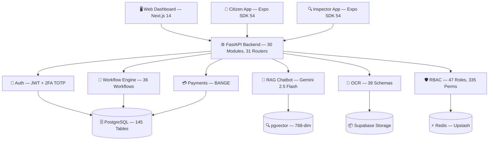
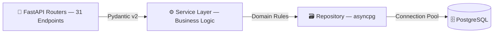
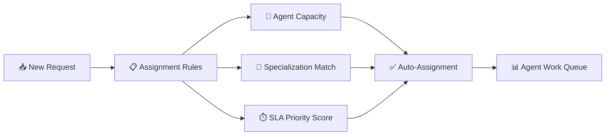
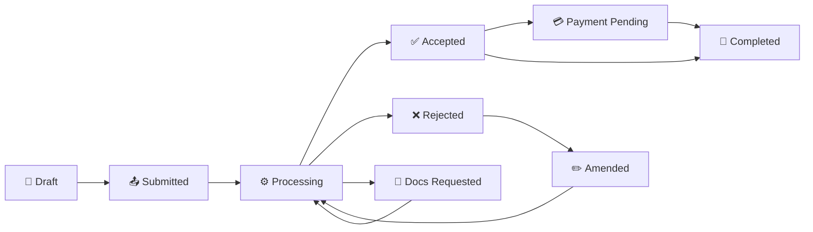
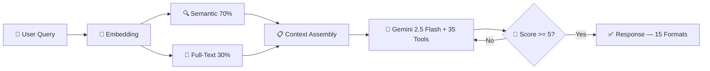
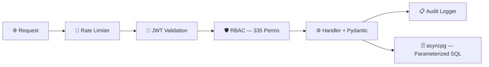

<div align="center">


### Scalable Government Digital Services Framework

**Powering digital transformation for government procedures, workflows, and fiscal services — deployable to any country.**

*Currently deployed for the Republic of Equatorial Guinea.*

---

[](https://github.com/KouemouSah/taxasge/actions/workflows/ci.yml)
[](https://github.com/KouemouSah/taxasge/actions/workflows/deploy-backend-staging.yml)
[](https://github.com/KouemouSah/taxasge/actions/workflows/deploy-frontend-staging.yml)
[](https://github.com/KouemouSah/taxasge/actions/workflows/mobile-build.yml)


</div>

---

## What is Facil?

**Facil** is a full-stack, AI-powered framework for digitizing government administrative procedures. It provides a complete platform — backend API, web dashboard, citizen mobile app, and field inspection app — that any government can configure to manage its own fiscal services, workflows, document processing, and citizen interactions.

The framework is **country-agnostic by design**: workflows, fiscal services, entities, roles, translations, and business rules are all **data-driven and configurable** through the database and admin UI — not hardcoded. Deploying Facil to a new country means configuring its services, entities, and workflows, not rewriting code.

**Current deployment**: Republic of Equatorial Guinea — 873 fiscal services, 21 ministries, 20 government entities, 36 business workflows, trilingual (Spanish, French, English).

---

## Core Capabilities

### Government Workflow Automation Engine

End-to-end digitization of administrative procedures. 36 predefined workflows (passport, residency, driving license, contracts, inspections...) with configurable steps, dynamic form validation, conditional routing, and multi-entity approval chains. Citizens submit requests through guided wizards; government agents process them via role-based dashboards with SLA-driven priority queues, automatic assignment, and real-time workload balancing across 20 government entities.

### AI-Powered Specialized Chatbot Agents

A RAG chatbot powered by Gemini 2.5 Flash with **role-based specialized agents** — each agent has domain-specific tools and access controls respecting strict data confidentiality:

| Agent | Scope | Tools | Confidentiality |
|-------|-------|-------|-----------------|
| Citizen Agent | Public services, fees, procedures | 19 public tools | No access to internal data |
| Authenticated Agent | Personal requests, status tracking | 8 auth tools | Own data only |
| Treasury Agent | Payment validation, revenue analysis | Deep reasoning | Entity-scoped financial data |
| Supervisor Agent | Team performance, anomaly detection | Deep reasoning | Entity-scoped agent metrics |
| Admin Agent | System configuration, audit analysis | Deep reasoning | Full system access with audit trail |

Each agent operates with Chain-of-Thought reasoning (6-step prompt), self-reflection (auto-regeneration if quality score < 5/10), and 15 response formats.

### Document-to-Data Transformation at Scale

Convert physical documents (contracts, invoices, identity papers, government forms, tax declarations) into structured digital data. The OCR pipeline extracts, validates, and structures data from 39+ document schemas using template-based field mapping with bounding box annotation, AI-powered classification, and cross-document validation. Extract structured text from PDFs while preserving layouts.

### Compliance Monitoring & Risk Management

Every agent action, payment validation, document review, and permission change is logged in the audit trail (2,800+ entries). The SchemaValidationEngine enforces document integrity with 70+ JSON rules. RiskAnalyzer runs a 12-step assessment pipeline on every document. All API requests pass through rate limiting, JWT validation, RBAC check (335 permissions), and parameterized SQL — ensuring OWASP compliance at every layer.

### Intelligent Pattern Detection & Data Validation

AI-driven analysis: detect recurring patterns across scanned documents, validate data by cross-referencing multiple sources (OCR extraction vs form input vs database records), and enable enterprise-grade search across the fiscal services catalog (873 services, 21 ministries). Automatic zone resolution with Levenshtein fuzzy matching and commerce type classification for commercial license workflows.

---

## Platform Numbers

| Metric | Value |
|--------|-------|
| Fiscal Services Catalog | 873 (869 active) |
| Government Entities | 20 |
| Business Workflows | 36 predefined |
| Database Tables | 145 |
| Database Enums | 50 |
| Roles | 47 (335 granular permissions) |
| OCR Document Schemas | 39 |
| Languages | 3 (ES, FR, EN — extensible) |
| Backend Modules | 30 |
| Frontend Modules | 41+ |
| Communication Templates | 85 (29 email, 31 SMS, 9 push, 16 in-app) |
| Audit Log Entries | 2,800+ |
| Total Commits | 3,800+ |

---

## Architecture

```
facil/
├── packages/
│   ├── backend/       Python 3.11 / FastAPI / asyncpg — 30 API modules, 31 routers
│   ├── web/           Next.js 14 / React 18 / TypeScript — 41+ modules
│   ├── mobile/        Expo SDK 54 / React Native — Citizen mobile app
│   └── inspector/     Expo SDK 54 / React Native — Field inspection agent app
├── scripts/           Automation (i18n sync, DB migration tools, batch processing)
├── data/              Configurable fiscal data (currently Equatorial Guinea)
├── docs/              GitHub Pages — live project dashboard
├── Documentations/    Technical documentation
└── .github/           6 CI/CD workflows + security scanning
```

### System Architecture



### Backend 3-Tier Architecture



### Technology Stack

| Layer | Technology | Purpose |
|-------|-----------|---------|
| **Backend API** | Python 3.11+ / FastAPI / asyncpg / Pydantic v2 | High-performance async API with strict validation |
| **Frontend** | Next.js 14 / React 18 / TypeScript / Tailwind / Shadcn/UI | Server-side rendered admin & agent dashboards |
| **Citizen App** | Expo SDK 54 / React Native / Paper MD3 | Cross-platform mobile for citizens |
| **Inspector App** | Expo SDK 54 / React Native | Field agent inspections with offline mode |
| **Database** | PostgreSQL 15+ (Supabase) | 145 tables, 50 enums, pgvector embeddings |
| **Cache** | Redis (Upstash) + in-memory HybridCache | Multi-tier caching (5min–1hr TTLs) |
| **AI Engine** | Google Vertex AI — Gemini 2.5 Flash | RAG chatbot, document classification, enrichment |
| **Vector Search** | pgvector (768-dim embeddings) | Hybrid search: 70% semantic + 30% full-text |
| **OCR** | Template-based extraction + Document AI | 39 document schemas, bounding box annotation |
| **Payments** | BANGE (mobile money, card, bank transfer) | Atomic payment processing with pessimistic locking |
| **Auth** | JWT + 2FA TOTP (pyotp) + bcrypt | 30min access tokens, 30-day refresh |
| **Deploy** | Google Cloud Run + Firebase Hosting | Auto-scaling 0–10 instances per service |
| **CI/CD** | 6 GitHub Actions workflows | Automated test, build, deploy pipeline |

---

## Features

### For Citizens
- Browse 873+ fiscal services across 21 government ministries
- Submit service requests through guided multi-step wizards with OCR document upload
- Real-time request tracking with status notifications
- Pay via BANGE mobile money, card, or bank transfer
- AI chatbot assistant: natural language queries about procedures, fees, and requirements
- Trilingual interface (Spanish, French, English)

### For Government Agents (100+ concurrent users)
- Role-based dashboards for 20 government entities (CNEDOGE, DGT, ONRC, Treasury, etc.)
- Agent work queue with SLA-based priority scoring (complexity, amount, deadline)
- Document validation with automated schema checks (70+ JSON rules)
- Workflow state management: submit → review → approve/reject → complete
- Performance metrics, workload monitoring, auto-assignment
- Bundle workflow: multi-entity commercial license inspections with pessimistic locking
- Treasury validation with multi-entity routing (TESORO, AYUNTAMIENTO, CAMARA)

### For Field Inspectors
- QR code scanning for entity seal verification
- On-site document capture with real-time OCR processing
- Offline-capable with automatic cache synchronization
- Supervisor dashboard with real-time agent location and status
- Photo capture with encrypted storage

### For Administrators
- RBAC engine: 47 roles, 335 permissions, per-user overrides with audit trail
- Dynamic menu configuration per role and entity
- Agent management (availability, workload balancing, reassignment)
- Auto-assignment rules based on capacity, specialization, and SLA
- System rules engine: modify business rules without redeployment
- Communication templates: 29 email, 31 SMS, 9 push, 16 in-app notification templates
- Comprehensive audit logging on all critical operations

---

## Agent Intelligence & Data Analytics

### Smart Assignment Engine

Incoming service requests are automatically assigned to the optimal agent based on:



- **Capacity-based**: Real-time workload balancing across 100+ agents, 20 entities
- **Specialization**: Agent-entity-workflow matching (e.g., passport specialist at CNEDOGE)
- **SLA scoring**: Dynamic priority based on complexity, amount, deadline, and escalation level
- **Reassignment**: Automatic redistribution when agents go on leave or become overloaded

### Agent Dashboards with Native Analytics

Each of the 47 roles has a tailored dashboard with embedded data analytics:

| Dashboard | Analytics Features |
|-----------|-------------------|
| **Agent** | Work queue with SLA countdown, document validation stats, decision history, performance metrics |
| **Supervisor** | Team workload heatmap, agent performance comparison, SLA compliance rates, escalation trends |
| **Treasury** | Revenue tracking per entity, payment validation rates, collection analytics, multi-entity reconciliation |
| **Admin** | System-wide KPIs, role usage analytics, audit log analysis, entity performance benchmarks |

### Automated Document Authentication

The platform verifies document authenticity at multiple levels:

- **OCR cross-validation**: Extracted data compared against form input and database records
- **Schema integrity**: 70+ JSON rules per document type enforce required fields, formats, and expiration dates
- **Risk scoring**: 12-step RiskAnalyzer flags anomalies (inconsistent dates, invalid signatures, expired documents)
- **MRZ validation**: ICAO 9303 compliant Machine Readable Zone verification for passports and identity documents
- **Document hash registry**: Detects duplicate submissions and tracks document lineage

### Report Generation

Automated report generation for different profiles:

| Profile | Reports |
|---------|---------|
| **Agent** | Daily work summary, decision audit trail, pending actions |
| **Supervisor** | Weekly team performance, SLA compliance report, workload distribution |
| **Entity Head** | Monthly entity metrics, revenue reports, processing time analytics |
| **Admin** | System health report, security audit summary, user activity analytics |

---

## Workflow Engine

36 predefined business workflows, fully configurable per country deployment:

| Domain | Workflows | Entity |
|--------|-----------|--------|
| Passport Services | NUEVO, RENOVACION, DETERIORO, PERDIDA, ROBO | CNEDOGE |
| Driving License | NUEVO, RENOVACION, EXTENSION, DUPLICADO, CANJE | DGT |
| Residency | PRIMERA_VEZ, RENOVACION | CNEDOGE |
| Contracts | ARRENDAMIENTO, CONCESION, JOINT_VENTURE, OBRA, SERVICIO, SUMINISTRO, OTRO | ONRC |
| Vehicles | PRIMERA_MATRICULACION, TRANSFERENCIA, DUPLICADO_CUVE, + 4 more | DGT / ITV |
| Civil Service | CARNET, CERTIFICADO, PERMISO, PROMOCION, VERIFICACION | MINFP |
| Immigration | PRORROGA_VISADO, VISADO_ALTERNATIVO, PERMANENCIA, SALIDA_VENCIDO | EXTRANJERIA |
| Commercial Inspections | BUNDLE_PAYMENT (multi-entity, multi-obligation) | Multiple entities |

Each workflow defines: required documents, OCR schemas, validation rules, appointment requirements, fee calculation methods, entity routing, and approval chains.

### Workflow State Machine



### Service Request Wizard Flow


---

## Database Schema

**145 tables** across 10 domains, **50 PostgreSQL enums** for type safety:

| Domain | Tables | Description |
|--------|--------|-------------|
| Core Business | 14 | Users, fiscal services, companies, ministries, categories |
| Declarations & Workflow | 12 | Tax declarations (5 detail types), workflow transitions, assignments |
| Service Requests | 8 | Multi-step requests, commercial licenses, license obligations |
| Agents & Workload | 7 | Agent profiles, workloads, priority queues, performance stats |
| Payments | 10 | Polymorphic payments, installments, receipts, bank integrations |
| Documents & OCR | 5 | File storage, OCR queue, extraction results, form templates |
| Auth & RBAC | 9 | Roles, permissions, sessions, audit logs |
| Communications | 9 | Email/SMS/push/notification templates, webhook configs |
| Support | 4 | Tickets, messages, attachments, categories |
| Translations | 3 | Unified translations, entity translations (40% storage optimization) |

---

## AI & Document Intelligence

### RAG Chatbot
- **Model**: Gemini 2.5 Flash (Google Vertex AI)
- **Search**: Hybrid — 70% semantic (pgvector 768-dim) + 30% full-text (tsvector)
- **Tools**: 35 specialized tools (19 public + 8 authenticated + 8 deep reasoning)
- **Reasoning**: Chain-of-Thought with 6-step system prompt, self-reflection (score < 5/10 triggers regeneration)
- **Formats**: 15 autonomous response formats (table, comparison, step-by-step, etc.)
- **Security**: OWASP-hardened — prompt injection detection (30+ patterns), rate limiting, XSS prevention

### RAG Chatbot Pipeline



### OCR Document Intelligence Pipeline


### OCR Capabilities
- **39 document schemas** covering identity documents, contracts, vehicle registrations, tax forms
- **Template-based extraction**: Field coordinates mapped to JSON schemas with bounding box annotation
- **Validation engine**: SchemaValidationEngine (70+ JSON rules) + RiskAnalyzer (12 steps)
- **Layout preservation**: Extracts structured text from PDFs while maintaining spatial relationships
- **AI classification**: Commerce type detection, zone resolution (Levenshtein fuzzy matching), cross-document validation

---

## Getting Started

### Prerequisites
- **Node.js** >= 20.0.0
- **Python** 3.11+
- **PostgreSQL** 15+ (or Supabase account)

### Quick Start

```bash
# Clone
git clone https://github.com/KouemouSah/taxasge.git
cd taxasge

# Frontend
npm install --legacy-peer-deps
cd packages/web && npm run dev

# Backend
cd packages/backend
pip install -r requirements.txt
uvicorn app.main:app --reload --port 8000

# Mobile (citizen app)
cd packages/mobile
npm install && npx expo start

# Inspector (field agent app)
cd packages/inspector
npm install && npx expo start
```

### Environment Configuration

Backend requires `packages/backend/.env`:

| Variable | Description |
|----------|-------------|
| `DATABASE_URL` | PostgreSQL connection string |
| `JWT_SECRET_KEY` | JWT signing key |
| `SUPABASE_URL` | Supabase project URL |
| `SUPABASE_ANON_KEY` | Supabase anonymous key |
| `GEMINI_API_KEY` | Google Vertex AI API key |
| `REDIS_URL` | Upstash Redis TLS connection |
| `SMTP_HOST` | Email server |

---

## CI/CD Pipeline

6 active GitHub Actions workflows:

| Workflow | Trigger | Purpose |
|----------|---------|---------|
| **CI Tests** | Push/PR to develop, main, feature/* | Backend pytest + frontend lint, typecheck, build, i18n parity |
| **Deploy Backend** | Push to develop | Docker build + Cloud Run deployment |
| **Deploy Frontend** | Push to develop | Next.js build + Cloud Run deployment |
| **Mobile CI/CD** | Push to develop/main, version tags | APK + AAB build with signing and verification |
| **Inspector Build** | Push to develop/main, inspector tags | Inspector APK build with 6-point integrity check |
| **Inspector CI** | Push/PR | TypeScript + ESLint gate |

**Deployment targets**:
- Backend: Google Cloud Run (`us-central1`, auto-scaling 0–10 instances, 2GB RAM)
- Frontend: Google Cloud Run (`us-central1`, custom domain)
- Mobile (Citizen): APK/AAB via GitHub Releases + Expo.dev (shareable beta links for testers)
- Mobile (Inspector): APK via GitHub Releases + Expo.dev
- Pages: GitHub Pages at [kouemousah.github.io/taxasge](https://kouemousah.github.io/taxasge/)

> **Rule**: No manual `gcloud` builds. All deployments trigger via GitHub Actions on push to `develop`.

---

## Security



| Measure | Implementation |
|---------|---------------|
| Authentication | JWT (30min access + 30-day refresh) + 2FA TOTP |
| Authorization | 47 roles, 335 permissions, per-user overrides |
| Password Storage | bcrypt (12 rounds) |
| SQL Injection | Parameterized queries (asyncpg `$1, $2`) |
| XSS Prevention | DOMPurify + CSP headers |
| Rate Limiting | Per-IP and per-user on sensitive endpoints |
| File Security | MIME magic byte validation, extension blacklist |
| Document URLs | Firebase signed URLs (15-minute expiration) |
| Audit Trail | Full logging on permissions, payments, agent actions |
| AI Security | Prompt injection detection (30+ unicode patterns) |

For vulnerability reporting, see [SECURITY.md](SECURITY.md).

---

## Project Status

| Phase | Status | Progress |
|-------|--------|----------|
| Infrastructure & CI/CD | Completed | 100% |
| Core Backend API (30 modules) | Completed | 100% |
| Frontend Dashboards (41+ modules) | Completed | 95% |
| AI Chatbot (Gemini 2.5 Flash + RAG) | Completed | 90% |
| OCR & Document Intelligence | Completed | 90% |
| Mobile Citizen App (Expo SDK 54) | In Progress | 85% |
| Inspector Field App | In Progress | 80% |
| Bundle Workflow & Inspections | In Progress | 75% |
| Testing & Quality Assurance | In Progress | 30% |
| Production Release v1.0 | Planned | 10% |

---

## Scalability Design

Facil is designed to serve **millions of citizens** and **100+ concurrent government agents**:

- **Async architecture**: FastAPI + asyncpg connection pooling
- **Multi-tier caching**: Redis (Upstash) + in-memory fallback with configurable TTLs
- **Pessimistic locking**: `SELECT ... FOR UPDATE` with transaction-scoped timeouts for payment processing
- **Auto-scaling**: Cloud Run 0–10 instances per service, 80 concurrent requests per instance
- **Priority queues**: Agent work queue with dynamic scoring (SLA, amount, complexity)
- **Background processing**: OCR queue with retry/fallback, async embedding generation

---

## Documentation

| Resource | Link |
|----------|------|
| Project Dashboard | [kouemousah.github.io/taxasge](https://kouemousah.github.io/taxasge/) |
| API Documentation | [Swagger UI](https://taxasge-backend-staging-392159428433.us-central1.run.app/docs) (31 routers) |
| Technical Docs | [Documentations/](Documentations/) |
| Wiki | [github.com/KouemouSah/taxasge/wiki](https://github.com/KouemouSah/taxasge/wiki) |
| Contributing | [CONTRIBUTING.md](CONTRIBUTING.md) |
| Security Policy | [SECURITY.md](SECURITY.md) |

---

## Author

<table>
<tr>
<td width="120" align="center">

</td>
<td>

**KOUEMOU SAH Jean Emac**

Full-Stack Developer | AI Solutions Architect | Digital Transformation Consultant

Building and deploying AI-powered enterprise solutions:

| Domain | Capabilities |
|--------|-------------|
| **Business Workflow Automation** | Designing and implementing end-to-end digital workflows that replace manual administrative processes, from citizen request intake to multi-level government approval chains |
| **Custom AI Agent Development** | Building specialized AI agents tailored to business needs — domain-specific tools, role-based access, confidentiality controls, and self-improving reasoning chains |
| **Document Intelligence at Scale** | OCR pipelines transforming physical documents into structured data — template-based extraction, AI classification, cross-validation, and compliance verification |
| **Digital Transformation Leadership** | Leading organizations through digital adoption — process analysis, technology selection, phased implementation, change management, and stakeholder alignment |
| **AI Model Deployment** | Training, fine-tuning, and deploying AI models across environments (cloud, edge, on-premise) — RAG systems, embedding pipelines, and production monitoring |
| **Team Training & Enablement** | Upskilling teams on AI agent creation, prompt engineering, workflow automation tools, and data-driven decision making |
| **Compliance & Risk Management** | Automated audit trails, document authentication, risk scoring, sensitive data handling, and regulatory compliance frameworks |

Email: kouemou.sah@gmail.com | GitHub: [@KouemouSah](https://github.com/KouemouSah)

</td>
</tr>
</table>

---

## License

This project is **proprietary software**. Copyright (c) 2025-2026 KOUEMOU SAH Jean Emac. All rights reserved.

Source code is publicly visible for transparency, educational reference, and government audit purposes only. No license is granted for use, modification, or distribution without prior written authorization.

See [LICENSE](LICENSE) for full terms.

---

<div align="center">

**Facil** — Scalable Government Digital Services Framework

Currently powering digital transformation for the **Republic of Equatorial Guinea**

*Desarrollado para la Republica de Guinea Ecuatorial*
*Developpe pour la Republique de Guinee Equatoriale*

</div>
