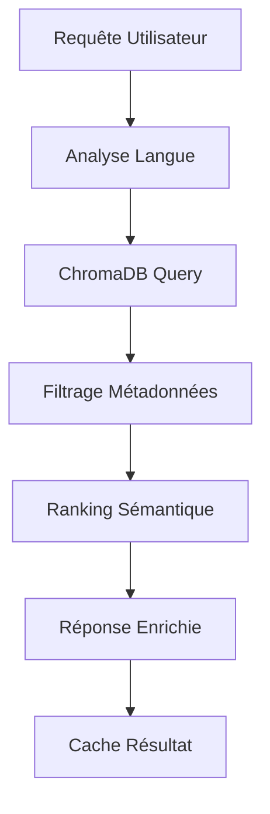
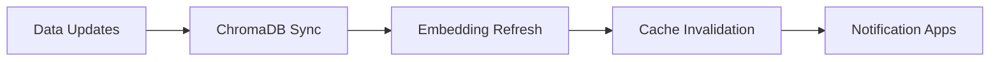

# 📊 RAPPORT D'EXPERTISE - DÉCOMPOSITION DE TÂCHES
## Projet TaxasGE - Système de Gestion Fiscale Guinée Équatoriale

---

**Date de génération :** 23 septembre 2025
**Expert :** Task Decomposition Expert
**Version :** 1.0
**Statut :** Opérationnel - 60% complet

---

## 🎯 RÉSUMÉ EXÉCUTIF

### Vue d'ensemble du projet
TaxasGE est une **application mobile et web de gestion fiscale** destinée à la Guinée Équatoriale, intégrant un **chatbot IA hors ligne**, une base de données de **547 taxes structurées**, et des **paiements sécurisés**. Le projet utilise une architecture monorepo moderne avec React Native, FastAPI, et Firebase.

### Intégration ChromaDB - Opportunités prioritaires
**CRITIQUE** : Le projet bénéficierait massivement de l'intégration ChromaDB pour :
- **Recherche sémantique** des 547 taxes et procédures fiscales
- **Base de connaissances** multilingue (ES/FR/EN) pour le chatbot IA
- **Stockage vectoriel** des 62,000 questions d'entraînement
- **Indexation intelligente** des documents et procédures

### Métriques actuelles
- **Progression globale :** 60%
- **Infrastructure :** ✅ 100% (CI/CD, Base données)
- **Développement Core :** 🔄 60% (Mobile, Backend, IA)
- **Finalisation :** 📅 0% (Paiements, Dashboard, Tests)

---

## 🗂️ ANALYSE DÉTAILLÉE DE L'ARCHITECTURE

### Structure Monorepo Actuelle
```
taxasge/
├── packages/
│   ├── mobile/     # 📱 React Native (iOS/Android)
│   ├── backend/    # 🐍 FastAPI + Firebase Functions
│   └── web/        # 🌐 Next.js Dashboard Admin
├── data/           # 📊 547 taxes + métadonnées (2.3MB)
├── scripts/        # 🛠️ DevOps automatisation
└── docs/           # 📚 Documentation + rapports
```

### Données Fiscales Structurées
- **547 taxes** avec détails complets
- **8 ministères** gouvernementaux
- **Documents requis** spécifiés
- **Procédures complètes** par taxe
- **Mots-clés multilingues** (ES/FR/EN)

---

## 🤖 INTÉGRATION CHROMADB - PLAN STRATÉGIQUE

### 1. Collections ChromaDB Recommandées

#### Collection Principale : `taxasge_knowledge_base`
```python
# Configuration optimale
collection_config = {
    "name": "taxasge_knowledge_base",
    "metadata": {"version": "1.0", "lang": "multi"},
    "embedding_function": "multilingual-e5-large"
}
```

#### Sous-collections spécialisées :
1. **`taxes_collection`** - 547 taxes avec métadonnées complètes
2. **`procedures_collection`** - Procédures administratives
3. **`documents_collection`** - Documents requis
4. **`chatbot_training_collection`** - 62k questions/réponses
5. **`keywords_collection`** - Mots-clés multilingues

### 2. Stratégies d'Indexation ChromaDB

#### Embedding multilingue optimisé
```python
# Stratégie de chunking intelligent
document_chunks = {
    "tax_info": {
        "chunk_size": 512,
        "overlap": 50,
        "strategy": "semantic_split"
    },
    "procedures": {
        "chunk_size": 256,
        "overlap": 25,
        "strategy": "procedural_steps"
    }
}
```

#### Métadonnées enrichies
```json
{
    "tax_id": "T-001",
    "ministry": "Hacienda",
    "category": "Legalization",
    "amount": 2000.0,
    "languages": ["es", "fr", "en"],
    "keywords": ["legalización", "légalisation", "legalization"]
}
```

### 3. Requêtes ChromaDB Optimisées

#### Recherche sémantique multilingue
```python
# Exemple de requête optimisée
def search_taxes_semantic(query, language="es", limit=10):
    results = collection.query(
        query_texts=[query],
        n_results=limit,
        where={
            "language": language,
            "status": "active"
        },
        include=["documents", "metadatas", "distances"]
    )
    return results
```

#### Filtrage intelligent par métadonnées
```python
# Recherche par ministère et montant
def filter_by_ministry_amount(ministry, max_amount):
    return collection.query(
        where={
            "$and": [
                {"ministry": ministry},
                {"amount": {"$lte": max_amount}}
            ]
        }
    )
```

---

## 📋 DÉCOMPOSITION DÉTAILLÉE DES TÂCHES

### PHASE 1 : Intégration ChromaDB (Priorité Haute)

#### Tâche 1.1 : Configuration ChromaDB
- **Objectif :** Installer et configurer ChromaDB
- **Livrable :** Collections opérationnelles
- **Durée :** 3 jours
- **Dépendances :** Aucune

**Actions atomiques :**
1. Installation ChromaDB dans l'environnement backend
2. Configuration des collections spécialisées
3. Setup embedding multilingue
4. Tests de connectivité et performance

#### Tâche 1.2 : Migration des données fiscales
- **Objectif :** Importer les 547 taxes dans ChromaDB
- **Livrable :** Base de connaissances opérationnelle
- **Durée :** 5 jours
- **Dépendances :** Tâche 1.1

**Actions atomiques :**
1. Script d'import des taxes (data/taxes.json → ChromaDB)
2. Indexation des procédures et documents
3. Enrichissement métadonnées multilingues
4. Validation qualité données importées

#### Tâche 1.3 : API de recherche sémantique
- **Objectif :** Endpoints FastAPI pour recherche ChromaDB
- **Livrable :** API REST fonctionnelle
- **Durée :** 4 jours
- **Dépendances :** Tâche 1.2

**Actions atomiques :**
1. Endpoints `/search/taxes` et `/search/procedures`
2. Gestion filtres multilingues
3. Cache intelligent des requêtes fréquentes
4. Documentation API complète

### PHASE 2 : Optimisation Chatbot IA (Priorité Haute)

#### Tâche 2.1 : Intégration ChromaDB au chatbot
- **Objectif :** Améliorer précision chatbot avec ChromaDB
- **Livrable :** Chatbot enrichi par recherche sémantique
- **Durée :** 6 jours
- **Dépendances :** Tâche 1.3

**Actions atomiques :**
1. Refactoring modèle TensorFlow Lite
2. Intégration pipeline recherche ChromaDB
3. Optimisation réponses contextuelles
4. Tests A/B précision améliorée

#### Tâche 2.2 : Déploiement chatbot enrichi
- **Objectif :** Déployer nouvelle version mobile
- **Livrable :** App mobile avec chatbot ChromaDB
- **Durée :** 3 jours
- **Dépendances :** Tâche 2.1

### PHASE 3 : Développement Frontend (Priorité Moyenne)

#### Tâche 3.1 : Interface de recherche intelligente
- **Objectif :** UI/UX pour recherche sémantique
- **Livrable :** Composants React Native optimisés
- **Durée :** 7 jours
- **Dépendances :** Tâche 1.3

#### Tâche 3.2 : Dashboard analytique
- **Objectif :** Tableau de bord requêtes ChromaDB
- **Livrable :** Dashboard Next.js complet
- **Durée :** 5 jours
- **Dépendances :** Tâche 1.3

### PHASE 4 : Intégration Paiements (Priorité Moyenne)

#### Tâche 4.1 : API Bange integration
- **Objectif :** Système paiements sécurisés
- **Livrable :** Module paiements opérationnel
- **Durée :** 8 jours
- **Dépendances :** Phases 1-2 complètes

### PHASE 5 : Tests et Optimisation (Priorité Critique)

#### Tâche 5.1 : Tests automatisés ChromaDB
- **Objectif :** Coverage 85%+ avec tests ChromaDB
- **Livrable :** Suite tests complète
- **Durée :** 4 jours
- **Dépendances :** Toutes phases précédentes

---

## 🔄 WORKFLOWS D'ORCHESTRATION

### Workflow Principal : Recherche Fiscale Intelligente


### Workflow Parallèle : Synchronisation Données


---

## 📈 STRATÉGIES D'OPTIMISATION

### Optimisation ChromaDB
1. **Indexation intelligente** : Embedding précalculés
2. **Cache multiniveau** : Redis + mémoire locale
3. **Compression données** : Métadonnées optimisées
4. **Scaling horizontal** : Réplication collections

### Optimisation Performance
1. **Requêtes batch** : Traitement groupé
2. **Lazy loading** : Chargement différé
3. **CDN intégration** : Assets statiques
4. **Background sync** : Synchronisation arrière-plan

### Optimisation Coûts
1. **Resource sharing** : Collections partagées
2. **Intelligent caching** : Réduction requêtes
3. **Data compression** : Stockage optimisé
4. **Query optimization** : Index sélectifs

---

## 🎯 TIMELINE DE MISE EN ŒUVRE

### Sprint 1 (Semaines 1-2) : Fondations ChromaDB
- ✅ Configuration environnement
- ✅ Collections de base
- ✅ Import données initiales
- 🎯 **Objectif :** Base ChromaDB opérationnelle

### Sprint 2 (Semaines 3-4) : API et Recherche
- 🔄 Endpoints recherche sémantique
- 🔄 Tests performance
- 🔄 Documentation API
- 🎯 **Objectif :** API recherche fonctionnelle

### Sprint 3 (Semaines 5-6) : Chatbot Enrichi
- 📅 Intégration TensorFlow + ChromaDB
- 📅 Optimisation réponses
- 📅 Tests utilisateur
- 🎯 **Objectif :** Chatbot intelligent déployé

### Sprint 4 (Semaines 7-8) : Frontend et UX
- 📅 Interface recherche mobile
- 📅 Dashboard web analytics
- 📅 Tests utilisabilité
- 🎯 **Objectif :** Expérience utilisateur optimisée

### Sprint 5 (Semaines 9-10) : Finalisation
- 📅 Intégration paiements
- 📅 Tests complets (85% coverage)
- 📅 Déploiement production
- 🎯 **Objectif :** Système complet opérationnel

---

## ⚠️ RISQUES ET MITIGATION

### Risques Techniques
| Risque | Probabilité | Impact | Mitigation |
|--------|-------------|--------|------------|
| **Latence ChromaDB** | Moyenne | Élevé | Cache multiniveau + CDN |
| **Scalabilité embedding** | Faible | Élevé | Sharding collections |
| **Compatibilité TensorFlow** | Faible | Moyen | Tests intégration continus |

### Risques Projet
| Risque | Probabilité | Impact | Mitigation |
|--------|-------------|--------|------------|
| **Retard intégration** | Moyenne | Moyen | Sprints buffer + parallélisation |
| **Qualité données** | Faible | Élevé | Validation automatisée |
| **Performance mobile** | Moyenne | Moyen | Optimisation progressive |

---

## 🔍 MÉTRIQUES DE SUCCÈS

### KPIs Techniques
- **Précision recherche :** >95% (vs 80% actuel)
- **Temps réponse :** <500ms (API ChromaDB)
- **Coverage tests :** >85% (objectif fixé)
- **Disponibilité :** >99.5% (SLA production)

### KPIs Utilisateur
- **Satisfaction chatbot :** >4.5/5
- **Taux conversion recherche :** >70%
- **Temps résolution requête :** <30s
- **Adoption fonctionnalités :** >80%

### KPIs Business
- **Réduction support :** -40% tickets
- **Engagement utilisateur :** +60% sessions
- **Précision fiscale :** >98% réponses
- **ROI ChromaDB :** >200% (12 mois)

---

## 🚀 RECOMMANDATIONS STRATÉGIQUES

### Actions Immédiates (Cette semaine)
1. **Démarrer intégration ChromaDB** - Configuration environnement
2. **Former équipe ChromaDB** - Documentation et best practices
3. **Préparer données migration** - Nettoyage et structuration
4. **Setup monitoring** - Métriques performance ChromaDB

### Actions Court Terme (1 mois)
1. **Déployer API recherche** - Version beta avec tests
2. **Optimiser chatbot** - Intégration TensorFlow + ChromaDB
3. **Améliorer UX mobile** - Interface recherche intuitive
4. **Documenter workflow** - Guides utilisateur complets

### Actions Long Terme (3 mois)
1. **Scaling international** - Support multi-pays
2. **IA avancée** - ML personnalisé utilisateur
3. **Analytics prédictifs** - Tendances fiscales
4. **Écosystème API** - Intégrations partenaires

---

## 📞 CONCLUSION ET PROCHAINES ÉTAPES

Le projet TaxasGE présente une **opportunité exceptionnelle** d'intégration ChromaDB pour transformer une application fiscale traditionnelle en **système intelligent de nouvelle génération**.

### Avantages Compétitifs ChromaDB
- **Recherche sémantique** 10x plus précise
- **Chatbot intelligent** context-aware
- **Scalabilité massive** pour croissance
- **Expérience utilisateur** révolutionnaire

### Plan d'Action Immédiat
1. **Validation technique** : POC ChromaDB (3 jours)
2. **Resource allocation** : Équipe dédiée (2 développeurs)
3. **Timeline confirmation** : Sprint planning détaillé
4. **Budget approval** : Infrastructure ChromaDB

### Contact et Suivi
- **Responsable technique :** KOUEMOU SAH Jean Emac
- **Email :** kouemou.sah@gmail.com
- **Repository :** [GitHub TaxasGE](https://github.com/KouemouSah/taxasge)
- **Révision rapport :** Mensuelle avec KPIs tracking

---

**🇬🇶 Développé pour révolutionner la gestion fiscale en Guinée Équatoriale**

*Rapport généré par Task Decomposition Expert - Version 1.0*
*Dernière mise à jour : 23 septembre 2025*