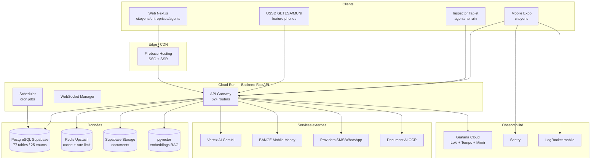
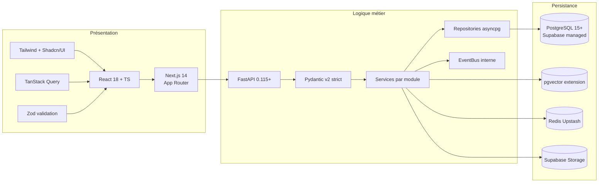
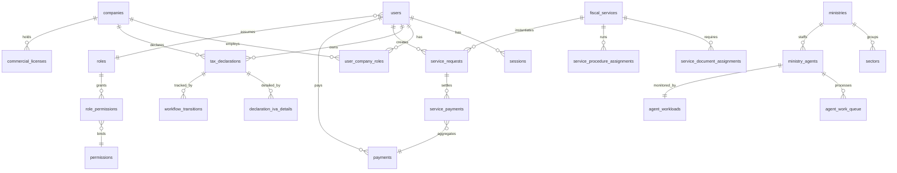
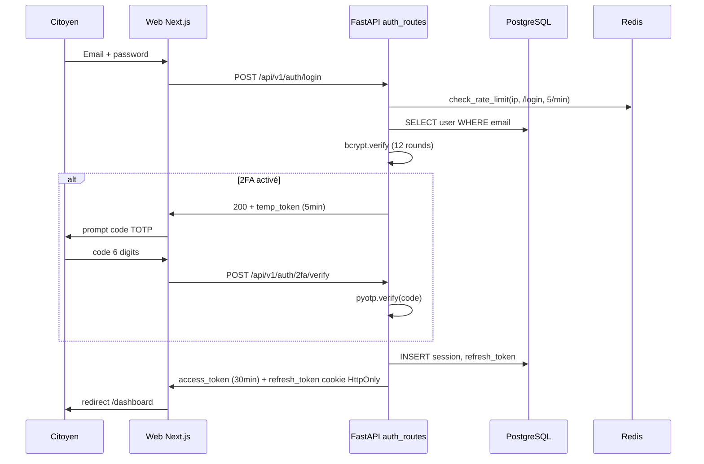
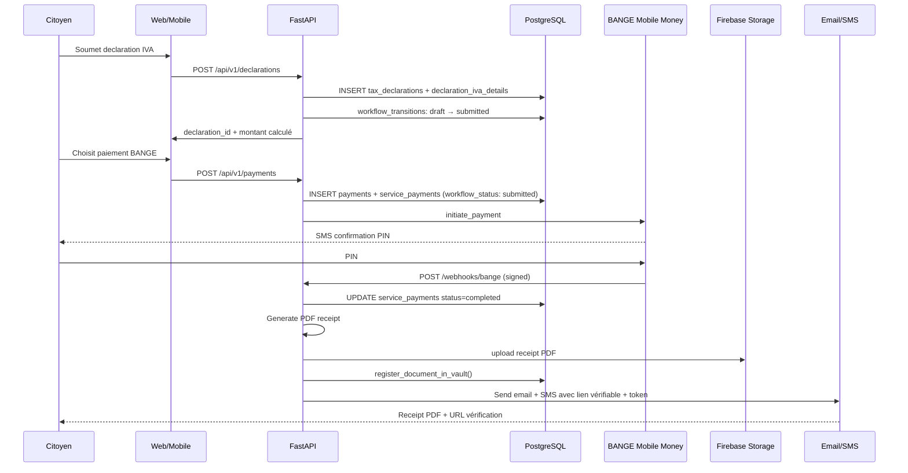
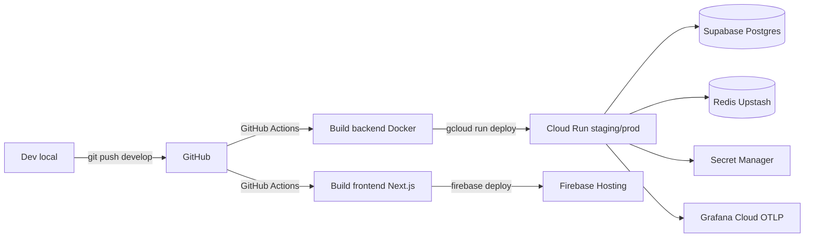

# Facil — Présentation Technique

> **Audience** : CTO, architectes solution, ingénieurs senior, équipes infra/DevOps de bailleurs et administrations.
> **Statut produit** : MVP avancé pre-launch, dev solo, code production-ready, pas de déploiement public massif.
> **Version** : 1.0 — 2026-05-11

---

## Table des matières

1. [Vue d'ensemble](#1-vue-densemble)
2. [Architecture 3-tiers détaillée](#2-architecture-3-tiers-détaillée)
3. [Modules backend](#3-modules-backend)
4. [Modules frontend](#4-modules-frontend)
5. [Base de données](#5-base-de-données)
6. [Patterns clés](#6-patterns-clés)
7. [Authentification et sécurité](#7-authentification-et-sécurité)
8. [Intelligence artificielle](#8-intelligence-artificielle)
9. [Paiements multi-canal](#9-paiements-multi-canal)
10. [Observabilité production](#10-observabilité-production)
11. [Déploiement et CI/CD](#11-déploiement-et-cicd)
12. [Scalabilité](#12-scalabilité)
13. [Mobile](#13-mobile)
14. [Statut technique actuel honnête](#14-statut-technique-actuel-honnête)
15. [Roadmap technique 12-24 mois](#15-roadmap-technique-12-24-mois)
16. [Limites actuelles](#16-limites-actuelles)

---

## 1. Vue d'ensemble

### 1.1 Pitch technique en une phrase

Facil est une plateforme de transformation digitale fiscale construite sur un monorepo Python/FastAPI + Next.js + React Native, qui catalogue 850+ services fiscaux, orchestre 28+ types de déclarations, encaisse via mobile money / USSD / cartes, et embarque un chatbot RAG Gemini, le tout instrumenté de bout en bout sur Grafana Cloud.

### 1.2 Caractéristiques techniques saillantes

| Dimension | Choix |
|---|---|
| Architecture | 3-tiers strict, modulaire, monorepo |
| Backend | FastAPI 0.115+ / asyncpg / PostgreSQL (Supabase) / Pydantic v2 strict |
| Frontend | Next.js 14 App Router / React 18 / TypeScript / Tailwind / Shadcn/UI |
| Mobile | Expo 54 / React Native 0.81 / EAS Build |
| AI | Vertex AI Gemini 2.0 Flash + pgvector RAG |
| Cache | Hybride Redis Upstash (TLS) + fallback in-memory |
| Auth | JWT (access 30min, refresh 30j) + 2FA TOTP + RBAC 50+ permissions |
| Observabilité | Grafana Cloud (Loki logs + Tempo traces + Mimir metrics) + AI Observability + Security Observability |
| Déploiement | Cloud Run (backend) + Firebase Hosting (frontend) + GitHub Actions CI/CD |
| Concurrence | Pessimistic locking PostgreSQL, dimensionné 100+ agents simultanés |

### 1.3 Schéma haut niveau



---

## 2. Architecture 3-tiers détaillée

### 2.1 Principes directeurs

1. **Séparation stricte API / Service / Repository** — chaque module backend respecte le pattern `api → service → repository → asyncpg`.
2. **Source de vérité unique = base de données** — aucune duplication d'enum entre code et DB ; les migrations SQL sont la source.
3. **Async first** — toute I/O passe par asyncio (asyncpg, httpx, aioredis).
4. **Type-safe end-to-end** — Pydantic v2 strict côté backend, Zod + TypeScript côté front, `openapi-typescript` pour générer les types client depuis le schéma OpenAPI live.
5. **Cache hybride** — Redis Upstash pour partage cross-instance + fallback mémoire pour résilience.
6. **Observabilité dès la conception** — chaque appel IA, chaque requête HTTP, chaque cron est tracé.

### 2.2 Stack par tier



### 2.3 Layout du monorepo

```
C:\taxasge\
├── packages/
│   ├── backend/         # FastAPI + asyncpg
│   │   ├── app/
│   │   │   ├── main.py              # Entry — 60+ routers enregistrés
│   │   │   ├── config.py            # Pydantic Settings
│   │   │   ├── core/                # cache, errors, secrets, telemetry
│   │   │   ├── database/            # connection pool asyncpg
│   │   │   └── modules/             # 35+ modules métier
│   │   ├── database/migrations/     # SQL versionnées (source of truth)
│   │   └── requirements.txt
│   ├── web/             # Next.js 14
│   │   ├── src/
│   │   │   ├── app/[locale]/        # App Router i18n (es/fr/en)
│   │   │   ├── modules/             # 38+ modules feature
│   │   │   ├── components/ui/       # Shadcn/UI
│   │   │   ├── core/api/            # client Axios + interceptors
│   │   │   └── i18n/messages/       # Translations
│   │   └── next.config.mjs
│   └── mobile/          # Expo 54 / React Native 0.81
│       ├── app/                     # Expo Router
│       ├── src/                     # Modules, hooks, services
│       └── eas.json                 # Profils dev / preview / production
├── deploy/              # Wizard Facil Framework (init.py)
├── docs/                # Manuel utilisateur HTML
└── Documentations/      # Marketing + master positioning
```

---

## 3. Modules backend

> **Vérification effectuée** : `Glob packages/backend/app/modules/*/api/*.py` retourne 35 répertoires de modules réels. CLAUDE.md mentionnait 18 modules « principaux » — la liste réelle est plus large car certains modules ont été ajoutés (ex. `inspections`, `dashboards`, `legal`, `funcionario`, `verified_identifiers`, `entity_locations`, `cities`, `enrichment`, `batch_requests`, `companies`, `service_requests`, `agents`, `assignment`, `accountant`, `menu_config`, `homepage`, `user_documents`, `permissions`, `support`).

### 3.1 Modules cœur métier

| Module | Routers principaux | Responsabilités |
|---|---|---|
| **auth** | `auth_routes.py`, `two_factor_routes.py` | Login/logout, JWT issue/refresh, 2FA TOTP enrôlement et vérif, gestion sessions, refresh cookies HttpOnly |
| **users** | `user_routes.py` | CRUD profil citoyen / entreprise / comptable, audit logs utilisateur |
| **fiscal_services** | `fiscal_service_routes.py`, `bundle_routes.py`, `bundle_workflow_routes.py`, `license_routes.py`, `oms_agent_routes.py`, `template_routes.py`, `config_rules_routes.py` | Catalogue 850+ services fiscaux, bundles (panier multi-services), licences commerciales, règles de calcul tarifaire dynamiques |
| **declarations** | `declaration_routes.py`, `accountant_batch_routes.py` | 28+ types de déclarations (IVA, IRPF, retenciones, petroliferos, etc.), batch comptable, corrections/amendements |
| **payments** | `payment_routes.py`, `verify_routes.py` | BANGE Mobile Money, cartes, virements, USSD, payment plans + installments, vérification publique reçus |
| **service_requests** | `routes.py`, `agent_routes.py`, `admin_routes.py`, `wizard_session_routes.py`, `appointment_routes.py`, `cron_routes.py` | Demandes de services unitaires, file agent, wizard sessions persistantes, prise de RDV, jobs cron |

### 3.2 Modules workflow et agents

| Module | Routers | Rôle |
|---|---|---|
| **agents** | `profile_routes.py`, `analyst_routes.py` | Profils agents ministère/CNEDOGE/DGT/extranjería, agent_workloads, file de travail dynamique |
| **assignment** | `assignment_routes.py`, `supervisor_routes.py`, `statistics_routes.py` | Auto-assignement par règles (`assignment_rules`), supervision, statistiques de productivité |
| **inspections** | `inspection_routes.py`, `mission_routes.py`, `analytics_routes.py`, `filter_export_routes.py` | Inspections terrain (commercial licences), missions, encaissement field payment, analytics |
| **funcionario** | `verificacion_routes.py` | Vérification publique de documents par funcionario |
| **accountant** | `accountant_routes.py` | Tableau de bord comptable, suivi échéances déclarations clients |

### 3.3 Modules données et catalogue

| Module | Routers | Rôle |
|---|---|---|
| **companies** | `company_routes.py`, `company_classification_routes.py`, `company_dashboard_routes.py`, `company_ministry_routes.py`, `company_public_routes.py`, `company_cron_routes.py` | CRUD entreprises, classification automatique, dashboard, annuaire public |
| **entity_locations** | `entity_location_routes.py` | Localisations physiques des ministères et délégations |
| **cities** | `city_routes.py` | Référentiel villes/régions Guinée Équatoriale |
| **verified_identifiers** | `verified_identifiers_routes.py` | NIF, NIA, Passeport — résolution et vérification croisée |
| **enrichment** | `enrichment_routes.py` | Enrichissement automatique de données (OCR, reconciliation) |
| **batch_requests** | `batch_routes.py` | Import en masse Excel (`import_batches`) |

### 3.4 Modules transverses

| Module | Routers | Rôle |
|---|---|---|
| **chatbot** | `chatbot_routes.py` | RAG sur services fiscaux + Gemini Flash, sessions persistantes |
| **documents** | `document_routes.py` | Upload, OCR async queue, document_templates, validity duration |
| **user_documents** | `user_documents_routes.py` | Documents personnels du citoyen avec coffre |
| **communications** | `communication_routes.py`, `email_templates_routes.py`, `sms_templates_routes.py`, `push_templates_routes.py`, `notification_templates_routes.py`, `provider_settings_routes.py`, `webhook_routes.py`, `ussd_routes.py` | Multi-canal SMS/Email/Push/WhatsApp/USSD avec templates multilingues et providers configurables |
| **support** | `support_routes.py` | Tickets utilisateurs avec messages, attachments, catégories multilingues |
| **translations** | `translation_routes.py`, `entity_translation_routes.py`, `frontend_translation_routes.py`, `enum_routes.py` | Traductions unifiées (UI, enums, entités, formulaires) ES/FR/EN |
| **menu_config** | `menu_config_routes.py` | Génération dynamique de menus selon rôle / workflow / overrides agent |
| **permissions** | `permission_routes.py`, `role_routes.py`, `user_permission_routes.py` | RBAC complet, overrides par utilisateur, audit log |
| **admin** | `admin_routes.py`, `audit_routes.py`, `monitoring_routes.py`, `user_management_routes.py` | Diagnostics, audit logs lecture, monitoring système, gestion users |
| **dashboards** | `dashboards_routes.py` | Dashboards multi-rôles (live queries + Redis cache 60s, MV en backup) |
| **legal** | `legal_routes.py` | Pages légales (CGU, confidentialité, suppression compte) |
| **homepage** | `homepage_routes.py` | Données homepage publique |
| **webhooks** | `webhook_routes.py` | Webhooks entrants (BANGE, providers SMS, etc.) avec audit dans `webhook_logs` |
| **chatbot** | (cf. supra) | Endpoints RAG |

### 3.5 Modules core (transverses techniques)

`packages/backend/app/core/` contient les briques transverses :
- `cache.py` — HybridCache (Redis + memory fallback) + rate limiting
- `errors.py` — TranslatedException + ErrorCode catalogue
- `secrets.py` — Google Secret Manager wrapper
- `events.py` — EventBus interne pour publication d'événements
- `scheduler.py` — Enregistrement et orchestration cron jobs
- `ai_telemetry.py` — Wrapper Gemini avec OTLP, BD, normalisation modèle
- `ai_security.py` — Détection prompt injection (14 patterns multilingues)
- `request_telemetry_middleware.py` — Pure ASGI middleware sampling adaptatif
- `geoip.py`, `user_agent_parser.py` — Enrichissement requêtes
- `circuit_breaker.py` — Pour Vertex AI et providers externes
- `idempotency.py` — Clés d'idempotence sur endpoints sensibles (paiements)
- `ws_manager.py`, `ws_routes.py` — WebSocket pour notifications temps réel

---

## 4. Modules frontend

> **Vérification effectuée** : `Glob packages/web/src/modules/*/index.ts` retourne 38 modules. CLAUDE.md en mentionnait 26 — la différence vient d'ajouts récents (`bundle-workflow`, `agent-dashboard`, `agents-admin`, `assignments-admin`, `audit-logs-admin`, `dashboards-admin`, `entity-locations`, `cities`, `funcionario`, `roles-admin`, `service-requests`, `service-requests-admin`, `treasury`, `user-documents`, `user-permissions-admin`, `verified-identifiers`).

### 4.1 Architecture App Router Next.js

```
packages/web/src/app/
└── [locale]/                    # i18n: es (défaut) / fr / en
    ├── (auth)/                  # Route group : login, register, 2FA, reset password
    ├── (dashboard)/             # Protégé : dashboard citoyen / agent / admin
    ├── (public)/                # Pages publiques : home, services, vérification reçu
    └── api/                     # API routes Next (proxy ou Edge)
```

### 4.2 Pattern module type

Chaque module front respecte la structure :
```
modules/<module>/
├── components/    # Composants React Shadcn-based
├── hooks/         # React Query hooks (useFiscalServices, useDeclarations…)
├── services/      # Wrappers axios (typés via openapi-typescript)
├── types/         # Types TS (souvent générés depuis OpenAPI)
├── utils/         # Helpers domaine
└── index.ts       # Barrel export
```

### 4.3 Inventaire (38 modules)

**Cœur métier** : `homepage`, `fiscal-services`, `declarations`, `payments`, `service-requests`, `bundle-workflow`, `documents`, `user-documents`

**Auth & utilisateurs** : `auth`, `users`, `verified-identifiers`

**Agents & assignement** : `agents`, `agent-dashboard`, `assignment`, `accountant`, `funcionario`

**Entreprises** : `companies`, `entity-locations`, `cities`

**Transverses** : `chatbot`, `communications`, `support`, `translations`, `webhooks`

**Admin** : `admin`, `users-admin`, `agents-admin`, `assignments-admin`, `audit-logs-admin`, `dashboards-admin`, `permissions`, `permissions-admin`, `roles-admin`, `service-requests-admin`, `user-permissions-admin`, `templates`

**Spécialisés** : `treasury` (vue Trésor public), `dashboard` (citoyen)

### 4.4 Stack frontend détaillée

| Brique | Choix |
|---|---|
| Framework | Next.js 14 (App Router, RSC partiel) |
| UI | Shadcn/UI (Radix + Tailwind), composants accessibles ARIA |
| State serveur | TanStack Query 5 (cache 5 min, optimistic updates) |
| State client | Zustand (panier services, wizard sessions) |
| Validation | Zod + react-hook-form |
| HTTP | Axios avec interceptors (JWT auto-refresh, error i18n) |
| i18n | next-intl, messages JSON (`es.json`, `fr.json`, `en.json`) |
| Types API | `openapi-typescript` génère depuis `/openapi.json` backend |
| Tests | Vitest (unit), Playwright (E2E partiel) |

---

## 5. Base de données

### 5.1 Vue d'ensemble

PostgreSQL 15+ hébergé sur **Supabase managed**. À ce jour : **77 tables**, **25 enums**, extension **pgvector** activée pour les embeddings RAG.

Source de vérité : `.github/docs-internal/database/DATABASE_SCHEMA_REFERENCE.md` + interrogation directe `information_schema`. Aucun ORM (asyncpg natif).

### 5.2 Tables groupées par domaine

#### Cœur métier (14)
`users`, `fiscal_services`, `tax_declarations`, `companies`, `user_company_roles`, `ministries`, `sectors`, `categories`, `service_keywords`, `service_document_assignments`, `service_procedure_assignments`, `procedure_templates`, `procedure_template_steps`, `document_templates`

#### Déclarations et workflow (12)
`declaration_iva_details` (90 % volume), `declaration_irpf_data` (5 %), `declaration_petroliferos_details` (4 % mais montants élevés), `declaration_retencion_details`, `declaration_other_details` (JSONB), `declaration_amount_adjustments`, `declaration_corrections`, `workflow_transitions`, `assignments`, `assignment_rules`, `adjustment_reasons`, `calculation_history`

#### Agents et workload (7)
`ministry_agents`, `agent_workloads`, `agent_work_queue` (priorité dynamique SLA + montant + complexité), `agent_performance_stats`, `user_ministry_assignments`, `ministry_validation_config`, `system_rules` (règles métier sans redéploiement)

#### Paiements (10)
`payments` (table polymorphique centrale), `service_payments` (workflow agent + locking), `payment_plans`, `payment_installments`, `payment_receipts`, `payment_lock_history`, `payment_validation_audit`, `bank_configurations`, `bank_transactions`, `fiscal_service_data`

#### Documents et OCR (5)
`uploaded_files`, `document_processing_queue` (retry + fallback), `ocr_extraction_results`, `form_templates` (coordonnées des champs OCR pour 14 formulaires), `import_batches` / `import_batch_items`

#### Auth et RBAC (9)
`sessions`, `refresh_tokens`, `pending_registrations` (TTL 15 min), `roles`, `permissions` (50+), `role_permissions`, `user_permissions` (overrides), `permission_audit_log`, `audit_logs`

#### Communications (9)
`communication_provider_settings`, `email_templates`, `sms_templates` (segmentation 160 chars), `push_templates`, `notification_templates`, `ussd_configurations` (Getesa, Muni), `webhook_configurations`, `webhook_logs`

#### Support (4)
`support_tickets`, `support_messages`, `support_attachments`, `support_categories`

#### Traductions (3)
`translations` (unifié), `entity_translations` (-40 % stockage), `user_favorites`

#### Observabilité (4 — récents)
`ai_call_metrics` (mig 325), `ai_pricing_config` (mig 327), `request_telemetry` (mig 329) + MV `mv_request_telemetry_hourly`

### 5.3 ER simplifié des relations principales



### 5.4 Conventions et règles dures

- **snake_case** plural pour tables, snake_case singulier pour colonnes
- **FK** : `{table}_id`
- **Timestamps obligatoires** : `created_at`, `updated_at`
- **Soft delete** : `deleted_at` (nullable)
- **JSONB côté asyncpg** : `json.dumps()` obligatoire avant INSERT/UPDATE (pas de codec global)
- **ENUM PostgreSQL** : cast `status::text` obligatoire pour comparaison string (asyncpg ne gère pas le cast implicite)
- **Migrations** : 321 fichiers `.sql` versionnés sous `packages/backend/database/migrations/`, jouées par `deploy-backend-staging.yml`. Refacto en cours pour passer en mode strict avec `schema_migrations` + `pg_advisory_lock` (cf. `.claude/plans/MIGRATIONS_BASELINE_REFACTOR_PLAN.md`).

---

## 6. Patterns clés

### 6.1 Backend — Requêtes paramétrées asyncpg

```
# Toujours $1, $2, JAMAIS de string formatting
query = "SELECT * FROM users WHERE email = $1"
row = await db.fetchrow(query, email)
```

Avantages : protection injection SQL native PostgreSQL, plan caching côté serveur, pas d'ORM = contrôle total des index et des plans.

### 6.2 Frontend — TanStack Query + Zod

```typescript
const { data } = useQuery({
  queryKey: ['fiscal-services', filters],
  queryFn: () => apiClient.fiscalServices.list(filters),
  staleTime: 5 * 60 * 1000,
});

const Schema = z.object({ email: z.string().email(), password: z.string().min(8) });
```

### 6.3 Cache hybride Redis + mémoire

`app/core/cache.py` expose des instances spécialisées avec TTL différenciés :

| Instance | TTL | Usage |
|---|---|---|
| `get_cache()` | 5 min | défaut |
| `get_menu_cache()` | 5 min | menus dynamiques |
| `get_permissions_cache()` | 10 min | permissions par user |
| `get_services_cache()` | 1 h | catalogue 850+ services |
| `get_translations_cache()` | 1 h | traductions ES/FR/EN |

Si Redis injoignable, fallback transparent en mémoire (intra-process). Les invalidations sont explicites (ex. `invalidate_user_permissions_cache(user_id)` après modification RBAC).

### 6.4 Lock ordering pour paiement bundle / inspection terrain

Pour 100+ agents simultanés, l'ordre canonique d'acquisition de verrous prévient les deadlocks :

1. `commercial_licenses` — `SELECT ... FOR UPDATE` (seul verrou explicite, racine)
2. `service_requests` — INSERT optimiste avec partial UNIQUE index `idx_sr_commercial_license_unique` + récupération `UniqueViolationError`
3. `license_obligations` — UPDATE batch (verrous auto)
4. `service_payments` — INSERT final

Avec timeouts transaction-scoped obligatoires :
```
SET LOCAL lock_timeout = '3s';
SET LOCAL statement_timeout = '5s';
```

Implémentation canonique : `app/modules/inspections/services/collection_service.py::CollectionService.collect_field_payment`.

### 6.5 EventBus interne

`app/core/events.py` publie des événements typés (création declaration, payment confirmed, document uploaded…) consommés par des handlers asynchrones (notifications, cache invalidation, audit). Pattern in-process pour limiter la latence ; à externaliser vers Pub/Sub si scaling multi-instances le requiert.

---

## 7. Authentification et sécurité

### 7.1 Schéma auth complet



### 7.2 Détails

- **Hashing** : bcrypt 12 rounds (`passlib`)
- **Access token** : JWT HS256, 30 minutes, claims `sub`, `role`, `permissions[]`
- **Refresh token** : 30 jours, stocké en DB (`refresh_tokens`) + cookie HttpOnly Secure SameSite=Strict, révocable
- **2FA** : TOTP via `pyotp`, QR code généré côté front, code de récupération à usage unique
- **Rate limiting** : Redis sliding window via `check_rate_limit()` (5 tentatives/min sur login, 100 req/min par défaut)
- **RBAC** : 50+ permissions catalogées (`permissions`), assignées par `roles` (citizen, business, accountant, admin, supervisor, dgi_agent, agent_cnedoge_*, agent_dgt, agent_extranjeria, etc.) + overrides par utilisateur (`user_permissions`)
- **Audit log** : table `audit_logs` append-only, indexée sur `(user_id, created_at)`, conservée pour audit gouvernemental
- **Permissions persistées** : depuis 2026-05-04, `initialize_permissions(cleanup_obsolete=False)` au boot — toute permission ajoutée par migration SQL survit même sans miroir code

### 7.3 Sécurité applicative

- **Headers CSP** définis à 2 endroits : `middleware.ts` (runtime) + `next.config.mjs` (admin legacy) — cohérence stricte requise pour tout nouvel embed iframe
- **Secret Manager** : tous les secrets Cloud Run via `--set-secrets="ENV=secret-name:latest"` (pas de `--set-env-vars`) — rotation sans toucher au workflow
- **CSRF** : double submit cookie sur opérations sensibles
- **CORS** : whitelist origin par environnement
- **Rate limit globaux** : par IP + par user_id + par endpoint
- **Détection prompt injection** : `app/core/ai_security.py` 14 patterns regex EN/FR/ES + base64 decode rescan, scoring 4 niveaux

---

## 8. Intelligence artificielle

### 8.1 Chatbot RAG

Pipeline complet :
1. **Indexation** : 850+ services + procédures + FAQ découpés en chunks → embeddings via Gemini Embedding (`text-embedding-004`) → stockage dans table pgvector
2. **Retrieval** : query utilisateur embeddée, recherche cosine top-K (typiquement K=5)
3. **Augmentation** : injection des chunks dans le prompt système Gemini
4. **Génération** : Gemini 2.0 Flash en mode JSON (`response_mime_type="application/json"`) avec retry 2× si extraction vide
5. **Post-traitement** : validation Pydantic, citation des sources, logging dans `ai_call_metrics`

Code central : `app/modules/chatbot/` + `app/core/ai_telemetry.py::traced_generate_sync`.

### 8.2 OCR documents

- **Provider** : Google Document AI (formulaires fiscaux GE)
- **14 form_templates** avec coordonnées de champs prédéfinies
- **Queue async** : `document_processing_queue` avec retry et fallback (Tesseract local en backup)
- **Validation IA** : champs extraits comparés à des règles métier (NIF format, montants > 0, dates plausibles)
- **Pattern strict** : `context.get_extracted_field(doc, path)` pour OCR ; jamais `form_data.get()` (qui peut être vide)

### 8.3 AI Observability (mig 325-328, déployée)

- Table `ai_call_metrics` (20 colonnes) : trace_id, model_name, feature, user_id/role, tokens, cost_xaf, latency_ms, status enum 6 valeurs, prompt_hash SHA-256
- Table `ai_pricing_config` versioning (effective_from/until) avec cache 10 min + fallback statique
- Détection injection avec `injection_risk` / `injection_score` / `rules_triggered`
- Dashboard Grafana 15 panels (cost, latency p95, errors, top consumers, injection)
- 5 alertes : cost spike (2× moyenne 24 h), error rate >5 %, p95 >10 s, Tempo quota >4.5 GB/h, injection spike ≥5 high/h

### 8.4 Coexistence VertexAIManager

L'instrumentation `traced_generate_sync` coexiste avec le `VertexAIManager` historique qui gère le circuit breaker. Le call site `gemini_service.py:1042` (streaming) reste à instrumenter (Phase B+).

---

## 9. Paiements multi-canal

### 9.1 Canaux supportés

| Canal | Status | Détails |
|---|---|---|
| **BANGE Mobile Money** | Intégré | API + webhook BANGE, table `bank_configurations` |
| **USSD GETESA** | Intégré | `ussd_configurations` + menu interactif |
| **USSD MUNI** | Intégré | idem |
| **Cartes bancaires** | GatewayProcessor abstrait | Intégration provider (Stripe-like) prêt, à brancher selon partenaire local |
| **Virement bancaire** | Manuel | `ManualValidationProcessor` — agent confirme manuellement |
| **Caisse / espèces** | Field payment | Agent terrain encaisse via app inspector |

### 9.2 Flow workflow déclaration → paiement → reçu



### 9.3 Workflow agent (locking pessimiste)

Enum `payment_workflow_status` (17 états) : `submitted → auto_processing → pending_agent_review → locked_by_agent → approved/rejected → completed`.

Agent verrouille un paiement (`lock_for_review`), travaille, puis `approve` ou `reject`. Verrou avec TTL automatique (libération si agent inactif 30 min). Audit complet dans `payment_lock_history` et `payment_validation_audit`.

### 9.4 Payment plans et installments

Pour montants élevés (notamment petroliferos), le citoyen/business peut demander un échéancier :
- `payment_plans` : nb échéances, taux pénalité retard, statut
- `payment_installments` : montants individuels, dates échéance, statut paiement
- Cron de rappel J-7, J-3, J-0, J+1, J+7

### 9.5 Vérification publique

Tout reçu PDF embarque un QR code → URL `https://taxasge.app/verify?t={token}` qui interroge `/api/v1/verify/{token}` et retourne les infos consolidées du paiement (statut, montant, contribuable, service). Permet contrôle terrain par funcionario.

---

## 10. Observabilité production

### 10.1 Stack

- **Grafana Cloud** : free tier ajusté (CAP token + instance ID numérique)
- **Loki** : logs structurés JSON via `loguru`
- **Tempo** : traces distribuées OTEL (FastAPI + asyncpg + httpx + redis auto-instrumentation)
- **Mimir** : métriques Prometheus (latency p50/p95/p99, error rate, throughput)
- **Sentry** : exceptions front + back + mobile (bridge Tempo activé)
- **LogRocket** : session replay mobile (RGPD opt-in)

### 10.2 AI Observability (déployé)

Détaillé en §8.3. Migrations 325 / 327 / 328. Dashboard `facil-ai-observability`.

### 10.3 Security Observability (code complet, GeoLite2 pending)

- Table `request_telemetry` (31 colonnes : path, method, status, latency, IP, UA parsé, geo, sampled_pct) — mig 329
- MV `mv_request_telemetry_hourly` avec correction `100/sampled_pct` (sinon counts 10× sous-estimés)
- Dashboard `facil-security-monitoring` 20 panels — mig 330
- 3 alertes : IP spike, failed login burst, bot share
- Pure ASGI middleware (pas BaseHTTPMiddleware) avec sampling adaptatif :
  - `/healthz`, `/static/*`, `/metrics`, `/favicon.ico`, `/docs`, `/redoc`, `/openapi.json` → 0 %
  - `status >= 400` → 100 %
  - new IP/user → 100 %
  - bot → 1 %
  - success steady → 10 %
- UA parsing avec `user-agents` lib + `@lru_cache(4096)`
- GeoIP MaxMind GeoLite2 offline (à provisionner — `country=None` actuellement en prod)

### 10.4 Dashboards Looker Studio

- Wrapper `vw_<x>` auto au boot pour chaque MV grantée à `looker_readonly` (Looker JDBC filtre `relkind='m'`)
- Service `app/modules/dashboards/services/looker_wrappers_sync.py::sync_looker_view_wrappers()`
- Idempotent (CREATE OR REPLACE)
- Pour exposer une nouvelle MV : écrire uniquement `GRANT SELECT ON mv_xxx TO looker_readonly;` dans la migration. Le boot suivant crée le wrapper.

### 10.5 Crons enregistrés

Tout endpoint `/cron/*` doit être enregistré dans `app/core/scheduler.py`, sinon ne tourne jamais. Crons actifs : assignation auto, rappels échéances, nettoyage `pending_registrations`, refresh MVs, nettoyage `request_telemetry`.

---

## 11. Déploiement et CI/CD

### 11.1 Architecture déploiement



### 11.2 Workflows GitHub Actions

| Workflow | Déclencheur | Action |
|---|---|---|
| `ci-tests.yml` | push `main` / `develop` / `feature/**` | pytest backend + npm test web + tsc + lint |
| `deploy-backend-staging.yml` | push `develop` avec `packages/backend/**` | build Docker + push Artifact Registry + `gcloud run deploy` + run migrations SQL |
| `deploy-frontend-staging.yml` | push `develop` avec `packages/web/**` | `npm run build` + `firebase deploy --only hosting` |
| `mobile-eas-build.yml` | tag `mobile-v*` | `eas build --profile production` |

### 11.3 Règle critique

**JAMAIS de build manuel `gcloud builds submit`** — toujours pousser vers `develop` et laisser GitHub Actions orchestrer. Cette règle évite l'incohérence d'images et trace tout dans Actions logs (audit).

### 11.4 Secret Manager pattern

Tous les secrets Cloud Run via :
```
gcloud run services update facil-backend \
  --set-secrets="DATABASE_URL=database-url:latest,GRAFANA_SA_TOKEN=grafana-token:latest"
```

Avantages :
- Le secret n'apparaît jamais dans le YAML descriptor
- Rotation = `gcloud secrets versions add` sans toucher au workflow
- Audit log GCP automatique sur chaque accès

### 11.5 Migrations SQL

Workflow actuel : rejoue les 321 `.sql` à chaque deploy avec try/except `'already exists'`. Refacto en cours (8 phases) pour passer en mode strict : table `schema_migrations` + `pg_advisory_lock` + classification DDL/DML + baseline `pg_dump`. Plan : `.claude/plans/MIGRATIONS_BASELINE_REFACTOR_PLAN.md`.

### 11.6 Wizard de déploiement (Facil Framework, planifié)

`deploy/init.py` (470 lignes, 9 sections Q&R) génère `config.yaml` + `.env.secrets` avec random keys auto. Mode external DB (Supabase / RDS / Cloud SQL / Neon) via `DATABASE_URL`. Tutorial : `docs/local-deployment-tutorial.md`.

---

## 12. Scalabilité

### 12.1 Concurrence — 100+ agents simultanés

Cible explicite : 100+ agents traitant simultanément des paiements / déclarations / inspections.

Mécanismes :
- **Pessimistic locking** ordonné (cf. §6.4) — déterministe, pas de retry exponentiel
- **Partial unique indexes** pour idempotence inserts (`idx_sr_commercial_license_unique`)
- **Lock timeouts courts** (3 s lock, 5 s statement) — fail fast plutôt que blocking
- **Workload routing** : `agent_work_queue` priorisée par scoring SLA × montant × complexité, avec scope géographique absolu (jamais reroutage cross-site)
- **Cache permissions** 10 min — évite N requêtes RBAC par appel

### 12.2 Cloud Run autoscaling

- Min instances : 1 (pour éviter cold start sur l'app citizen)
- Max instances : 100 (configurable, limite par défaut)
- Concurrency par instance : 80
- CPU : 2 vCPU, RAM 2 GiB
- Autoscaling sur CPU + concurrency

### 12.3 PostgreSQL

- Pool asyncpg : min 5, max 20 par instance Cloud Run
- Index sur tous les FK + colonnes de filtre fréquent (`status`, `created_at`, `user_id`)
- Partial indexes pour requêtes fréquentes filtrées (ex. `WHERE status='pending'`)
- Materialized Views pour dashboards lourds, rafraîchies par cron 5 min

### 12.4 Redis

- Upstash TLS managé (eu-west)
- Latence p50 < 5 ms en région
- Fallback in-memory si injoignable (résilience > consistance pour le cache)

### 12.5 Sampling adaptatif observabilité

Le `request_telemetry_middleware` sample 10 % du traffic steady, 100 % des erreurs, 100 % des nouvelles IP. Permet de scaler à des millions de requêtes sans saturer Loki/Tempo.

---

## 13. Mobile

### 13.1 Stack

- **Expo 54** + **React Native 0.81** + **React 19**
- **Expo Router 6** (file-based routing)
- **EAS Build** cloud (profils dev / preview / production)
- **TanStack Query 5** + persist via AsyncStorage / MMKV
- **Zustand** state local
- **Zod** validation
- **react-native-paper** + composants custom (design natif Android : flat lists, dividers, dots colorés statuts, ripple, items 56-64dp)
- **Sentry React Native** + **LogRocket React Native**

### 13.2 Build pipeline

```
GitHub tag mobile-v* → GitHub Actions
  → expo/expo-github-action
  → eas build --profile production
  → AAB / IPA artefacts
  → Upload Play Console / App Store
```

Pas de `expo prebuild` manuel sauf debug local.

### 13.3 Push notifications — FCM/APNs natifs

**Décision tranchée** : `expo-notifications` sert uniquement à récupérer le token natif via `getDevicePushTokenAsync()` (FCM Android, APNs iOS) et gérer les permissions UI. Le backend appelle FCM/APNs directement avec `firebase-admin` (déjà présent pour Storage).

Pas d'Expo Push Service car :
- Latence supplémentaire (proxy externe)
- Dépendance externe additionnelle
- Payload data-only mal géré
- Inadapté à un objectif 1M users

Stockage : token FCM standard dans `users.device_tokens`, pas un `ExpoPushToken`.

### 13.4 Inspector tablet

Variante de l'app mobile dédiée aux agents terrain :
- Auth obligatoire 2FA
- Sync différée si offline (queue locale + retry quand connectivité revient)
- Encaissement field payment avec lock pessimiste backend (cf. §6.4)
- Génération de reçu PDF locale + sync cloud à reconnexion

### 13.5 Statut Play Store / App Store

- **Play Store** : refus initial 2026-05-08 sur classification "Government services" + compte personnel. Repositionnement légal effectué (Facil = service indépendant). Ré-soumission attendue.
- **App Store** : pas encore soumis.
- **PWA fallback** : disponible via Firebase Hosting (alternative 100 % si stores bloquent).

---

## 14. Statut technique actuel honnête

### 14.1 ✅ Implémenté et testé

- 35+ modules backend opérationnels avec endpoints documentés Swagger
- 38 modules frontend avec composants Shadcn et i18n complet ES/FR/EN
- 77 tables PostgreSQL avec 321 migrations historisées
- Auth complète : JWT, 2FA TOTP, RBAC 50+ permissions, audit logs
- Catalogue 850+ services fiscaux + 28+ types de déclarations
- Workflow agent avec lock pessimiste et 17 états payment
- AI Observability mig 325-328 déployée (cost tracking, latency, injection detection)
- Security Observability mig 329-330 code complet
- Dashboards Grafana 15 + 20 panels actifs
- Mobile + inspector tablet builds via EAS
- Multi-canal SMS / Email / Push / WhatsApp / USSD avec templates et providers
- Wizard CLI Facil Framework (`deploy/init.py`) testé localement

### 14.2 ⏳ En cours

- Migration des `.sql` historiques vers mode strict `schema_migrations` + `pg_advisory_lock` (8 phases planifiées)
- Provisioning GeoLite2 pour Security Observability (cron mensuel à enregistrer)
- Instrumentation streaming Gemini (call site `gemini_service.py:1042`)
- Documentation HTML utilisateur (manuel) — phases 1 à 4 livrées, suite en cours
- Re-soumission Play Store après repositionnement légal

### 14.3 📋 Planifié

- **Facil Framework V1** : extraction du socle réutilisable (multi-tenant, multi-pays). 19 phases planifiées (133-193j). Repo séparé prévu (`facil-framework`).
- **Facil Framework V1.1** : capacités treasury (réponse TDR type PIMEPE)
- **Document Designer + Schemas** (Phase N) : Monaco editor + JSON Schema Draft 2020-12 + auto-extract AI
- **Document Signature** (Phase N.5) : SignatureProvider ABC (LocalCAProvider eIDAS PAdES + DocuSign + Adobe Sign)
- Tests E2E Playwright étendus (couverture actuelle partielle)
- Externalisation EventBus vers Pub/Sub pour multi-instances

### 14.4 ❌ Non implémenté / volontairement écarté

- Pas de déploiement public massif (pre-launch)
- Pas d'utilisateurs actifs en production publique
- Pas d'app sur Play Store / App Store live (PWA disponible)
- Pas de contrat signé avec MFPDE / DGT (étape vente, hors scope technique)
- Pas d'Expo Push Service (décision : FCM/APNs natifs)

---

## 15. Roadmap technique 12-24 mois

> Source unique : (document interne) §9. Reproduit ici pour cohérence.

| Trimestre | Jalons techniques |
|---|---|
| **Q3 2026** | Pilote GE 1-2 directions (DGIR + DGT). Hardening prod : finaliser refacto migrations, GeoLite2 prod, tests E2E +50 %, monitoring SLA 99.5 %. Re-soumission Play Store. |
| **Q4 2026** | Soft launch citizen-facing. Optimisation perf (cold start Cloud Run < 2 s, p95 API < 300 ms). Itération sur feedback réel. |
| **Q1 2027** | Stabilisation + 1er rapport d'impact. Externalisation EventBus → Pub/Sub. Audit sécurité externe (pentest). |
| **Q2-Q3 2027** | **Bootstrap Facil Framework V1** (extraction socle, multi-tenant, repo séparé `facil-framework`). 19 phases. LLM abstraction (LLMClient ABC + 6 impls). EmbeddingClient ABC + pgvector polymorphique. |
| **Q4 2027** | Premier déploiement régional CEMAC pilote (Cameroun ou Gabon). Adaptation langue locale + canaux paiement. |
| **Q1-Q2 2028** | **Facil Framework V1.1 — treasury capabilities**. Document Designer + Schemas (Phase N). Document Signature (Phase N.5, eIDAS PAdES). Réponse TDR type PIMEPE. |
| **H2 2028** | 2-3 déploiements actifs CEMAC / UEMOA. Monétisation services managés (Open Core + Cloud SaaS). |

---

## 16. Limites actuelles

Section auto-critique honnête. Aucun bullshit.

### 16.1 Couverture de tests insuffisante sur l'E2E

Tests unitaires backend (`pytest`) corrects sur les modules cœur (auth, payments, declarations). Tests Playwright frontend existent mais couverture partielle — manquent des scénarios critiques cross-modules (ex. citoyen crée déclaration → paye → reçoit reçu → vérifie publiquement). Pas de tests de charge automatisés (locust / k6) à ce jour. **Risque** : régression silencieuse en cas de refactor cross-module.

### 16.2 Migration legacy non strictement versionnée

Les 321 fichiers `.sql` sous `packages/backend/database/migrations/` sont rejoués à chaque déploiement avec try/except sur `'already exists'`. Pas de table `schema_migrations`, pas de `pg_advisory_lock`, pas de classification DDL/DML. **Risque** : drift entre environnements, deux deploys concurrents peuvent entrer en conflit. Refacto 8 phases planifiée (`.claude/plans/MIGRATIONS_BASELINE_REFACTOR_PLAN.md`) mais non démarrée.

### 16.3 GeoIP non provisionné en production

`app/core/geoip.py` initialisé avec `init_geoip(db_path)` mais le fichier `GeoLite2-City.mmdb` n'est pas téléchargé en prod → `country=None` partout dans `request_telemetry`. Le dashboard Security a des panels carte vides. Bloque l'analyse géo des attaques. **Action requise** : license MaxMind + cron mensuel + montage `/tmp/`.

### 16.4 Dépendance forte au modèle solo

Ce produit est développé en solo (dev unique) avec assistance LLM. Pas de revue par les pairs systématique, pas de bus factor > 1. **Risque** : si le développeur principal devient indisponible, la maintenance s'arrête. **Mitigation partielle** : documentation extensive (`Documentations/`, `.claude/plans/`, `MEMORY.md`), code conventionnel (FastAPI / Next.js patterns standards), pas de magie maison non-documentée. Mais une équipe externe nécessitera 2-4 semaines d'onboarding sérieuses avant de pouvoir contribuer en autonomie.

### 16.5 Pas de validation terrain réelle

Le code est production-ready au sens technique, mais aucun pilote citoyen n'a tourné en charge. Les hypothèses sur les patterns de paiement (taux d'échec BANGE, latence USSD, comportement utilisateur sur le wizard) sont basées sur la documentation des providers, pas sur des données mesurées. **Risque** : surprises lors du pilote Q3 2026 — prévoir un buffer de 4-8 semaines de hardening post-pilote.

---

*Version 1.0 — 2026-05-11 — Claude Opus 4.7 (1M context).*
