# Facil — Processus métier BPMN v2 (architecture + workflows + patterns)

> **Statut** : Document de référence processus + architecture — version 2026-05-11 (v2 enrichie)
> **Audience** : architectes, analystes métier, équipe produit, décideurs gov, partenaires intégrateurs, bailleurs internationaux, équipes intégration tierces
> **Source de vérité** : aligné sur (document interne) (§7 maturité honnête, §10 lexique)
> **Maturité globale** : **MVP avancé pre-launch** — workflows code production-ready, déploiement public massif pas encore engagé
> **Différence v1 → v2** : v1 = 10 processus seuls (721 lignes). v2 = architecture C4 complète + 31 modules backend mappés + 42 modules frontend mappés + patterns transverses détaillés + 5 workflows planifiés V1.1 + section continuité Décret-Loi 1/2026 + 17 diagrammes Mermaid

---

## Sommaire

- [Partie I — Introduction et conventions](#partie-i)
- [Partie II — Architecture macro (C4 model)](#partie-ii)
- [Partie III — Vue agrégée des 31 modules backend](#partie-iii)
- [Partie IV — Vue agrégée des 42 modules frontend](#partie-iv)
- [Partie V — Les 10 processus métier détaillés](#partie-v)
- [Partie VI — Workflows par persona (cross-functional)](#partie-vi)
- [Partie VII — État machine globale](#partie-vii)
- [Partie VIII — Patterns transverses détaillés](#partie-viii)
- [Partie IX — Mapping BPMN ↔ Base de données](#partie-ix)
- [Partie X — Métriques par workflow (SLA + KPIs)](#partie-x)
- [Partie XI — Workflows planifiés V1.1 (Facil Framework)](#partie-xi)
- [Partie XII — Continuité Décret-Loi 1/2026](#partie-xii)
- [Partie XIII — Écarts vs BPMN 2.0 et roadmap](#partie-xiii)
- [Partie XIV — Annexes (glossaire, références, sources)](#partie-xiv)

---

<a name="partie-i"></a>
## Partie I — Introduction et conventions

### 1.1 Pourquoi BPMN pour Facil

Facil orchestre des processus administratifs complexes impliquant **plusieurs administrations**, **plusieurs canaux de paiement** et des **contraintes fortes de traçabilité** (audit fiscal, exigences bailleurs, conformité OWASP, alignement Décret-Loi 1/2026). La modélisation BPMN permet :

- **Aligner code et métier** : chaque diagramme renvoie à des fichiers Python concrets, des tables PostgreSQL réelles, des enums versionnés
- **Documenter pour audit** : toute transition d'état est traçable dans `audit_logs` et `workflow_transitions` (append-only)
- **Faciliter intégration partenaires** : Trésors publics, banques, ministères doivent comprendre les flux pour s'y intégrer (CUT, ADIGE, BOE, SYDONIA)
- **Préparer industrialisation Facil Framework V1.1** : extraction d'un socle réutilisable multi-pays (CEMAC + UEMOA + OHADA)
- **Servir de référence d'avant-vente** : démonstration crédible aux bailleurs (BAD, BM, PNUD, AFD, UE)

### 1.2 Notation Mermaid utilisée (équivalences BPMN 2.0)

Mermaid n'est **pas** BPMN 2.0 strict. Les diagrammes utilisent des **flowcharts**, **sequence diagrams** et **state diagrams** pour couvrir ~90 % du besoin BPMN, avec ces conventions :

| Symbole BPMN 2.0 | Équivalent Mermaid utilisé |
|---|---|
| Start Event (cercle fin) | `Start([Début])` capsule verte `#90EE90` |
| End Event (cercle épais) | `End([Fin])` capsule verte succès / jaune neutre / rouge erreur |
| Task (rectangle arrondi) | `Task[Action]` rectangle simple |
| Gateway exclusif XOR (losange) | `Decision{Question?}` losange orange `#FFA500` |
| Pool / Lane (acteur) | `subgraph Acteur ... end` |
| Message Flow | `-->` ou `-->>` (sequence diagram) |
| Sequence Flow conditionnel | `-->|condition|` |
| Service Task automatique | rectangle violet `#E6E6FA` (intégrations IA / LLM) |
| Critical section (lock DB) | rectangle rose `#FFB6C1` |
| Sub-process | diagramme séparé (`bpmn/NN-*.mmd`) référencé |

### 1.3 Acteurs principaux (lanes BPMN)

| Lane | Description | Rôles concrets en BD |
|---|---|---|
| **Citoyen** | Personne physique contribuable | `users.role='citizen'` |
| **Business / Comptable** | Représentant entreprise ou cabinet comptable | `users.role IN ('business','accountant')` + `user_company_roles` |
| **Agent Inspector** | Agent terrain mobile (collecte field) | `agent_profiles` lié à `entities.code='AYUNTAMIENTO'`, `MIN_*` |
| **Agent Entité** | Agent back-office d'une administration | `agent_profiles` (CNEDOGE, EXTRANJERIA, DGT, ONRC, MINFP, etc.) |
| **Agent Trésor** | Agent réconciliation Trésor public | `agent_profiles` lié à `entities.code='TESORO'` |
| **Supervisor** | Superviseur entité (validation 2e niveau) | `users.role='supervisor'` |
| **Admin** | Administrateur plateforme | `users.role='admin'` |
| **Système Facil** | Backend FastAPI + workers cron | Services Python automatiques |
| **Banque externe** | BANGE, Ecobank, Mastercard | `bank_configurations` |
| **Opérateur USSD** | GETESA, MUNI | `ussd_configurations` |
| **Gemini IA** | Vertex AI Gemini 2.0 Flash | Service Cloud externe via `traced_generate_sync` |

### 1.4 Comment lire les diagrammes

1. **Suivre les flèches** depuis le `Start` vert
2. Les **losanges orange** sont des décisions : suivre le `-->|condition|` pertinent
3. Les **subgraph** délimitent qui fait quoi (lanes BPMN)
4. Les **fichiers `.mmd`** dans `bpmn/` sont les sources individuelles, intégrables dans n'importe quel outil compatible Mermaid (GitHub, GitLab, Notion, Confluence avec plugin, VS Code)
5. Les sections « État de l'implémentation » et « Référence code » de chaque processus permettent de descendre au code réel
6. Les **diagrammes C4** (parties II et III) suivent la convention de Simon Brown : Context → Containers → Components → Code

### 1.5 Inventaire des diagrammes (17 au total)

| # | Fichier | Type | Sujet |
|---|---|---|---|
| 01 | `bpmn/01-declaration-iva.mmd` | Flowchart | Déclaration IVA fiscale |
| 02 | `bpmn/02-inspection-field-payment.mmd` | Flowchart + critical section | Inspection terrain + paiement collecte |
| 03 | `bpmn/03-citizen-service-request.mmd` | Flowchart 19-state | Demande de service citoyen |
| 04 | `bpmn/04-payment-bange.mmd` | Sequence | Paiement BANGE Mobile Money |
| 05 | `bpmn/05-agent-assignment.mmd` | Flowchart | Auto-assignment 5-critères + LLM |
| 06 | `bpmn/06-document-validation-ocr.mmd` | Flowchart | OCR + Gemini validation document |
| 07 | `bpmn/07-recours-administratif.mmd` | Flowchart (planifié V1.1) | Recours administratif |
| 08 | `bpmn/08-bundle-payment-licence.mmd` | Flowchart | Bundle Payment licence commerciale |
| 09 | `bpmn/09-2fa-authentication.mmd` | Sequence 3-phases | 2FA TOTP |
| 10 | `bpmn/10-payment-reconciliation.mmd` | Flowchart | Réconciliation Trésor scoring SQL |
| **11** | `bpmn/11-c4-context.mmd` | **C4 niveau 1** | **Contexte global Facil** |
| **12** | `bpmn/12-c4-containers.mmd` | **C4 niveau 2** | **Containers déployables** |
| **13** | `bpmn/13-c4-components-backend.mmd` | **C4 niveau 3** | **31 modules backend par domaine** |
| **14** | `bpmn/14-deployment-architecture.mmd` | **Déploiement** | **Multi-env DEV/STG/PROD + CI/CD** |
| **15** | `bpmn/15-global-state-machine.mmd` | **State diagram global** | **Tous états dossier de bout-en-bout** |
| **16** | `bpmn/16-workflow-citizen-end-to-end.mmd` | **Cross-functional swimlane** | **Parcours citoyen complet** |
| **17** | `bpmn/17-pattern-lock-ordering.mmd` | **Sequence** | **Pattern lock ordering (2 agents concurrents)** |

---

<a name="partie-ii"></a>
## Partie II — Architecture macro (C4 model)

> Référence : C4 model de Simon Brown — [c4model.com](https://c4model.com)
> Niveaux : 1. Context → 2. Containers → 3. Components → 4. Code (skipped : on descend au code via la partie V « Référence code »)

### 2.1 C4 niveau 1 — Context

**Question répondue** : « Qui interagit avec Facil et avec quels systèmes externes ? »

**Diagramme** : voir [`bpmn/11-c4-context.mmd`](bpmn/11-c4-context.mmd)

**Acteurs humains** (7 types) :
1. **Citoyen / Contribuable** — personne physique GE (8 districts + Annobón + Bioko + Río Muni continent)
2. **Business / Comptable** — représentant entreprise ou cabinet comptable
3. **Agent Inspector** — agent terrain mobile Android tablet
4. **Agent Entité administrative** — CNEDOGE / EXTRANJERIA / DGT / ONRC / MINFP / MIN_*
5. **Agent Trésor public** — DGT réconciliation et analyse anomalies
6. **Superviseur** — validation 2e niveau et reassignment
7. **Admin plateforme** — RBAC + menus + observabilité

**Systèmes externes — Paiement** (5) : BANGE Mobile Money (webhook HMAC), Ecobank Pay (gateway prêt), Mastercard Gateway (gateway prêt), GETESA USSD, MUNI USSD.

**Systèmes externes — IA** (2) : Vertex AI Gemini 2.0 Flash (RAG + OCR + classification, instrumenté `traced_generate_sync`), Vertex AI Embeddings text-embedding-005 (pgvector RAG chatbot).

**Systèmes externes — Infrastructure** (6) : Supabase / PostgreSQL (77 tables + 25 enums + Storage), Upstash Redis (HybridCache TLS, 5 instances + ratelimit), Firebase Hosting + Firebase Storage (PDFs reçus signés), Google Cloud Run (FastAPI backend stateless scale-to-zero), Grafana Cloud (Loki + Tempo + Prometheus + AI + Security Observability), Google Secret Manager (tokens / API keys, rotation auditée).

**Systèmes externes — Communication** (4) : SMTP Provider (SendGrid / Mailgun, templates multilingues), SMS Gateway (segments 160 char), FCM / APNs natifs (push mobile data-only — règle mémoire #33), WhatsApp Business API.

**Systèmes externes — Gouvernement (futurs V1.1)** : SYDONIA Douanes (intégration future), BOE Journal Officiel GE (référencement V1.1), CUT Cuenta Única del Tesoro (agrégation flux V1.1), ADIGE Agenda Digital GE (brique d'exécution V1.1).

### 2.2 C4 niveau 2 — Containers

**Question répondue** : « Quels containers déployables existent et comment communiquent-ils ? »

**Diagramme** : voir [`bpmn/12-c4-containers.mmd`](bpmn/12-c4-containers.mmd)

**Frontaux applicatifs (5 containers)** :
- **Web Citizen App** — Next.js 14 + React 18 + TypeScript + Tailwind + Shadcn/UI, i18n es/fr/en (App Router)
- **Web Admin / Agent Console** — Next.js 14, 42 modules frontend, dashboards par rôle
- **Mobile Citizen App** — Expo / React Native, i18n + push FCM/APNs (Play Store rejected gov 2026-05-08, plan voie A en cours)
- **Inspector Tablet App** — Expo native, mission terrain offline + field receipt printing
- **Chatbot Widget** — composant React embeddable, RAG Gemini + pgvector

**Backend applicatif (Cloud Run, stateless, 8 containers logiques)** :
- **FastAPI API Gateway** — `app/main.py`, 31 routers + CORS + middleware + pure ASGI request_telemetry
- **Workflow Engine** — 28 workflows + state machines + `workflow_transitions` append
- **Backend Services** — Python 3.11 + asyncpg + 31 modules métier 3-tier + Pydantic v2 strict
- **Cron Scheduler** — `app/core/scheduler.py`, 10+ crons enregistrés + `pg_advisory_lock`
- **EventBus interne** — fire-and-forget `asyncio.create_task` + WeakSet tracking
- **AI Runtime Wrapper** — `app/core/ai_telemetry.py`, `traced_generate_sync` + circuit breaker Vertex
- **AI Security Filter** — `app/core/ai_security.py`, 14 patterns injection EN/FR/ES + base64 decode

**Couche données (managée Supabase)** :
- **PostgreSQL 15** (Supabase) — 77 tables + 25 enums + `pg_advisory_lock` + RLS + pgvector RAG
- **Supabase Storage** — uploads citoyens (quarantine + scan MIME magic bytes)
- **Migrations versionnées** — `packages/backend/database/migrations` + `schema_migrations` + `pg_advisory_lock`

**Cache + temps réel** :
- **Upstash Redis (TLS)** — HybridCache 5 instances + rate limit + preview_cache
- **In-Memory Fallback** — LRU TTL 4096 cap si Redis down

**Documents générés** :
- **Firebase Storage** — PDFs reçus + certificats + `register_document_in_vault()`
- **Documents Vault** — `verify_token` + QR, table `user_documents`

**Observabilité production** :
- **Grafana Cloud** — stack Loki + Tempo + Prometheus, OTLP gateway EU west 3
- **Sentry bridge** — via OTLP, erreurs front + back
- **Alertmanager** — 5 alertes IA + 3 alertes Sécurité + deploy/health

### 2.3 C4 niveau 3 — Components (backend)

**Question répondue** : « Quels modules métier existent dans le backend et comment dépendent-ils les uns des autres ? »

**Diagramme** : voir [`bpmn/13-c4-components-backend.mmd`](bpmn/13-c4-components-backend.mmd)

**31 modules métier** (vérifiés `ls packages/backend/app/modules/` 2026-05-11) groupés en 8 domaines + 1 module utilitaire `shared` + 7 modules cross-cutting dans `app/core/`. Détail complet en partie III.

### 2.4 Architecture de déploiement multi-environnement

**Diagramme** : voir [`bpmn/14-deployment-architecture.mmd`](bpmn/14-deployment-architecture.mmd)

**3 environnements** :

| Environnement | Stack | Pourquoi |
|---|---|---|
| **DEV** (local) | `docker-local` stack via `deploy/init.py` wizard + Postgres local OU Supabase dev project | Itération rapide solo dev |
| **STAGING** | Cloud Run `taxasge-backend-staging` + Firebase Hosting `taxasge-staging` + Supabase Staging + Upstash Redis | Tests E2E + démo bailleurs |
| **PRODUCTION** | Cloud Run `taxasge-backend-prod` (`--set-secrets` pattern) + Firebase Hosting `taxasge-prod` (CSP middleware + next.config) + Supabase Production (`pg_advisory_lock` + RLS) + Upstash Redis prod TLS + Firebase Cloud Messaging prod + APNs natifs | MVP avancé pre-launch (pas encore citizen-facing) |

**CI/CD GitHub Actions (6 étapes)** :
1. **CI Lint + Type-check** — flake8, mypy strict, black, tsc --noEmit, eslint
2. **CI Tests** — pytest backend + jest frontend + e2e Playwright
3. **CI Build** — Docker backend + Next.js frontend
4. **CI OpenAPI drift** — `openapi-types check` auto-fail si désync
5. **CI Deploy** — Cloud Run (backend) + Firebase Hosting (web) sur `develop`, prod sur tag release
6. **EAS Mobile Build** — preview / production (.aab + .ipa)

**Infrastructure partagée** :
- **Google Secret Manager** — tokens rotation auditée, `roles/secretmanager.secretAccessor` granted runtime SA
- **Artifact Registry** — Docker images backend
- **Grafana Cloud (EU west 3)** — Loki + Tempo + Mimir, OTLP gateway, 5 dashboards (`facil-ai-observability`, `facil-security-monitoring`, etc.)
- **Vertex AI (europe-west)** — Gemini 2.0 Flash + embedding-005 + Sentry bridge

**Règle critique** (CLAUDE.md §1, mémoire #1) : **JAMAIS de build manuel `gcloud`**. Tout passe par push vers `develop` ou tag release et GitHub Actions gère le build + déploiement.

---

<a name="partie-iii"></a>
## Partie III — Vue agrégée des 31 modules backend

> Source : `ls packages/backend/app/modules/` vérifié 2026-05-11. Total = 31 modules métier + 1 module `shared` utilitaire.
> Groupement par domaine fonctionnel.

### 3.1 Domaine « Identité, Auth, RBAC » (5 modules)

| # | Module | Responsabilité 1-ligne | Workflows | Tables BD | Endpoints API clés | Statut |
|---|---|---|---|---|---|---|
| 1 | `auth` | JWT + 2FA TOTP + bcrypt + sessions | Proc 9 (2FA), gate transverse | `users.totp_*`, `sessions`, `refresh_tokens`, `pending_registrations` | `POST /auth/login`, `POST /auth/refresh`, `POST /auth/2fa/*` | ✅ |
| 2 | `users` | CRUD comptes + profils + device_tokens FCM | Onboarding citoyen | `users`, `audit_logs` | `GET /users/me`, `PATCH /users/me`, `DELETE /users/{id}` | ✅ |
| 3 | `permissions` | RBAC 50+ permissions + overrides + audit_log | Toutes décisions agent | `permissions`, `role_permissions`, `user_permissions`, `permission_audit_log` | `GET /permissions`, `POST /role-permissions/{role_id}/...` | ✅ |
| 4 | `verified_identifiers` | Vérification email + phone (registration + recovery) | Onboarding + 2FA | `pending_registrations`, `verified_identifiers` | `POST /verify/email`, `POST /verify/phone` | ✅ |
| 5 | `legal` | CGU / RGPD-like / disclosure multilingue | — | `legal_pages` (statiques) | `GET /legal/{slug}` | ✅ |

### 3.2 Domaine « Catalogue & Référentiels » (6 modules)

| # | Module | Responsabilité 1-ligne | Workflows | Tables BD | Endpoints API clés | Statut |
|---|---|---|---|---|---|---|
| 6 | `fiscal_services` | Catalogue 850+ services + 28 types declarations | Proc 1, 3 | `fiscal_services`, `categories`, `service_keywords`, `service_document_assignments`, `service_procedure_assignments` | `GET /fiscal-services`, `GET /fiscal-services/{id}` | ✅ |
| 7 | `cities` | Districts + provinces GE (geo IDs) | Routing site scope | `cities`, `provinces` | `GET /cities`, `GET /cities/{id}` | ✅ |
| 8 | `entity_locations` | Sites physiques agents + routing scope | Auto-assignment proc 5 | `entity_locations`, `user_ministry_assignments` | `GET /entity-locations`, `POST /entity-locations/{id}/agents` | ✅ |
| 9 | `translations` | i18n unified table (ENUMs, UI, forms) | Cross-cutting | `translations`, `entity_translations` | `GET /translations/{locale}`, `POST /admin/translations` | ✅ |
| 10 | `homepage` | Sections dynamiques + user favorites | Homepage citoyen | `user_favorites`, `homepage_sections` | `GET /homepage`, `POST /favorites/{service_id}` | ✅ |
| 11 | `enrichment` | Données enrichies catalogue + recherche sémantique | Chatbot RAG | `enrichment_data`, pgvector embeddings | `GET /enrichment/services/{id}` | 🟡 |

### 3.3 Domaine « Workflow Core » (4 modules)

| # | Module | Responsabilité 1-ligne | Workflows | Tables BD | Endpoints API clés | Statut |
|---|---|---|---|---|---|---|
| 12 | `service_requests` | WorkflowEngine + 28 workflows + gemini_document_processor | Proc 3, 6, 8 | `service_requests`, `workflow_transitions`, `appointments` | `POST /service-requests`, `GET /my-requests` | ✅ |
| 13 | `declarations` | 20+ types fiscaux GE + workflow_transitions | Proc 1 | `tax_declarations`, `declaration_iva_details`, `declaration_irpf_data`, `declaration_petroliferos_details`, `declaration_retencion_details`, `declaration_other_details`, `declaration_corrections`, `declaration_amount_adjustments` | `POST /declarations`, `GET /my-declarations` | ✅ |
| 14 | `assignment` | Auto-assignment 5-critères + LLM tie-breaker + workload rebalance | Proc 5 | `assignments`, `assignment_rules`, `agent_work_queue`, `agent_workloads`, `agent_workflow_proficiency` | `POST /assignment/auto`, `POST /assignment/manual` | ✅ |
| 15 | `batch_requests` | Imports massifs Excel + tracking | Bulk import companies | `import_batches`, `import_batch_items` | `POST /batch/import`, `GET /batch/{id}/status` | 🟡 |

### 3.4 Domaine « Trésor & Paiements » (3 modules)

| # | Module | Responsabilité 1-ligne | Workflows | Tables BD | Endpoints API clés | Statut |
|---|---|---|---|---|---|---|
| 16 | `payments` | Gateways BANGE/Ecobank/MC/USSD + processors + receipts PDF | Proc 4, 8 | `payments`, `service_payments`, `bank_transactions`, `payment_receipts`, `payment_plans`, `payment_installments`, `payment_lock_history`, `payment_validation_audit`, `bank_configurations`, `fiscal_service_data` | `POST /payments`, `POST /payments/webhook/bange`, `GET /payments/{id}/receipt` | ✅ |
| 17 | `treasury` | Réconciliation auto + anomaly detection | Proc 10 | `bank_transactions`, `payment_validation_audit` | `POST /cron/treasury-reconciliation`, `GET /treasury/anomalies` | ✅ |
| 18 | `inspections` | Field collection 100+ agents + lock ordering canonique | Proc 2 | `field_inspections`, `commercial_licenses`, `license_obligations`, `service_payments`, `service_requests`, `license_compliance_events`, `bundle_items` | `POST /inspections/collect-field-payment`, `POST /inspections/reconcile/supervisor/{id}/validate` | ✅ |

### 3.5 Domaine « Documents & IA » (3 modules)

| # | Module | Responsabilité 1-ligne | Workflows | Tables BD | Endpoints API clés | Statut |
|---|---|---|---|---|---|---|
| 19 | `documents` | OCR Tesseract + queue + form_templates | Proc 6 | `uploaded_files`, `document_processing_queue`, `ocr_extraction_results`, `form_templates`, `document_templates` | `POST /documents/upload`, `GET /documents/{id}/ocr` | ✅ |
| 20 | `user_documents` | Vault citoyen + verify_token + QR | Proc 4 (PDF reçus), proc 3 (certificats) | `user_documents`, `audit_logs` | `GET /user-documents`, `GET /verify/{token}` | ✅ |
| 21 | `chatbot` | RAG Gemini + pgvector (README_RAG.md) | Assistance 24/7 | `chatbot_sessions`, `chatbot_messages`, pgvector embeddings | `POST /chatbot/message`, `GET /chatbot/sessions` | ✅ |

### 3.6 Domaine « Communication & Support » (3 modules)

| # | Module | Responsabilité 1-ligne | Workflows | Tables BD | Endpoints API clés | Statut |
|---|---|---|---|---|---|---|
| 22 | `communications` | Email/SMS/Push/USSD/WA + templates + providers | Cross-cutting toutes notifications | `communication_provider_settings`, `email_templates`, `sms_templates`, `push_templates`, `notification_templates`, `ussd_configurations`, `webhook_configurations` | `POST /admin/communications/send`, `GET /admin/templates` | ✅ |
| 23 | `webhooks` | Webhook entrants + log + audit | Webhooks BANGE/WA/Ecobank | `webhook_configurations`, `webhook_logs` | `POST /webhooks/{provider}/inbound` | ✅ |
| 24 | `support` | Tickets + messages + catégories + attachments | Proc 11 (planifié extension) | `support_tickets`, `support_messages`, `support_attachments`, `support_categories` | `POST /support/tickets`, `POST /support/tickets/{id}/messages` | ✅ |

### 3.7 Domaine « Companies & Fonction publique » (3 modules)

| # | Module | Responsabilité 1-ligne | Workflows | Tables BD | Endpoints API clés | Statut |
|---|---|---|---|---|---|---|
| 25 | `companies` | CRUD entreprises + user_company_roles | Proc 8 (bundle), proc 3 (business) | `companies`, `user_company_roles` | `POST /companies`, `POST /companies/{id}/members` | ✅ |
| 26 | `accountant` | Cabinets comptables + délégations | Déclarations multi-clients | `accountant_profiles`, `accountant_clients` | `POST /accountant/clients`, `GET /accountant/declarations` | 🟡 |
| 27 | `funcionario` | Workflows fonction publique (5 types funcionario_*) | Proc 3 (variant fonction publique) | `funcionario_profiles`, `funcionario_requests` | `POST /funcionario/requests` | ✅ |

### 3.8 Domaine « Opérations agents & supervision » (4 modules)

| # | Module | Responsabilité 1-ligne | Workflows | Tables BD | Endpoints API clés | Statut |
|---|---|---|---|---|---|---|
| 28 | `agents` | agent_profiles + workloads + workflow_proficiency | Proc 5 (auto-assignment data) | `agent_profiles`, `agent_workloads`, `agent_workflow_proficiency`, `agent_performance_stats`, `ministry_agents` | `GET /agents/me`, `GET /agents/{id}/workload` | ✅ |
| 29 | `dashboards` | Widgets par rôle + Looker MV wrappers | Cross-cutting | `dashboard_configs`, MV `mv_*` + wrappers `vw_*` | `GET /dashboards/me/widgets` | ✅ |
| 30 | `menu_config` | Workflow-based ou JSON + workflow_menu_mapping | Cross-cutting | `workflow_menu_mapping`, `roles.menu_config`, `agent_profiles.menu_overrides` | `GET /menu-config/me`, `GET /roles/{id}/menu-config` | ✅ |
| 31 | `admin` | RBAC config + audit_log review + system_rules dynamic | Cross-cutting | `system_rules`, `audit_logs`, `permission_audit_log`, `ai_call_metrics`, `request_telemetry`, `ai_pricing_config` | `GET /admin/audit-logs`, `POST /admin/system-rules` | ✅ |

### 3.9 Module transverse (1 module)

| # | Module | Responsabilité |
|---|---|---|
| — | `shared` | Utilitaires transverses non-métier (helpers, exceptions communes) |

### 3.10 Core cross-cutting (7 fichiers `app/core/`)

| Fichier | Responsabilité |
|---|---|
| `app/core/cache.py` | HybridCache 5 instances (default, menu, permissions, services, translations) + fallback in-memory |
| `app/core/ai_telemetry.py` | `traced_generate_sync` + `traced_embed_sync` + `normalize_model_name()` + `classify_error()` + `hash_prompt()` |
| `app/core/ai_security.py` | 14 patterns regex EN/FR/ES injection + base64 decode rescan + 4 risk levels + `AI_SECURITY_BLOCK_HIGH_RISK` env var |
| `app/core/scheduler.py` | Cron registration (règle mémoire #23 — sinon ne tourne JAMAIS) |
| `app/core/secrets.py` | Google Secret Manager wrapper |
| `app/core/request_telemetry_middleware.py` | Pure ASGI middleware (pas BaseHTTPMiddleware) + sampling adaptatif + TTL LRU 10K cap + fire-and-forget asyncio.create_task + WeakSet tracking |
| `app/core/geoip.py` | MaxMind GeoLite2 offline + `@lru_cache(4096)` + private IP short-circuit + boot init via `init_geoip(db_path)` |
| `app/core/user_agent_parser.py` | `user-agents` lib + `@lru_cache(4096)` + soft-import |

### 3.11 Résumé chiffré

| Catégorie | Compte |
|---|---|
| Modules backend métier | **31** |
| Module transverse (`shared`) | **1** |
| Total modules `app/modules/` | **32** |
| Fichiers `app/core/` cross-cutting | **8** |
| Routers FastAPI enregistrés dans `main.py` | **31** |
| Tables PostgreSQL | **77** (`.github/docs-internal/database/DATABASE_SCHEMA_REFERENCE.md`) |
| Enums PostgreSQL | **25** |

> **Note** : la valeur « 18 modules backend » mentionnée dans le master positioning §7 reflète une version antérieure du projet. Le compte actuel est **31 métier + 1 utilitaire = 32 modules**. À aligner dans le master au prochain rebase.

---

<a name="partie-iv"></a>
## Partie IV — Vue agrégée des 42 modules frontend

> Source : `ls packages/web/src/modules/` vérifié 2026-05-11. Total = 42 modules (hors `index.ts`).

### 4.1 Modules par domaine

#### 4.1.1 Identité & Auth (3)

| Module | Composants clés | Pages associées |
|---|---|---|
| `auth` | LoginForm, RegisterForm, TOTPSetup, BackupCodes | `/login`, `/register`, `/recover`, `/2fa/setup` |
| `users` | Profile, DeviceTokensList, AccountDelete | `/account`, `/account/security` |
| `permissions` | (consommé en lecture seule par dashboards) | — |

#### 4.1.2 Catalogue & Découverte (5)

| Module | Composants clés | Pages associées |
|---|---|---|
| `fiscal-services` | ServicesGrid, ServiceCard, FilterPanel | `/services`, `/services/[slug]` |
| `cities` | CitySelector | (composant transverse) |
| `entity-locations` | LocationMap (Leaflet), LocationCard | `/locations` |
| `homepage` | HeroSection, FavoritesSection, FeaturedServices | `/` |
| `chatbot` | ChatWidget, ChatHistory | (widget global) |

#### 4.1.3 Workflows citoyen (7)

| Module | Composants clés | Pages associées |
|---|---|---|
| `service-requests` | WizardSteps, DocumentUpload, PreviewModal | `/services/[slug]/request`, `/my-requests` |
| `declarations` | DeclarationForm (IVA / IRPF / Petroliferos), CalculationPreview | `/declarations/new`, `/my-declarations` |
| `documents` | UploadDropzone, OCRPreview, ConfidenceBadge | (sous-composants wizards) |
| `user-documents` | VaultGrid, QRVerifier | `/my-documents` |
| `payments` | PaymentMethodSelector, BangeGateway, USSDInstructions, ReceiptDownload | `/pay/[id]` |
| `bundle-workflow` | BundlePricingTable, BundleSelector | `/bundle/[license_id]` |
| `companies` | CompanyCard, MembersList, RoleAssign | `/my-companies`, `/companies/[id]` |

#### 4.1.4 Dashboards opérationnels (5)

| Module | Composants clés | Pages associées |
|---|---|---|
| `dashboard` | DashboardLayout, RoleSwitcher | `/dashboard` (root par rôle) |
| `agent-dashboard` | InboxTable, WorkloadGauge, AssignmentBadge | `/dashboard/inbox` |
| `inspections` | MissionList, FieldCollectionForm, OfflineQueue | `/dashboard/missions` |
| `assignment` | AutoAssignModal, ManualAssignDialog | (modals dans inbox) |
| `treasury` | ReconciliationTable, AnomalyAlertCard, ScoreBadge | `/dashboard/treasury` |

#### 4.1.5 Communication & Support (2)

| Module | Composants clés | Pages associées |
|---|---|---|
| `communications` | NotificationBell, NotificationList | (widget global) |
| `support` | TicketList, TicketDetail, ReplyForm | `/support`, `/support/tickets/[id]` |

#### 4.1.6 Admin / Console (12)

| Module | Composants clés | Pages associées |
|---|---|---|
| `admin` | AdminLayout, SystemRulesEditor, AuditLogTable | `/admin` |
| `agents-admin` | AgentsTable, AgentProfileEditor | `/admin/agents` |
| `assignments-admin` | AssignmentsTable, BulkReassignDialog | `/admin/assignments` |
| `audit-logs-admin` | AuditLogTable, FilterAdvanced | `/admin/audit-logs` |
| `dashboards-admin` | DashboardConfigEditor | `/admin/dashboards` |
| `permissions-admin` | PermissionsMatrix, PermissionTreeEditor | `/admin/permissions` |
| `roles-admin` | RolesTable, MenuConfigEditor (JSON ou workflow-based) | `/admin/roles`, `/admin/roles/[id]/menu-config` |
| `service-requests-admin` | RequestsTable, ManualOverride | `/admin/service-requests` |
| `users-admin` | UsersTable, UserDetail, SuspendDialog | `/admin/users` |
| `user-permissions-admin` | UserPermissionOverrides | `/admin/users/[id]/permissions` |
| `templates` | TemplateEditor (email/sms/push/notification), TemplateVariablesHelper | `/admin/templates` |
| `oms` | (Operations Management, audit + recent activity) | `/admin/oms` |

#### 4.1.7 Spécialisés (3)

| Module | Composants clés | Pages associées |
|---|---|---|
| `accountant` | ClientsList, ClientDelegation, ClientDeclarations | `/accountant/clients` |
| `funcionario` | FuncionarioWizard, FuncionarioRequestList | `/funcionario/*` |
| `webhooks` | WebhookConfigList, WebhookLogsTable | `/admin/webhooks` |

#### 4.1.8 Référentiels & enrichissement (5)

| Module | Composants clés |
|---|---|
| `enrichment` | EnrichmentEditor (admin) |
| `batch-requests` | BatchImportWizard, BatchProgress |
| `translations` | TranslationsEditor (admin) |
| `verified-identifiers` | EmailVerifyForm, PhoneVerifyForm |
| `agents` | AgentProfileView (citoyen côté lecture) |

### 4.2 Résumé chiffré frontend

| Catégorie | Compte |
|---|---|
| Modules frontend dans `packages/web/src/modules/` | **42** (hors `index.ts`) |
| Pages App Router par route group | `(auth)` + `(dashboard)` + `(public)` + `(admin)` |
| Routes localisées | 3 langues (es / fr / en) × routes |
| Composants Shadcn/UI utilisés | (sous `components/ui/`) |

> **Note** : la valeur « 26 modules frontend » dans le master positioning §7 reflète une version antérieure. Le compte actuel est **42 modules**. À aligner dans le master au prochain rebase.

---

<a name="partie-v"></a>
## Partie V — Les 10 processus métier détaillés

> Identique v1 mais enrichi : sections « Métriques attendues », « Garanties cross-cutting », « Diagrammes liés » ajoutées.

### 5.1 Processus 1 — Déclaration fiscale IVA

**Objectif métier** : permettre à un contribuable (personne ou entreprise) de soumettre sa déclaration de TVA (`IVA Destajo` forfaitaire ou `IVA Real` détaillée), la faire valider par la DGI et obtenir un avis de paiement.

**Acteurs** : Citoyen / Business / Système Facil / Agent DGI

**Trigger** : fin de période fiscale (mensuelle, trimestrielle, annuelle selon régime)

**Diagramme** : voir [`bpmn/01-declaration-iva.mmd`](bpmn/01-declaration-iva.mmd)

**Étapes détaillées** :

| Étape | Acteur | SLA cible | Side effects |
|---|---|---|---|
| Saisie formulaire IVA | Citoyen/Business | — | Sauvegarde `tax_declarations.status=DRAFT` |
| Soumission | Citoyen/Business | — | `status=SUBMITTED`, `submitted_at=NOW()`, `audit_logs` |
| Auto-assignment | Système | < 5 sec | INSERT `assignments`, `agent_work_queue` |
| Notification agent | Système | < 30 sec | Email + push agent assigné |
| Review agent | Agent DGI | < 5 jours ouvrés | `status=PROCESSING`, lock via `assignments.status=in_progress` |
| Décision finale | Agent DGI | < 10 jours total | `status IN (ACCEPTED, REJECTED, AMENDED)`, `processed_at`, `processed_by` |
| Notification décision | Système | < 30 sec | Email contribuable + génération PDF avis |

**Cas d'erreur et compensation** :
- Validation Pydantic échoue : retour formulaire avec liste champs en erreur (pas de transition d'état)
- Agent absent / surchargé : escalation_sla_service après 4h → supervisor, après 24h → admin
- Rejet : possibilité d'amendement (`status=AMENDED`) ou recours (voir processus 7 — planifié V1.1)

**Garanties cross-cutting** :
- Audit chain immuable : toute transition dans `audit_logs` + `workflow_transitions`
- Cache permissions : `get_permissions_cache()` 10 min TTL invalidé après update RBAC
- Observabilité : trace OpenTelemetry de chaque step (Tempo)

**État de l'implémentation** : ✅ **Implémenté** (workflow IVA = 90% du volume déclarations selon doc DB)

**Référence code** :
- `packages/backend/app/modules/declarations/services/declaration_service.py`
- `packages/backend/app/modules/declarations/models/declaration.py` (enum `DeclarationStatus` 6 valeurs)
- `packages/backend/app/modules/declarations/api/declaration_routes.py`
- Tables : `tax_declarations`, `declaration_iva_details`, `declaration_corrections`, `workflow_transitions`

---

### 5.2 Processus 2 — Inspection terrain + paiement collecte sur place

**Objectif métier** : permettre à un agent municipal en mission d'inspecter un commerce, de constater les obligations dues (`license_obligations`) et d'encaisser le paiement sur place (cash ou mobile money), avec validation supervisor obligatoire.

**Acteurs** : Agent Inspector (mobile) / Système Facil (transactionnel) / Supervisor

**Trigger** : mission terrain assignée à un agent + visite physique d'un commerce

**Diagramme principal** : voir [`bpmn/02-inspection-field-payment.mmd`](bpmn/02-inspection-field-payment.mmd)
**Diagramme pattern lock ordering** (nouveau v2) : voir [`bpmn/17-pattern-lock-ordering.mmd`](bpmn/17-pattern-lock-ordering.mmd)

**Étapes détaillées** :

| Étape | Acteur | Mécanisme technique | Garantie |
|---|---|---|---|
| Authentification + 2FA | Agent | JWT 30min + TOTP | OWASP A07 |
| Sélection mission + commerce | Agent | UI mobile native | — |
| `SET LOCAL lock_timeout=3s` | Système | Postgres transaction-scoped | Pas de blocage indéfini (D5) |
| `SET LOCAL statement_timeout=5s` | Système | Postgres transaction-scoped | — |
| **Lock 1** : `commercial_licenses FOR UPDATE` | Système | Root lock | Sérialise tous les agents sur cette licence |
| **Lock 2** : INSERT `service_requests` | Système | Optimistic via partial UNIQUE `idx_sr_commercial_license_unique` | 1 dossier ↔ 1 licence (1:1) |
| **Lock 3** : UPDATE `license_obligations` | Système | Locks acquis automatiquement | — |
| **Lock 4** : INSERT `service_payments` | Système | `workflow_status=field_collected`, `chk_service_request_required` satisfait | — |
| EventBus + audit_logs (post-tx) | Système | Fire-and-forget | OWASP A09 |
| Validation supervisor | Supervisor | POST `/inspections/reconcile/supervisor/{id}/validate` | Double validation |
| Routing montants ministères | Système | `LicenseService.on_payment_completed` | Distribution multi-entités |

**Conformité OWASP** :
- **A01 (Broken Access Control)** : `agent_id == inspection.agent_id`
- **A03 (Injection)** : `Decimal amount == sum(obligations)` (recalcul serveur)
- **A04 (Insecure Design)** : `payment_collected` flag prévient double paiement + double validation supervisor
- **A05 (Security Misconfiguration)** : `service_request_id` toujours set via lazy-create
- **A09 (Logging)** : `audit_logs` + `license_compliance_events` + EventBus

**Concurrence** : voir CLAUDE.md « Lock Ordering — Bundle / Field Payment » + `.claude/plans/INSPECTION_BUNDLE_P1_DETAIL.md` + [`bpmn/17-pattern-lock-ordering.mmd`](bpmn/17-pattern-lock-ordering.mmd)

**Cas d'erreur et compensation** :
- `UniqueViolationError` sur `service_requests` : recovery déterministe (SELECT existant), pas de retry/backoff (D3)
- `lock_timeout` dépassé : transaction abort, agent retry manuel
- `amount mismatch` : ROLLBACK, agent corrige saisie
- Supervisor rejette : obligations restent en `payment_pending`, agent doit re-collecter

**Métriques attendues (SLA)** :
- Latence transaction (P95) : < 800ms sous 100 agents concurrents
- Lock hold time : < 150ms par transaction
- Taux unique violation recovery : < 5% (acceptable)
- Validation supervisor : < 4h ouvrées après collecte

**État de l'implémentation** : ✅ **Implémenté** (le workflow le plus complexe — 100+ agents concurrents supportés en charge synthétique)

**Référence code** :
- `packages/backend/app/modules/inspections/services/collection_service.py` (524 lignes — implémentation canonique)
- `packages/backend/app/modules/inspections/services/inspection_service.py`
- `packages/backend/app/modules/inspections/services/mission_auto_assigner.py`
- Tables : `commercial_licenses`, `license_obligations`, `field_inspections`, `service_payments`, `service_requests`, `license_compliance_events`

---

### 5.3 Processus 3 — Demande de service citoyen (passeport, résidence, conduire, etc.)

**Objectif métier** : permettre à un citoyen de demander un service administratif (passeport, résidence, permis de conduire, contrat ONRC, etc.) à travers un wizard multi-étapes avec upload de documents, paiement, et délivrance finale.

**Acteurs** : Citoyen / Système Facil / Agent Entité (CNEDOGE, EXTRANJERIA, DGT, ONRC, MINFP)

**Trigger** : citoyen sélectionne un service dans le catalogue (850+ services)

**Diagramme** : voir [`bpmn/03-citizen-service-request.mmd`](bpmn/03-citizen-service-request.mmd)

**Étapes détaillées (machine à états `service_request_status_enum`, 19 valeurs)** :

| État | Transition vers | Trigger |
|---|---|---|
| `DRAFT` | `TIMBRES_PENDING` ou `SUBMITTED` | Citoyen soumet |
| `TIMBRES_PENDING` | `TIMBRES_PAID` | Paiement timbres |
| `TIMBRES_PAID` | `SUBMITTED` | Auto |
| `SUBMITTED` | `UNDER_REVIEW` | Auto-assignment |
| `DOCUMENTS_REQUIRED` | `SUBMITTED` ou `UNDER_REVIEW` | Citoyen ré-upload |
| `UNDER_REVIEW` | `DOSSIER_VALIDE`, `REJECTED`, `DOCUMENTS_REQUIRED` | Décision agent |
| `DOSSIER_VALIDE` | `PENDING_NOTA_INGRESO` ou `PAYMENT_PENDING` | Selon `requires_nota_ingreso` |
| `PENDING_NOTA_INGRESO` | `NOTA_UPLOADED` | Citoyen upload nota |
| `NOTA_UPLOADED` | `PAYMENT_PENDING` | Validation auto |
| `PAYMENT_PENDING` | `PAYMENT_PROCESSING` ou `PAID` | Paiement |
| `PAID` | `CITA_SCHEDULED` ou `IN_PROGRESS` | Selon `requires_appointment` |
| `IN_PROGRESS` | `COMPLETED` | Émission document |
| `COMPLETED` | (terminal) | — |
| `CANCELLED`, `EXPIRED`, `REJECTED` | (terminaux) | — |

**Cas d'erreur et compensation** :
- Documents manquants : `DOCUMENTS_REQUIRED` + `agent_work_queue.status='waiting_documents'` (Règle mémoire #18 — JAMAIS `cancelled`)
- Paiement échoué : `PAYMENT_FAILED` → retry possible
- Expiration (paiement, rendez-vous non honoré) : cron `EXPIRED`

**État de l'implémentation** : ✅ **Implémenté** (28 workflows enregistrés via `WorkflowEngine` — passeport 5 types, résidence 2, vehiculo 7, contrato 7, conducir 5, función pública 5, bundle 1)

**Référence code** :
- `packages/backend/app/modules/service_requests/services/service_request_service.py` (orchestrateur)
- `packages/backend/app/modules/service_requests/services/workflow_engine.py`
- `packages/backend/app/modules/service_requests/workflows/` (un fichier par famille de workflow)
- `packages/backend/app/modules/service_requests/models/enums.py` (enums `ServiceRequestStatus`, `WorkflowCode`, `EntityCode`)

---

### 5.4 Processus 4 — Paiement BANGE Mobile Money

**Objectif métier** : encaisser un paiement via la plateforme mobile money de la Banque BANGE (Bank of Africa Equatorial Guinea), avec confirmation par webhook signé HMAC.

**Acteurs** : Citoyen / Frontend / Backend / BANGE Gateway externe / Webhook handler / PDF Receipt Service

**Trigger** : citoyen choisit BANGE Mobile Money pour payer un `service_request` ou une `tax_declaration`

**Diagramme** : voir [`bpmn/04-payment-bange.mmd`](bpmn/04-payment-bange.mmd) (sequence diagram)

**Garanties techniques** :
- **Idempotence webhook** : si `external_id` déjà traité, retour `200 OK` sans changement
- **Signature HMAC SHA256** : vérification obligatoire avec `webhook_secret`
- **Atomicité PDF + vault** : Règle mémoire #30 — tout document généré → Firebase upload + `register_document_in_vault()` + email PJ
- **Audit complet** : `payments`, `service_payments`, `bank_transactions`, `payment_validation_audit`
- **URL frontend ≠ URL backend** : Règle mémoire #31 — `<a href="/api/v1/...">` est servi par Firebase Hosting → 404. Toujours `apiClient.get()` ou `${appConfig.api.baseUrl}/api/v1/...`

**Cas d'erreur et compensation** :
- Webhook signature invalide : 401 + log security
- Payment introuvable : 200 OK idempotent (BANGE ne doit pas retry indéfiniment)
- Échec PDF generation : retry async, paiement reste validé
- Timeout BANGE : `payment_workflow_status=expired` après 30 min sans webhook

**État de l'implémentation** : ✅ **Implémenté** (gateway + processor + webhook). Ecobank et Mastercard ont des gateways en place mais à valider en sandbox bancaire.

**Référence code** :
- `packages/backend/app/modules/payments/services/bange_service.py` (wrapper backward-compat)
- `packages/backend/app/modules/payments/services/gateways/bange_gateway.py`
- `packages/backend/app/modules/payments/services/processors/bange_processor.py`
- `packages/backend/app/modules/payments/services/receipt_service.py` (PDF + QR + verification token)
- Tables : `payments`, `service_payments`, `bank_transactions`, `payment_receipts`

---

### 5.5 Processus 5 — Auto-assignment d'un dossier à un agent

**Objectif métier** : sélectionner automatiquement le meilleur agent disponible pour traiter un dossier (déclaration, demande, paiement) selon des règles + scoring multi-critères + LLM en tie-breaker.

**Acteurs** : Système Facil (`AutoAssignmentService`) / Gemini IA (en feature flag)

**Trigger** : événement `EventBus` sur création / soumission d'un item (`tax_declaration`, `service_request`, `service_payment`)

**Diagramme** : voir [`bpmn/05-agent-assignment.mmd`](bpmn/05-agent-assignment.mmd)

**Algorithme de scoring** :

| Critère | Poids par défaut | Source données |
|---|---|---|
| Workload (capacité disponible) | 30 % | `agent_workloads.capacity_percentage` |
| Success rate sur ce workflow | 25 % | `agent_workflow_proficiency.success_rate` |
| Spécialisation (workflow ∈ specializations) | 20 % | `agent_profiles.specializations[]` |
| Site match (même `entity_location_id`) | 15 % | `agent_profiles.entity_location_id` |
| Speed (avg processing hours inversé) | 10 % | `agent_workflow_proficiency.avg_processing_hours` |

**Penalty escalation prédictive** : si `complexity_score >= seuil` ET `success_rate < seuil`, score multiplié par `ANOMALY_UNDERPERFORMER_PENALTY`.

**LLM tie-breaker** (feature flag `FEATURE_LLM_ROUTING_ENABLED`) : si gap score top1 vs top2 < `LLM_ROUTING_SCORE_GAP_THRESHOLD`, Gemini reçoit contexte (workflow, complexity, agents candidats) et choisit avec raisonnement contextuel.

**Garanties** :
- **Location scope absolu** (Règle mémoire #20) : pas de re-routage cross-site même si tous saturés
- **Synchronisation** : Règle mémoire #17 — `agent_work_queue.assigned_to = users.id` pas `agent_profile_id`
- **Pas d'agents disponibles** : retour `None`, dossier reste en `agent_work_queue` avec `assigned_to IS NULL`, supervisor peut assigner manuellement

**État de l'implémentation** : ✅ **Implémenté** (scoring 5 critères + RulesEngine + LLM en feature flag)

**Référence code** :
- `packages/backend/app/modules/assignment/services/auto_assignment_service.py`
- `packages/backend/app/modules/assignment/services/rules_engine.py`
- `packages/backend/app/modules/assignment/services/llm_routing_service.py`
- `packages/backend/app/modules/assignment/services/workload_rebalance_service.py`
- Tables : `assignments`, `assignment_rules`, `agent_workloads`, `agent_work_queue`, `agent_workflow_proficiency`

---

### 5.6 Processus 6 — Validation document avec OCR + Gemini AI

**Objectif métier** : extraire automatiquement les données structurées d'un document uploadé (passeport, certificat, padrón municipal) via OCR Tesseract + Gemini, permettre la révision citoyen, puis upload final Firebase.

**Acteurs** : Citoyen / Frontend / Backend / Gemini IA / Firebase Storage

**Trigger** : citoyen upload un document dans un wizard de demande de service

**Diagramme** : voir [`bpmn/06-document-validation-ocr.mmd`](bpmn/06-document-validation-ocr.mmd)

**Pattern PREVIEW + VALIDATE** : extraction avant upload Firebase (économie storage + meilleure UX) — voir `service_request_service.py::preview_document_extraction`

**Pipeline d'extraction** :
1. Validation MIME + magic bytes (anti-corruption / anti-malware)
2. Récupération `extraction_schema_key` du document requis
3. Si schema défini : `gemini_document_processor.process()` avec `response_mime_type="application/json"` (Règle mémoire #21)
4. Retry 2× si extraction vide (Règle mémoire #21)
5. Fallback OCR Tesseract si échec Gemini
6. Risk analysis cross-document (`frontend_extractions` dict)
7. Confidence scoring + classification : `success` / `manual_review`

**Garanties** :
- **AI Observability** : tout appel Gemini tracé via `traced_generate_sync` → `ai_call_metrics` (cost XAF, p95 latency, error type)
- **AI Security** : `ai_security.py` détecte injection patterns (14 regex EN/FR/ES + base64 decode rescan)
- **Audit centralisé** : `_log_to_audit()` dans `gemini_document_processor`

**Cas d'erreur et compensation** :
- Schema non défini : OCR Tesseract seul, citoyen saisit manuellement
- Gemini timeout / quota : fallback OCR + flag manual_review
- Confidence basse : citoyen révise champs avant validation
- Magic bytes ne match pas MIME : 400 Bad Request (anti-corruption)

**État de l'implémentation** : ✅ **Implémenté** (Gemini + Tesseract + cache preview Redis/in-memory)

**Référence code** :
- `packages/backend/app/modules/documents/services/ocr_service.py` (Tesseract)
- `packages/backend/app/modules/service_requests/services/gemini_document_processor.py`
- `packages/backend/app/modules/service_requests/services/preview_cache.py`
- `packages/backend/app/core/ai_telemetry.py` (instrumentation)
- Tables : `uploaded_files`, `document_processing_queue`, `ocr_extraction_results`, `form_templates`

---

### 5.7 Processus 7 — Recours administratif

**Objectif métier** : permettre à un contribuable de contester une décision défavorable (rejet, sanction, montant) via un recours hiérarchique en commission de recours.

**Acteurs** (cible) : Citoyen / Système / Commission de recours

**Trigger** : décision défavorable (`REJECTED`) sur déclaration ou demande

**Diagramme** : voir [`bpmn/07-recours-administratif.mmd`](bpmn/07-recours-administratif.mmd)

**État de l'implémentation** : 📋 **PLANIFIÉ — non implémenté**

**Vérification honnête** : recherche `recours|recurso|appeal|apela` dans `packages/backend/app/modules/` → seulement 5 mentions ponctuelles (commentaires, NLP preprocessor), **aucun module dédié `appeals`**, **pas d'état "en recours" dans `declaration_status_enum` ni `service_request_status_enum`**.

**Roadmap d'implémentation cible (Facil V1.1)** :
- Migration : table `appeals` + `appeal_documents` + `appeal_decisions` + enum `appeal_status_enum`
- Module : `packages/backend/app/modules/appeals/` (3-tier)
- Frontend : nouveau wizard recours + dashboard commission
- Permissions : `appeal.create`, `appeal.review`, `appeal.decide`
- SLA cibles : 30j délai recours, 60j délai décision, 90j délai recours hiérarchique externe

**Référence code** : à créer

---

### 5.8 Processus 8 — Bundle Payment Licence Commerciale

**Objectif métier** : permettre à un entrepreneur autonomo (commerçant indépendant) de payer en une seule transaction l'ensemble de ses obligations fiscales annuelles (TESORO + AYUNTAMIENTO + CAMARA_COMERCIO + ministères sectoriels) liées à sa licence commerciale.

**Acteurs** : Citoyen entrepreneur / Système Facil / Caissier Tesoro (si cash)

**Trigger** : démarrage paiement annuel obligations fiscales par le contribuable

**Diagramme** : voir [`bpmn/08-bundle-payment-licence.mmd`](bpmn/08-bundle-payment-licence.mmd)

**Particularités vs workflows standard** :
- **Tarif DYNAMIQUE** : calculé à la volée depuis `bundle_items × zone pricing × année fiscale` (pas un montant fixe en `workflow_tariffs`)
- **1 paiement → N obligations** : un seul `service_payment` couvre toutes les `license_obligations` sélectionnées, distribution post-paiement multi-entités
- **Pas d'appointment** requis
- **Document conditionnel** : `Certificado de Padrón Municipal` requis uniquement pour nouvelle entreprise (pas dans le système)
- **Récurrence annuelle** : même workflow, même société, année fiscale `+1`

**Mode paiement A vs B** :
- **Mode A** : tout en une fois (toutes obligations)
- **Mode B** : sélectif (l'entrepreneur choisit lesquelles payer maintenant)

**État de l'implémentation** : ✅ **Implémenté** (workflow `BUNDLE_PAYMENT`, entité `TESORO`, voir Règle mémoire #29 — endpoints citoyens dédiés `/bundle-workflow/my-companies/...`)

**Référence code** :
- `packages/backend/app/modules/service_requests/workflows/bundle_payment_workflow.py`
- Plan détail : `.claude/plans/design_bundle_workflow.md`
- Tables : `commercial_licenses`, `license_obligations`, `bundle_items`, `service_payments`, `license_compliance_events`

---

### 5.9 Processus 9 — Authentification 2FA TOTP

**Objectif métier** : sécuriser l'accès aux comptes (citoyens, business, agents, admins) via une seconde couche d'authentification basée sur TOTP RFC 6238 (Google Authenticator, Authy, 1Password, etc.).

**Acteurs** : Utilisateur / Frontend / Backend / Authenticator App / Email Service

**Trigger** : tentative de login (Phase A+B) ou activation manuelle 2FA (Phase C)

**Diagramme** : voir [`bpmn/09-2fa-authentication.mmd`](bpmn/09-2fa-authentication.mmd) (sequence diagram avec 3 phases)

**Sécurité technique** :
- **TOTP secret** chiffré au repos via `Fernet` (clé dérivée de `JWT_SECRET_KEY` SHA-256 si `TOTP_ENCRYPTION_KEY` absente)
- **bcrypt 12 rounds** pour mot de passe et backup_codes
- **JWT access token** : 30 min ; **refresh token** : 30 jours, révocables
- **Audit complet** : tous événements (LOGIN_SUCCESS, LOGIN_FAILED, 2FA_FAILED, 2FA_ENABLED, 2FA_DISABLED) dans `audit_logs`
- **Backup codes** : 10 codes hashés, affichés une seule fois après activation

**Cas d'erreur et compensation** :
- Code TOTP invalide : challenge_token expire après 5 min, max attempts limité (rate_limit)
- Authenticator app perdue : recovery via backup code OU support manuel admin
- Email non reçu : possibilité de re-trigger via UI (rate-limited)

**État de l'implémentation** : ✅ **Implémenté** (TOTP via `pyotp` + QR code SVG `qrcode` + chiffrement Fernet + audit complet)

**Référence code** :
- `packages/backend/app/modules/auth/services/two_factor_service.py`
- `packages/backend/app/modules/auth/services/auth_service.py`
- `packages/backend/app/modules/auth/services/jwt_service.py`
- `packages/backend/app/modules/auth/api/two_factor_routes.py`
- Tables : `users.totp_secret_encrypted`, `users.totp_enabled`, `users.backup_codes_hashed`, `sessions`, `refresh_tokens`

---

### 5.10 Processus 10 — Réconciliation Trésor

**Objectif métier** : associer automatiquement les transactions bancaires reçues (webhooks BANGE / Ecobank / Mastercard ou imports CSV) avec les `service_payments` correspondants en base, déclencher la complétion des dossiers et alerter sur les anomalies.

**Acteurs** : Système (cron quotidien) / Agent Trésor (analyste) / Supervisor Trésor

**Trigger** : cron `POST /cron/treasury-reconciliation` (à enregistrer dans `app/core/scheduler.py` — Règle mémoire #23)

**Diagramme** : voir [`bpmn/10-payment-reconciliation.mmd`](bpmn/10-payment-reconciliation.mmd)

**Algorithme de scoring SQL (LATERAL JOIN, O(n × log m))** :

| Score | Critère |
|---|---|
| 100 pts | Référence exacte (`bank_reference == payment_reference`) |
| 80 pts | Montant exact + currency exacte |
| 60 pts | Montant ±1 % AND même jour |
| 40 pts | Montant ±1 % AND ±3 jours, OU Montant ±5 % AND ±3 jours |

**Auto-match threshold** : ≥ 80 pts → match automatique sans intervention humaine.

**Indexes utilisés** :
- `idx_bank_transactions_unreconciled` (partial sur `status='unreconciled'`)
- `idx_service_payments_reconciliation` (partial sur `workflow_status='completed'`)
- `idx_bank_transactions_service_payment_id` (partial sur `NOT NULL`)

**Sécurité multi-entité (P7 2026-05-06)** : agents non-globaux ne voient les candidats `service_payments` que pour leur entité.

**Détection d'anomalies** (`treasury_anomaly_service`) :
- Pattern 1 : montants identiques répétés < 5 min
- Pattern 2 : `bank_transaction` orpheline > 30 j
- Pattern 3 : `payment` validé sans `bank_transaction`
- Pattern 4 : écart de change suspect

**État de l'implémentation** : ✅ **Implémenté** (scoring SQL + dashboard analyste + détection anomalies). Cron à enregistrer si non encore fait dans `scheduler.py`.

**Référence code** :
- `packages/backend/app/modules/service_requests/services/treasury_reconciliation_service.py`
- `packages/backend/app/modules/service_requests/services/treasury_anomaly_service.py`
- `packages/backend/app/modules/service_requests/services/treasury_analyst_service.py`
- `packages/backend/app/modules/service_requests/services/treasury_export_service.py`
- Tables : `bank_transactions`, `service_payments`, `payment_validation_audit`

---

<a name="partie-vi"></a>
## Partie VI — Workflows par persona (cross-functional swimlane)

> Cette partie cumule les flux pour chaque persona en partant de l'entrée dans le système jusqu'à la sortie.

### 6.1 Persona : Citoyen — parcours end-to-end

**Diagramme dédié** : voir [`bpmn/16-workflow-citizen-end-to-end.mmd`](bpmn/16-workflow-citizen-end-to-end.mmd)

**10 étapes synthétisées** :

1. **Onboarding** — création compte (email + téléphone + ID national) → vérification email/SMS (`pending_registrations` 15 min expiry) → activation 2FA TOTP (optionnelle citoyen, obligatoire agents).
2. **Découverte service** — recherche catalogue 850+ services + `service_keywords` ; ou via chatbot RAG Gemini (assistance 24/7 multilingue es/fr/en) ; page détail service.
3. **Demande de service** — wizard multi-étapes (28 workflows possibles) → upload documents PREVIEW + VALIDATE → OCR Tesseract + Gemini extraction → citoyen révise champs (si confidence < seuil) → soumission `service_request status=SUBMITTED`.
4. **Timbres fiscaux** (si requis) — paiement timbres BANGE / USSD / cash → validation `TIMBRES_PAID`.
5. **Traitement administratif** — auto-assignment (5 critères + LLM) → agent entité analyse → demande docs si manquants → décision approve / reject / escalate.
6. **Paiement principal** — choix mode (BANGE / Ecobank / Mastercard / USSD / cash caissier) → initiation `payment_workflow_status=processing` → webhook signed HMAC → validation + génération `payment_receipts` PDF.
7. **Rendez-vous physique** (si applicable) — réservation slot + `entity_location_id` → présence citoyen + check-in mobile.
8. **Délivrance** — agent finalise → document généré → PDF upload Firebase + `register_document_in_vault()` + `verify_token` QR → notifications multi-canal (email + SMS + push + WhatsApp) → citoyen télécharge.
9. **Suivi & vérification** — historique demandes / dashboard citoyen → vérification QR publique (`verify_token` immutable) → récurrence annuelle (ex. bundle licence).
10. **Support post-délivrance** — création ticket `support_tickets` → agent support répond + attachments → résolution + satisfaction.
11. **Recours** (📋 PLANIFIÉ V1.1) — formulaire recours post-rejet → commission de recours (30j délai) → décision favorable (réintégrer workflow) ou défavorable (terminal).

### 6.2 Persona : Agent Entité (CNEDOGE, DGT, EXTRANJERIA, etc.)

**Workflow synthétique** :

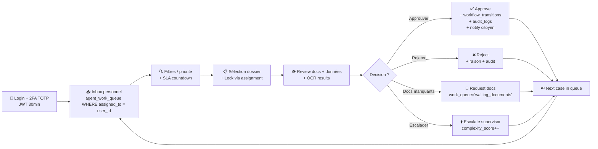

**Pages dashboard agent** : `/dashboard/inbox`, `/dashboard/cases/[id]`, `/dashboard/missions` (si terrain), `/dashboard/history` (timeline actions).

**Permissions clés** : `request.review.{workflow_code}`, `request.approve`, `request.reject`, `assignment.claim`, `escalation.create`.

### 6.3 Persona : Agent Trésor — Réconciliation

**Workflow synthétique** :

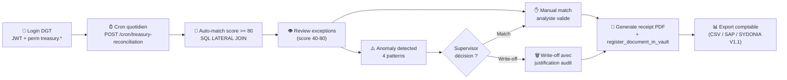

**Page dashboard** : `/dashboard/treasury` (`packages/web/src/modules/treasury/`).

**Permissions clés** : `treasury.reconcile`, `treasury.anomaly.review`, `treasury.write_off`, `treasury.export`.

### 6.4 Persona : Inspector terrain — Mission

**Workflow synthétique** :

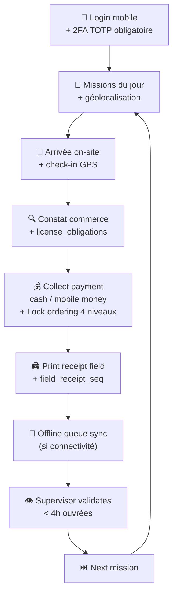

**Page mobile** : Inspector Tablet App (`packages/web/src/modules/inspections/` + Expo native).

**Permissions clés** : `inspection.collect`, `inspection.field_payment`, `inspection.supervisor_validate` (supervisor).

### 6.5 Persona : Superviseur

**Workflow synthétique** :

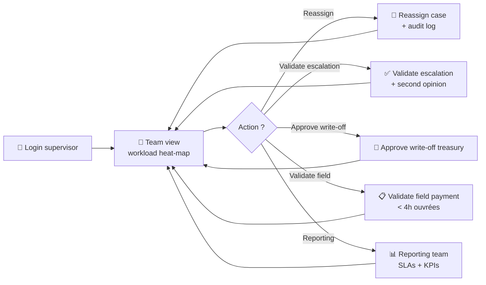

**Pages dashboard** : `/dashboard/supervisor` + reports + reassignment dialogs.

**Permissions clés** : `assignment.reassign`, `escalation.validate`, `treasury.write_off.approve`, `inspection.supervisor_validate`, `reports.team`.

### 6.6 Persona : Admin plateforme

**Workflow synthétique** :

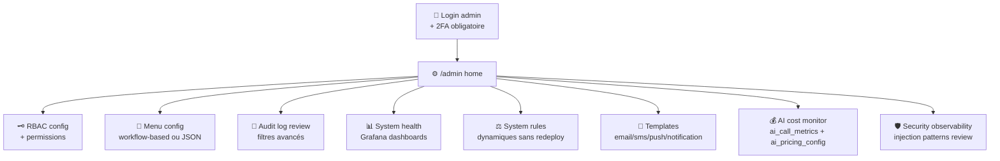

**Pages dashboard** : `/admin/*` (12 modules frontend admin, voir partie IV).

**Permissions clés** : `admin.*` (50+ permissions).

---

<a name="partie-vii"></a>
## Partie VII — État machine globale

> Vue agrégée de **tous les états** possibles d'un dossier dans Facil, du DRAFT à l'archivage final, en incluant les sous-machines paiement, rendez-vous, réconciliation Trésor et recours (planifié V1.1).

**Diagramme complet** : voir [`bpmn/15-global-state-machine.mmd`](bpmn/15-global-state-machine.mmd)

### 7.1 Vue d'ensemble en 12 super-états

| Super-état | États inclus | Acteurs principaux | Sortie possible |
|---|---|---|---|
| 📝 **Initiation** | `IDLE`, `DRAFTING`, `VALIDATION_LOCAL` | Citoyen | → Timbres OU Soumission OU Cancelled |
| 🏛️ **Timbres fiscaux** | `STAMPING`, `STAMPS_PAYING`, `STAMPS_PAID`, `STAMPS_FAILED` | Citoyen + Système | → Soumission |
| 📨 **Soumission** | `SUBMITTED`, `AUTO_ASSIGNING` | Système | → Routing |
| 🎯 **Routing** | `ASSIGNED`, `WAITING_POOL` | Système + Supervisor | → Review |
| 👁️ **Review agent** | `IN_REVIEW`, `DOCS_REQUESTED`, `RE_UPLOADED`, `APPROVED`, `REJECTED`, `ESCALATED`, `SUPERVISOR_REVIEW`, `ADMIN_REVIEW` | Agent + Supervisor + Admin | → Paiement OU Recours OU Rejected |
| 💰 **Paiement** | `NOTA_INGRESO_PENDING`, `NOTA_UPLOADED`, `PAYMENT_PENDING`, `PAYMENT_PROCESSING`, `PAID`, `PAYMENT_FAILED`, `PAYMENT_EXPIRED` | Citoyen + Système | → Rendez-vous OU Exécution |
| 📅 **Rendez-vous** | `CITA_SCHEDULED`, `IN_PROGRESS`, `EXPIRED` | Citoyen + Agent | → Exécution |
| 🎁 **Exécution + Délivrance** | `DOCUMENT_GENERATED`, `PDF_IN_VAULT`, `NOTIFIED_CITIZEN`, `COMPLETED` | Agent + Système | → Archivage |
| 💼 **Réconciliation Trésor** | `AWAITING_RECONCILIATION`, `RECONCILED_AUTO`, `RECONCILED_MANUAL`, `ANOMALY`, `WRITE_OFF_NEEDED` | Trésor + Supervisor | → Terminal |
| ⚖️ **Recours (V1.1)** | `APPEAL_FILED`, `APPEAL_REVIEW`, `APPEAL_APPROVED`, `APPEAL_CONFIRMED` | Citoyen + Commission | → Re-Review OU Archivage |
| 🗄️ **Archivage** | `ARCHIVED`, `ARCHIVED_REJECTED`, `ARCHIVED_EXPIRED`, `ARCHIVED_CANCELLED` | Système | Terminal |
| 🚪 **Terminaux** | `[*]` final | — | — |

### 7.2 Garanties état machine

- **Append-only audit** : chaque transition d'état génère 1 ligne dans `audit_logs` + 1 ligne dans `workflow_transitions` (table 2 audit dédiée)
- **Location scope absolu** (Règle mémoire #20) : pas de re-routage cross-site
- **Récupération idempotente** : sur webhook payment, vérification `external_id` déjà traité → 200 OK sans changement
- **Étrangleurs** : aucun acteur ne peut bypasser une transition obligatoire (validation Pydantic + RLS Postgres + permission gates)
- **Réconciliation Trésor parallèle** : peut tourner en parallèle de l'exécution sans bloquer le citoyen

---

<a name="partie-viii"></a>
## Partie VIII — Patterns transverses détaillés

### 8.1 Audit log immuable (chaîne hash projetée V1.1)

**Implémentation actuelle (V1)** :

Toute transition d'état significative est journalisée en append-only dans `audit_logs` (table 11 colonnes : `user_id`, `entity_type`, `entity_id`, `action`, `new_values JSONB`, `old_values JSONB`, `ip_address`, `user_agent`, `created_at`, etc.).

**Pattern d'utilisation** :
```python
await conn.execute("""
    INSERT INTO audit_logs (user_id, action, entity_type, entity_id, new_values, created_at)
    VALUES ($1, 'PAYMENT_VALIDATED', 'service_payment', $2, $3::jsonb, NOW())
""", user_id, payment_id, json.dumps(payload))
```

**Garantie** : aucune `DELETE`/`UPDATE` autorisée sur `audit_logs` (politique RLS Postgres + revue applicative).

**Évolution projetée (Facil V1.1)** : ajout d'une colonne `hash_chain TEXT NOT NULL` avec `prev_hash + payload_hash` SHA-256, permettant détection d'altération a posteriori (proche concept "blockchain interne").

**Diagramme conceptuel** :

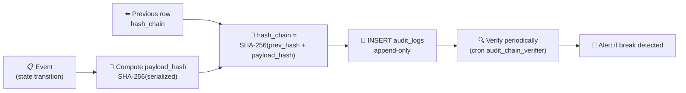

### 8.2 Notification multi-canal centralisée

Service centralisé `CommunicationService` orchestrant :
- **Email** (templates multilingues `email_templates`) — provider SMTP TLS
- **SMS** (segments 160 char, templates `sms_templates`) — provider SMS Gateway
- **Push mobile** (FCM / APNs natifs — Règle mémoire #33, **pas Expo Push Service**)
- **In-app notifications** (`notification_templates`)
- **USSD** (configurations `ussd_configurations` pour Getesa, Muni)
- **WhatsApp** (`webhook_configurations` pour WhatsApp Business API)

Provider settings dynamiques en BD (`communication_provider_settings`) → activation/désactivation sans redeploy.

**Diagramme flow** :

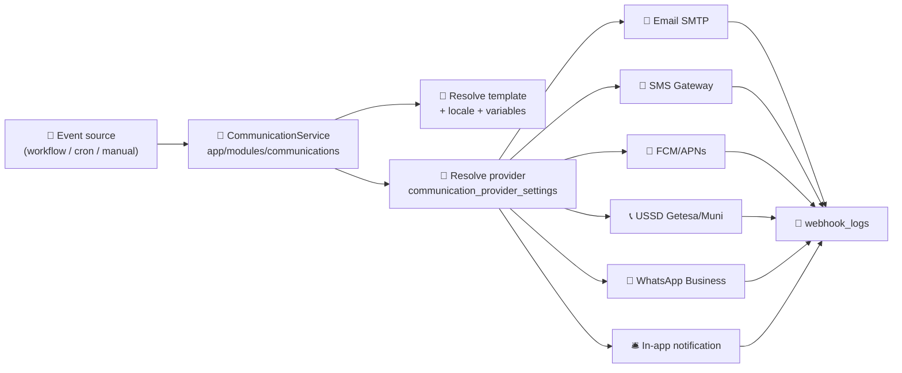

### 8.3 Lock ordering pour 100+ agents concurrents

**Diagramme sequence détaillé** (nouveau v2) : voir [`bpmn/17-pattern-lock-ordering.mmd`](bpmn/17-pattern-lock-ordering.mmd)

Voir CLAUDE.md section « Lock Ordering — Bundle / Field Payment ». Pattern canonique :

```sql
-- Toujours dans cet ordre, transaction-scoped timeouts obligatoires
SET LOCAL lock_timeout = '3s';
SET LOCAL statement_timeout = '5s';

-- 1. ROOT lock
SELECT * FROM commercial_licenses WHERE id = $1 FOR UPDATE;
-- 2. INSERT optimistic (UNIQUE partial index)
INSERT INTO service_requests (...) VALUES (...);
-- 3. UPDATE batch (locks acquis auto)
UPDATE license_obligations SET status='payment_pending' WHERE id = ANY($2);
-- 4. INSERT final
INSERT INTO service_payments (...) VALUES (...);
```

**Cas de race condition évités** :

| Scénario | Risque sans pattern | Mitigation pattern |
|---|---|---|
| 2 agents collectent même licence simultanément | Double `service_request` + double paiement | Root lock + partial UNIQUE → recovery déterministe |
| Agent A bloqué indéfiniment | Deadlock + queue saturée | `SET LOCAL lock_timeout = '3s'` → abort + retry manuel |
| Statement runaway > 5s | Connection pool exhausté | `SET LOCAL statement_timeout = '5s'` |
| Service_request orpheline | Obligations bloquées | Recovery déterministe `SELECT ... LIMIT 1` après `UniqueViolationError` |

**Anti-patterns interdits** :
- `FOR UPDATE` sur `service_requests` (utiliser le partial UNIQUE index à la place)
- Retry/backoff sur `UniqueViolationError` (recovery déterministe avec `SELECT ... LIMIT 1`)

### 8.4 Auto-assignment 5-critères + LLM tie-breaker (algorithme détaillé)

**Diagramme** :

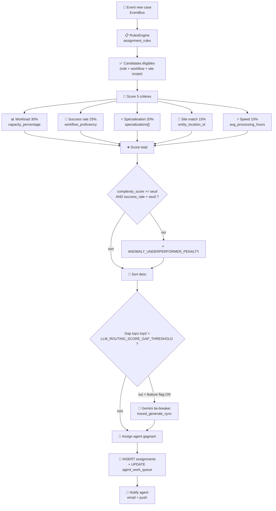

**Garanties** :
- **Location scope absolu** : Règle mémoire #20 — pas de re-routage cross-site
- **Synchronisation `assigned_to`** : Règle mémoire #17 — `users.id` pas `agent_profile_id`
- **Pas d'agent → manuel supervisor** : `WAITING_POOL` visible supervisor

### 8.5 Circuit breaker pour intégrations externes

**État actuel** : `VertexAIManager` (Gemini) intègre un circuit breaker avec 3 états (closed / open / half-open).

**Diagramme état** :

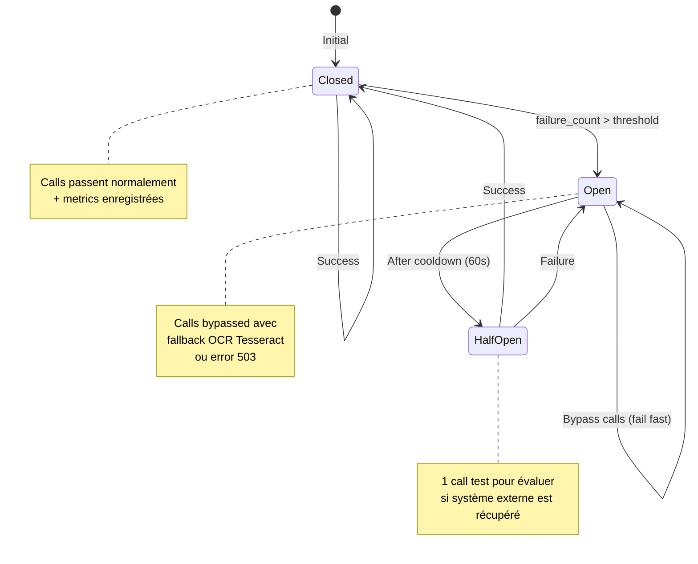

**À étendre** : gateways BANGE / Ecobank / Mastercard (état actuel : retries httpx simples, pas de circuit breaker formel — TODO V1.1).

### 8.6 Hybrid cache (Upstash Redis + in-memory fallback)

**Diagramme flow cache hit / miss / invalidation** :

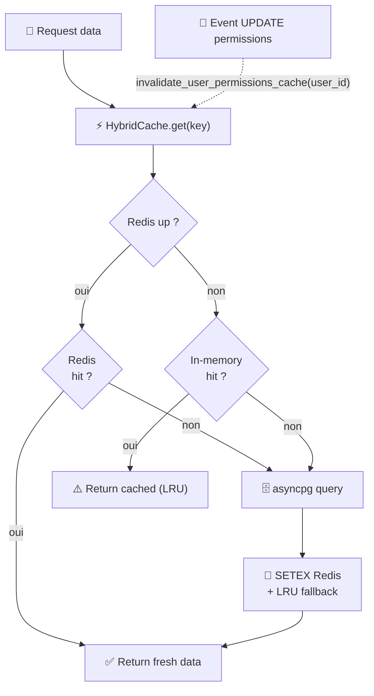

**5 instances configurées** dans `app/core/cache.py` :
- `get_cache()` — défaut 5 min
- `get_menu_cache()` — 5 min
- `get_permissions_cache()` — 10 min
- `get_services_cache()` — 1 h
- `get_translations_cache()` — 1 h

**Pattern d'invalidation** : `invalidate_user_permissions_cache(user_id)` après `UPDATE` permissions.

**Rate limiting** : `check_rate_limit(user_id, endpoint, max, window)` utilise Redis sliding window.

### 8.7 Idempotency keys

**3 cas d'usage canoniques** :

| Cas | Clé d'idempotence | Mécanisme |
|---|---|---|
| **Webhooks BANGE/Ecobank/Mastercard/WA** | `external_id` provider | Vérification `external_id` déjà traité avant `UPDATE` → 200 OK idempotent |
| **Cron jobs** | `pg_advisory_lock(cron_id)` | Empêche exécutions parallèles sur même payload |
| **Payments (terrain)** | `payment_reference` unique | Séquence Postgres `field_receipt_seq` pour les paiements terrain |

**Pattern webhook idempotent** :

```python
async def handle_bange_webhook(payload, signature):
    # 1. Vérification signature HMAC SHA-256
    verify_hmac(payload, signature, settings.BANGE_WEBHOOK_SECRET)
    # 2. Check idempotency
    existing = await conn.fetchrow(
        "SELECT id FROM bank_transactions WHERE external_id = $1",
        payload["transaction_id"]
    )
    if existing:
        return {"status": "already_processed", "id": existing["id"]}
    # 3. Process atomically
    async with conn.transaction():
        # ... INSERT bank_transactions + UPDATE service_payments + audit_logs ...
        pass
    return {"status": "ok"}
```

### 8.8 Observabilité production (AI + Security)

**Diagramme** :

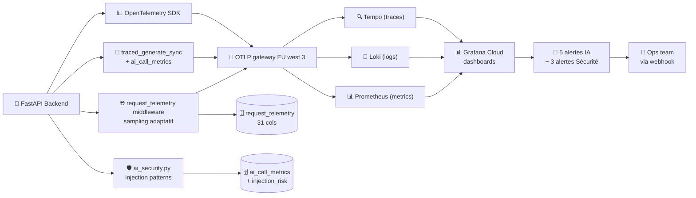

**Détails dashboards** :
- `facil-ai-observability` — 15 panels (4 overview + 3 cost + 2 perf + 2 errors + 2 top consumers + 3 injection)
- `facil-security-monitoring` — 20 panels (request volume + geo + UA breakdown + status codes + login attempts)

**Détails alertes** :
- **IA** : cost spike (2× moyenne 24h), error rate (>5% 15min), p95 latency (>10s 30min), Tempo quota (>4.5GB/h), injection spike (≥5 high/h)
- **Sécurité** : IP spike, failed login burst, bot share

---

<a name="partie-ix"></a>
## Partie IX — Mapping BPMN ↔ Base de données

### 9.1 Workflows × tables principales

| Workflow BPMN | Tables principales | Enums |
|---|---|---|
| 1. Déclaration IVA | `tax_declarations`, `declaration_iva_details`, `declaration_corrections`, `workflow_transitions` | `declaration_status_enum`, `declaration_type_enum` (34) |
| 2. Inspection field | `field_inspections`, `commercial_licenses`, `license_obligations`, `service_payments`, `service_requests`, `license_compliance_events` | `payment_workflow_status` (17), `inspection_status_enum` |
| 3. Service request | `service_requests`, `uploaded_files`, `assignments`, `agent_work_queue`, `appointments` | `service_request_status_enum` (19), `service_request_priority_enum`, `workflow_code` (varchar — 28 valeurs enum app) |
| 4. Paiement BANGE | `payments`, `service_payments`, `bank_transactions`, `payment_receipts` | `payment_status_enum`, `payment_method_enum`, `payment_workflow_status` |
| 5. Auto-assignment | `assignments`, `assignment_rules`, `agent_workloads`, `agent_work_queue`, `agent_workflow_proficiency`, `agent_profiles` | `assignment_status_enum`, `assignment_method`, `agent_availability_enum`, `workload_status_enum` |
| 6. OCR/Gemini | `uploaded_files`, `document_processing_queue`, `ocr_extraction_results`, `form_templates`, `ai_call_metrics` | `extraction_status_enum`, `processing_status_enum` |
| 7. Recours (PLANIFIÉ) | `appeals` (à créer), `appeal_documents`, `appeal_decisions` | `appeal_status_enum` (à créer) |
| 8. Bundle licence | `commercial_licenses`, `license_obligations`, `bundle_items`, `service_payments`, `license_compliance_events` | `payment_workflow_status`, `obligation_status_enum` |
| 9. 2FA TOTP | `users` (totp cols), `sessions`, `refresh_tokens`, `audit_logs` | `user_role_enum`, `user_status_enum` |
| 10. Réconciliation | `bank_transactions`, `service_payments`, `payment_validation_audit` | `bank_transaction_status`, `payment_workflow_status` |

**Volumétrie totale référencée** : 77 tables, 25 enums (voir `.github/docs-internal/database/DATABASE_SCHEMA_REFERENCE.md`).

### 9.2 Détails des enums clés

#### 9.2.1 `payment_workflow_status` (17 valeurs)

Utilisé par : Proc 2, 4, 8, 10.

```
submitted → auto_processing → pending_agent_review → locked_by_agent
→ approved / rejected → completed
```

Plus les états : `expired`, `field_collected`, `awaiting_reconciliation`, `reconciled_auto`, `reconciled_manual`, `anomaly`, `write_off`, etc.

#### 9.2.2 `service_request_status_enum` (19 valeurs)

Utilisé par : Proc 3, 8.

Voir tableau partie 5.3 (machine à états complète).

#### 9.2.3 `declaration_type_enum` (34 valeurs)

Utilisé par : Proc 1.

34 types : `income_tax`, `corporate_tax`, `vat_declaration`, `iva_destajo`, `iva_real`, `retencion_*`, `imp_*`, `cuota_min_*`, `impreso_*`.

#### 9.2.4 `assignment_status_enum`

Utilisé par : Proc 5.

`assigned`, `in_progress`, `pending_review`, `completed`, `reassigned`, `cancelled`, `rejected`.

#### 9.2.5 `agent_action_type`

Utilisé par : Proc 2, 5.

`lock_for_review`, `approve`, `reject`, `request_documents`, `escalate`, `unlock_release`, `assign_to_colleague`.

#### 9.2.6 `escalation_level`

Utilisé par : SLA enforcement transverse.

`low`, `medium`, `high`, `critical`.

### 9.3 Tables transverses cross-workflow

| Table | Workflows concernés | Description |
|---|---|---|
| `audit_logs` | TOUS | Audit chain append-only |
| `workflow_transitions` | TOUS | Transition d'état formelle |
| `agent_work_queue` | 1, 2, 3, 4, 5, 8 | Queue dynamique priorité (SLA + amount + complexity) |
| `agent_workloads` | 5 (data), reporting | Workload temps réel |
| `ai_call_metrics` | 5, 6 | Toutes calls Gemini |
| `request_telemetry` | TOUS | Telemetry HTTP + sampling adaptatif |

---

<a name="partie-x"></a>
## Partie X — Métriques par workflow (SLA + KPIs)

| # | Workflow | SLA cible (P95) | KPIs mesurés | Dashboard Grafana |
|---|---|---|---|---|
| 1 | Déclaration IVA | Décision < 10j ouvrés | Taux acceptation, durée moyenne review, taux amendement | `facil-declarations` (V1.1) |
| 2 | Inspection field | Lock hold < 150ms, transaction < 800ms | Concurrence soutenable (100+ agents), `UniqueViolation` rate, supervisor validation < 4h | `facil-inspections-loadtest` |
| 3 | Service request | Décision < 5j ouvrés | Taux complétion par workflow_code, taux DOCS_REQUESTED, taux EXPIRED | `facil-service-requests` (V1.1) |
| 4 | Paiement BANGE | Webhook < 5min après initiation | Taux succès paiement, time-to-receipt-PDF, taux PAYMENT_EXPIRED | `facil-payments` (V1.1) |
| 5 | Auto-assignment | < 5s décision | Score moyen affecté, taux LLM tie-breaker, taux waiting pool | `facil-assignment` (V1.1) |
| 6 | OCR + Gemini | < 30s extraction | Confidence moyenne, taux manual_review, cost XAF par doc | `facil-ai-observability` ✅ |
| 7 | Recours (V1.1) | Décision < 60j | Taux recours sur rejets, taux décision favorable | N/A (V1.1) |
| 8 | Bundle licence | Décision instantanée (calcul) | Mode A vs B ratio, montant moyen, taux complétion annuelle | `facil-bundle` (V1.1) |
| 9 | 2FA TOTP | Login < 2s | Taux activation 2FA, taux backup_code usage, échecs LOGIN | `facil-security-monitoring` ✅ |
| 10 | Réconciliation | Auto-match score >= 80 → 100% auto | Taux auto-match, anomalies par pattern (1-4), write-off rate | `facil-treasury` (V1.1) |

**Légende dashboard** :
- ✅ : dashboard déjà en place et configuré
- (V1.1) : dashboard à créer

---

<a name="partie-xi"></a>
## Partie XI — Workflows planifiés V1.1 (Facil Framework)

### 11.1 Workflow CUT — Cuenta Única del Tesoro

**Objectif** : agrégation centralisée des flux financiers fiscaux dans la Cuenta Única del Tesoro (compte unique du Trésor), conformément au projet PGE 2026 **23A-004 « Implementación Cuenta Única - CUT »** (100 M FCFA budgétisés).

**Acteurs cibles** :
- Système Facil (orchestrateur)
- Trésor public (DGT)
- Banque centrale (BEAC)

**États-clés projetés** :

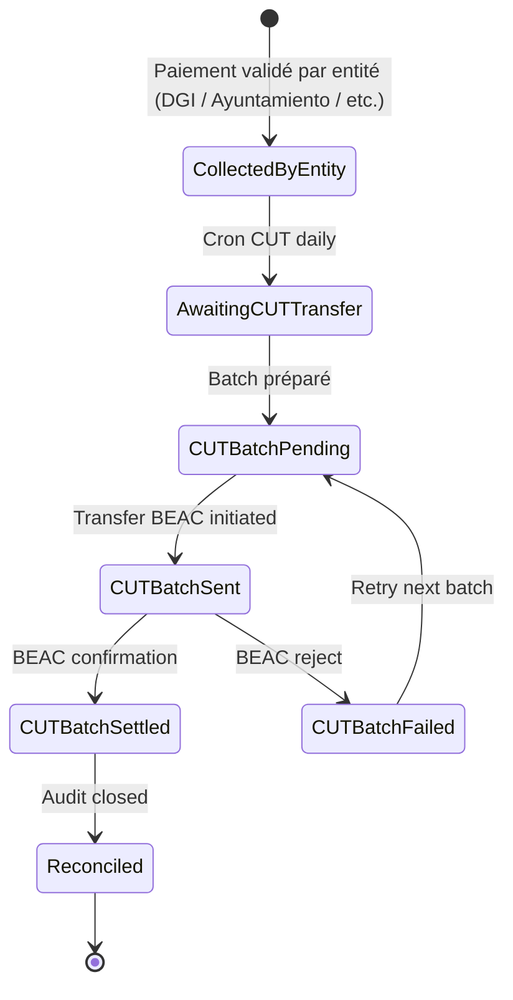

**Tables BD projetées** : `cut_batches`, `cut_batch_items`, `cut_settlements`.

**Statut** : 📋 **PLANIFIÉ V1.1**

### 11.2 Workflow Hacienda Educa — Parcours pédagogique fiscal

**Objectif** : programme d'éducation fiscale au citoyen, conformément au projet PGE 2026 **20A-016 « Hacienda Educa »** (100 M FCFA budgétisés).

**Acteurs cibles** :
- Citoyen apprenant
- Facil chatbot RAG Gemini (mentor)
- Agent DGI animateur (sessions live optionnelles)

**Pipeline projeté** :

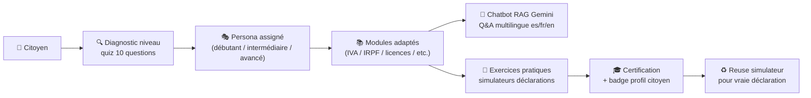

**Tables BD projetées** : `learning_paths`, `learning_modules`, `user_learning_progress`, `learning_quizzes`, `learning_certifications`.

**Statut** : 📋 **PLANIFIÉ V1.1**

### 11.3 Workflow ADIGE — Brique d'exécution Agenda Digital GE

**Objectif** : intégration de Facil comme brique d'exécution de l'Agenda Digital de Guinea Ecuatorial, conformément au projet PGE 2026 **51B-006 « Implementación de la Agenda Digital de GE »** (100 M FCFA budgétisés).

**Acteurs cibles** :
- Ministère 51 (Transportes, Telecomunicaciones y Sistemas de IA)
- Facil
- Autres briques ADIGE (services administratifs, santé, éducation)

**Diagramme intégration** :

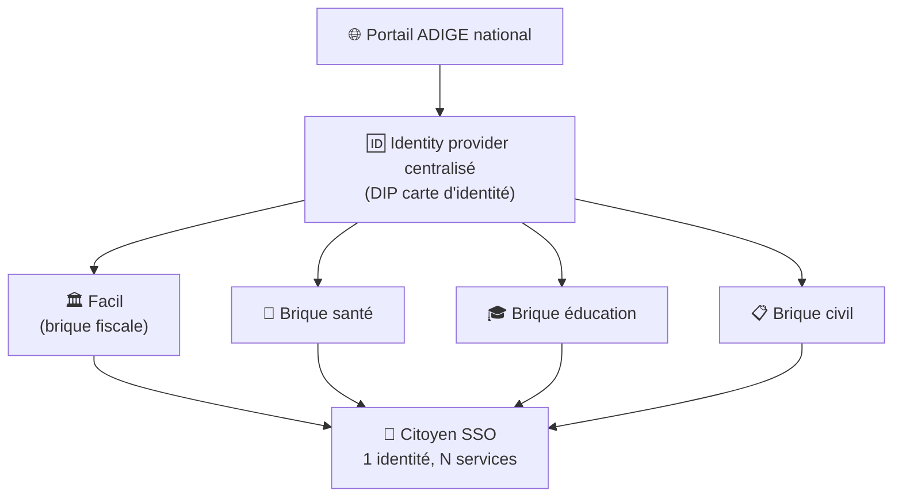

**Statut** : 📋 **PLANIFIÉ V1.1** — dépend de la disponibilité de l'identity provider centralisé GE.

### 11.4 Workflow Ventanilla Única Empresarial — Création entreprise multi-administration

**Objectif** : guichet unique de création d'entreprise (multi-administration : ONRC + DGI + Cámara de Comercio + ministère sectoriel + BEAC) en une seule transaction citoyen.

**Acteurs cibles** :
- Entrepreneur
- ONRC (Office du Registre du Commerce)
- DGI (Direction Générale des Impôts)
- Cámara de Comercio
- Ministère sectoriel selon activité
- BEAC (numéro contribuable BEAC)

**Pipeline projeté** :

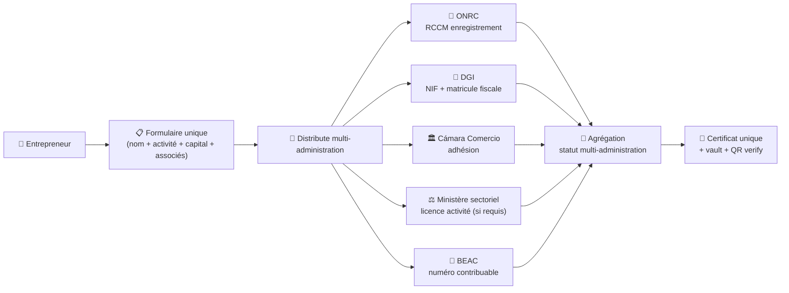

**Statut** : 📋 **PLANIFIÉ V1.1** — fort potentiel impact pour CEM 2025 BM (climat des affaires GE).

### 11.5 Workflow DIP desde nacimiento — Expédition DIP citoyen depuis la naissance

**Objectif** : émission automatique du Documento de Identidad Personal (DIP) dès la déclaration de naissance auprès du registre civil, alignement Décret-Loi 1/2026 (modernisation administration publique).

**Acteurs cibles** :
- Hôpital / sage-femme (déclaration naissance)
- Registre civil (CNEDOGE)
- Facil (orchestrateur émission DIP)
- Parents

**Pipeline projeté** :


**Statut** : 📋 **PLANIFIÉ V1.1** — dépend de l'intégration Registre Civil (CNEDOGE).

---

<a name="partie-xii"></a>
## Partie XII — Continuité Décret-Loi 1/2026 (déménagement capitale)

### 12.1 Contexte légal

**Décret-Loi n° 1/2026** signé le **2 janvier 2026** par le Président Teodoro Obiang Nguema Mbasogo (sources : rapports BAD, PNUD, BM publics).

| Paramètre | Valeur |
|---|---|
| Nouvelle capitale | **Ciudad de la Paz** (Djibloho, ex-Oyala) |
| Date officielle | **2 janvier 2026** |
| Délai relocalisation | **1 an** pour Présidence, ministères, organes constitutionnels, agences, entreprises publiques |
| Calendrier transferts agents civils | Programmé pour **2027** |
| Population projetée | 160 000 à 200 000 habitants |

**Citation officielle** : *« L'adoption de Ciudad de la Paz comme nouvelle capitale cherche, entre autres, à décentraliser l'administration publique, en promouvant un développement socioéconomique harmonieux dans toutes les régions du pays. Cette mesure contribuera à maintenir la paix, **moderniser l'administration publique**, diversifier les zones de développement et renforcer l'unité nationale. »*

### 12.2 Risque opérationnel pendant la transition Malabo → Ciudad de la Paz

Pendant 12-24 mois (2026-2027), les agents fiscaux sont **répartis entre 2 sites physiques** (Malabo + Ciudad de la Paz). Les citoyens des 8 districts + Annobón + Bioko + Río Muni continent **ne peuvent pas dépendre du déplacement physique** vers les bureaux.

### 12.3 Comment Facil assure la continuité

#### A. Stockage des dossiers indépendant du site agent

- Tous les `service_requests`, `tax_declarations`, `service_payments` sont stockés dans **Supabase managé** (PostgreSQL souverain hébergeable on-prem si requis)
- Documents générés dans **Firebase Storage** + `register_document_in_vault()` (Règle mémoire #30)
- Backups quotidiens managés Supabase + plan d'export vers cloud souverain GE V1.1

#### B. Routing intelligent multi-site (Règle mémoire #20)

Le pattern « **location scope absolu** » garantit que :
- Un dossier soumis depuis n'importe où dans le pays est routé vers un agent **disponible**, peu importe son site physique (Malabo OU Ciudad de la Paz)
- Si **tous les agents d'un site sont surchargés**, le système assigne quand même au moins chargé du site (pas de re-routage cross-site automatique → préserve les responsabilités de site)
- Le `agent_profiles.entity_location_id` peut être **mis à jour dynamiquement** par admin lorsqu'un agent change de site (Malabo → Ciudad de la Paz) sans perte de queue ou de dossiers en cours

#### C. Accès citoyen indépendant de la géolocalisation

- Web (Next.js + Firebase Hosting + Cloud Run) → accessible depuis **n'importe où en GE + diaspora**
- Mobile (Expo) → accessible si Play Store débloqué (voir mémoire `project_playstore_gov_rejection_2026_05_08.md`)
- USSD GETESA / MUNI → couvre les zones rurales sans data
- Multi-canal de paiement → bancarisé OU mobile money OU cash caissier OU USSD

#### D. Diagramme architecture multi-site continuité

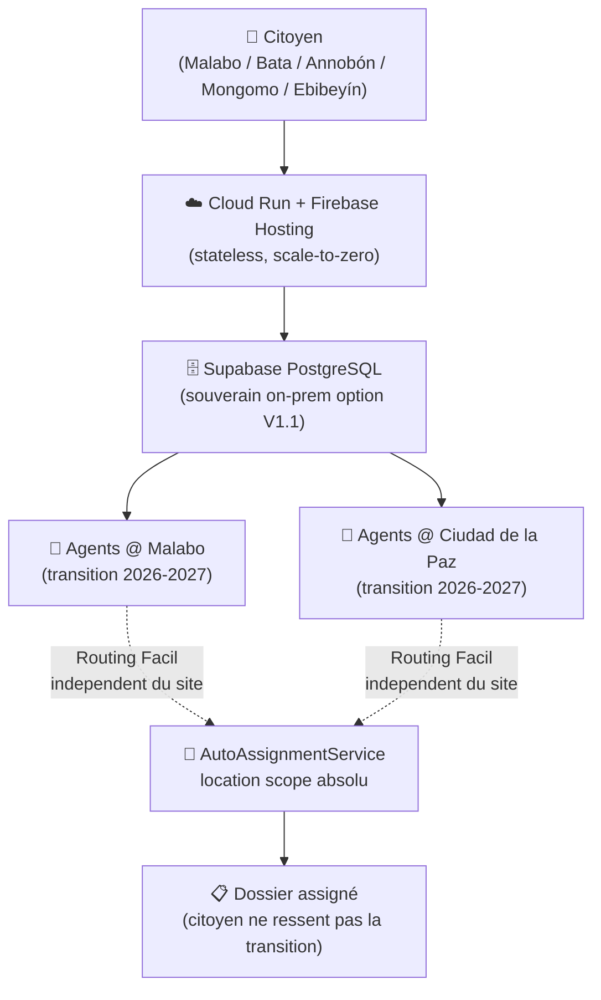

### 12.4 Argumentaire bailleurs / gov

> « Pendant les 12-24 mois où l'administration fiscale se transfère physiquement de Malabo vers Ciudad de la Paz, Facil garantit que les citoyens des 8 districts + Annobón + Bioko + Río Muni continent continuent d'accéder aux services fiscaux **sans interruption** et **sans avoir à se déplacer**. Les agents traitent les dossiers indépendamment du site où ils se trouvent physiquement. »

---

<a name="partie-xiii"></a>
## Partie XIII — Écarts vs BPMN 2.0 et roadmap

### 13.1 Limites de la représentation Mermaid

Mermaid n'est **pas** BPMN 2.0 strict. Limitations honnêtes :

| Élément BPMN 2.0 | Support Mermaid | Workaround utilisé |
|---|---|---|
| Pools / Lanes | Partiel (`subgraph`) | OK pour la lisibilité |
| Sub-processes (collapsed/expanded) | ❌ | Diagramme séparé (`bpmn/0X-*.mmd`) |
| Boundary events (timer, error, message) | ❌ | Annoté en texte dans node |
| Compensation flow | ❌ | Décrit dans la section « Cas d'erreur » |
| Choreography diagrams | ❌ | Sequence diagram en remplacement |
| Data objects, Data stores | ❌ | Annotations texte + référence tables |
| Parallel/Inclusive gateways | Limité | Décomposé en branches XOR |
| Event sub-processes | ❌ | Décrit en patterns transverses §8 |

### 13.2 Voie de migration vers BPMN 2.0 vrai (post Facil V1.1)

Si à terme un besoin de **modèles exécutables** (Camunda, Bonita, Flowable) émerge :

| Étape | Outil | Effort |
|---|---|---|
| 1. Re-modéliser en `.bpmn` XML | Camunda Modeler (gratuit) | 5-10 j |
| 2. Validator BPMN 2.0 | Bizagi Modeler / bpmn-js | 2-3 j |
| 3. Génération code WS-BPEL | Camunda Engine | 10-20 j (POC) |
| 4. Connecteurs externes | Camunda Connect | 5-10 j |
| 5. Cockpit monitoring runtime | Camunda Cockpit | inclus |

**Décision actuelle** : Mermaid suffit pour la phase MVP avancé + investisseurs + bailleurs. Migration BPMN 2.0 exécutable = **roadmap Facil Framework V2** (post 2028).

### 13.3 Ce qui n'est PAS modélisé ici

- **Notifications inter-ministères structurées** (envoi RAPPORT type ROAS) : non dans le périmètre actuel, à ajouter pour répondre TDR PIMEPE
- **Workflow signature numérique eIDAS** : planifié dans Phase N+N.5 du Facil Framework (cf. mémoire « Voie B », plan `EMBEDDING_RAG_ABSTRACTION_PLAN.md`)
- **Workflow KYC business renforcé** : actuellement basique, à étendre pour bailleurs
- **Workflow de subvention/exemption fiscale** : pas dans MVP

### 13.4 Workflows actuels stables (production-ready)

| Workflow | Stabilité | Volume estimé MVP |
|---|---|---|
| Déclaration IVA | ✅ stable | 90% des déclarations |
| Service Request (passeport) | ✅ stable | volume primaire CNEDOGE |
| Service Request (résidence) | ✅ stable | volume EXTRANJERIA |
| Service Request (conduire) | ✅ stable | volume DGT |
| Paiement BANGE | ✅ stable | gateway principal |
| Auto-assignment | ✅ stable | 100+ agents concurrents validé en charge synthétique |
| OCR + Gemini | ✅ stable | observabilité production |
| 2FA TOTP | ✅ stable | sécurité critique |

### 13.5 Workflows en cours de stabilisation

| Workflow | Statut | Action requise |
|---|---|---|
| Inspection field + bundle payment | 🟡 stable code, validation terrain à faire | Pilote DGIR + Ayuntamientos |
| Réconciliation Trésor | 🟡 algo OK, dashboard analyste à valider UX | Workshop avec Tesoro |
| Service Request (vehiculo, contrato, función pública) | 🟡 implémentés mais peu testés en charge | Tests E2E + smoke prod |
| Bundle payment licence | 🟡 implémenté, planifié déploiement Q3 2026 | Validation calcul tarif zonal réel |

### 13.6 Workflows planifiés (Facil V1.1)

| Workflow | Priorité | Effort estimé |
|---|---|---|
| Recours administratif (proc 7) | Haute | 15-20 j |
| Signature numérique eIDAS | Haute | 6-9 j (cf. plan EMBEDDING + LocalCAProvider PAdES) |
| Notifications inter-ministères structurées | Moyenne | 10-15 j |
| Workflow exemption/subvention fiscale | Moyenne | 20-30 j |
| KYC business renforcé (DUNS, OCDE) | Basse | 10-15 j |
| Workflow ICDP (intercommunication directions ministérielles) | Basse | 30+ j |
| Workflow CUT (Cuenta Única del Tesoro) | Haute | 20-30 j |
| Workflow Hacienda Educa | Moyenne | 25-35 j |
| Workflow ADIGE intégration | Haute (dép. external) | 15-20 j |
| Workflow Ventanilla Única Empresarial | Haute | 40-60 j |
| Workflow DIP desde nacimiento | Moyenne | 15-25 j |

### 13.7 Cohérence avec roadmap master

Aligné sur (document interne) §9 :

| Trimestre | Lien BPMN |
|---|---|
| Q3 2026 — Pilote DGIR + DGT | Stabilisation processus 1, 2, 5, 8, 10 |
| Q4 2026 — Soft launch citizen | Validation processus 3, 4, 6, 9 grandeur réelle |
| Q1 2027 — 1er rapport d'impact | Dashboards + métriques sur les 10 processus |
| Q2 2027 — Bootstrap Facil V1 | Extraction socle (workflow_engine.py + assignment + payments) |
| Q1 2028 — Facil V1.1 + recours + signature | Implémentation processus 7 + workflows planifiés §13.6 |
| H2 2028 — Déploiements régionaux | 2-3 pays CEMAC / UEMOA |

---

<a name="partie-xiv"></a>
## Partie XIV — Annexes

### 14.1 Glossaire des acronymes

| Acronyme | Définition |
|---|---|
| **2FA** | Two-Factor Authentication (RFC 6238 TOTP) |
| **ADIGE** | Agenda Digital de Guinea Ecuatorial |
| **APNs** | Apple Push Notification service (iOS) |
| **ASGI** | Asynchronous Server Gateway Interface (FastAPI / Uvicorn) |
| **ASYCUDA** | Automated System for Customs Data (douanes) |
| **AYUNTAMIENTO** | Ayuntamiento — Mairie / municipalité (entité émettrice GE) |
| **BANGE** | Bank of Africa Equatorial Guinea (Mobile Money gateway principal) |
| **BEAC** | Banque des États de l'Afrique Centrale |
| **BOE** | Boletín Oficial del Estado (Journal officiel GE) |
| **BPMN** | Business Process Model and Notation (OMG standard) |
| **CAMARA_COMERCIO** | Chambre de commerce (entité émettrice GE) |
| **CEM** | Country Economic Memorandum (Banque Mondiale) |
| **CEMAC** | Communauté Économique et Monétaire d'Afrique Centrale |
| **CNEDOGE** | Centro Nacional de Documentos del Estado de Guinea Ecuatorial (passeports, DIP) |
| **CUT** | Cuenta Única del Tesoro (compte unique du Trésor) |
| **DGD** | Direction Générale des Douanes |
| **DGI** | Direction Générale des Impôts (Dirección General de Impuestos) |
| **DGIR** | Direction Générale des Impôts et Recouvrement |
| **DGT** | Direction Générale du Trésor (Dirección General del Tesoro) |
| **DIP** | Documento de Identidad Personal (carte d'identité GE) |
| **eIDAS** | Electronic Identification, Authentication and trust Services (UE) |
| **ENDS 2035** | Estrategia Nacional de Desarrollo Sostenible Horizonte 2035 (GE) |
| **EXTRANJERIA** | Service extranjería (titres de séjour / résidence GE) |
| **FCM** | Firebase Cloud Messaging (push Android) |
| **GE** | Guinée Équatoriale |
| **GETESA** | Guinea Ecuatorial de Telecomunicaciones S.A. (opérateur USSD) |
| **HMAC** | Hash-based Message Authentication Code |
| **ICDP** | Intercommunication des Directions Ministérielles (concept GE) |
| **IRPF** | Impuesto sobre la Renta de las Personas Físicas (impôt sur le revenu) |
| **IUI** | Impuesto Único sobre los Ingresos |
| **IUG** | Impuesto Único Global |
| **IVA** | Impuesto sobre el Valor Añadido (TVA) |
| **JWT** | JSON Web Token (RFC 7519) |
| **MIN_*** | Ministère sectoriel (préfixe entités émettrices GE) |
| **MFPDE** | Ministère des Finances, de la Planification et du Développement Économique |
| **MUNI** | Opérateur télécom local (USSD) |
| **MV** | Materialized View (PostgreSQL) |
| **OCR** | Optical Character Recognition |
| **OHADA** | Organisation pour l'Harmonisation en Afrique du Droit des Affaires |
| **ONRC** | Office National du Registre du Commerce |
| **OTLP** | OpenTelemetry Protocol |
| **PAdES** | PDF Advanced Electronic Signature (eIDAS) |
| **PGE** | Presupuesto General del Estado (budget national GE) |
| **PIMEPE** | Projet d'Investissement Multisectoriel d'Économie Politique Élargie (type TDR bailleur) |
| **PMI** | Project Management Institute |
| **PNUD** | Programme des Nations Unies pour le Développement |
| **RAG** | Retrieval-Augmented Generation (IA + base vectorielle) |
| **RBAC** | Role-Based Access Control |
| **RCCM** | Registre du Commerce et du Crédit Mobilier (OHADA) |
| **RFP** | Request for Proposal |
| **RLS** | Row-Level Security (PostgreSQL) |
| **ROAS** | Rapport Officiel d'Activités de Service |
| **SLA** | Service Level Agreement |
| **SYDONIA** | Système Douanier Automatisé (UNCTAD ASYCUDA) |
| **TDR** | Termes de Référence |
| **TESORO** | Tesoro Público (Trésor public GE) |
| **TLS** | Transport Layer Security |
| **TOTP** | Time-based One-Time Password (RFC 6238) |
| **UEMOA** | Union Économique et Monétaire Ouest-Africaine |
| **USSD** | Unstructured Supplementary Service Data (canal opérateur sans data) |
| **XAF** | Franc CFA BEAC (devise CEMAC) |

### 14.2 Documents complémentaires (cross-links)

- **Présentation technique** : `01-PRESENTATION_TECHNIQUE.md`
- **PRD** : `02-PRD.md`
- **BPMN (ce document)** : `03-BPMN_PROCESSES.md`

### 14.3 Documentation technique interne

- **Code source backend** : `packages/backend/app/modules/` (31 modules métier)
- **Code source frontend** : `packages/web/src/modules/` (42 modules)
- **Code source mobile** : `packages/mobile/` (Expo / React Native)
- **Migrations DB** : `packages/backend/database/migrations/` (300+ migrations versionnées + plan refacto `MIGRATIONS_BASELINE_REFACTOR_PLAN.md`)
- **Schema reference** : `.github/docs-internal/database/DATABASE_SCHEMA_REFERENCE.md`
- **Plans détaillés (échantillon)** :
  - `.claude/plans/INSPECTION_BUNDLE_P1_DETAIL.md` (lock ordering canonique)
  - `.claude/plans/design_bundle_workflow.md` (bundle payment licence)
  - `.claude/plans/AI_OBSERVABILITY_PLAN.md` (observabilité IA)
  - `.claude/plans/SECURITY_OBSERVABILITY_PLAN.md` (observabilité sécurité)
  - `.claude/plans/VOIE_B_FRAMEWORK_PLAN.md` (Facil Framework V1.1 19 phases)
  - `.claude/plans/LLM_ABSTRACTION_PLAN.md` (abstraction LLMClient)
  - `.claude/plans/EMBEDDING_RAG_ABSTRACTION_PLAN.md` (embedding polymorphic + Document Schemas)
- **Observabilité** :
  - `infra/observability/AI_OBSERVABILITY_AGENT.md`
  - `infra/observability/SECURITY_OBSERVABILITY_AGENT.md`

### 14.4 Sources externes (référencées dans le document)

- **C4 model** — Simon Brown : [c4model.com](https://c4model.com)
- **BPMN 2.0** — OMG specification : [omg.org/bpmn](https://www.omg.org/spec/BPMN)
- **OWASP Top 10** — [owasp.org/Top10](https://owasp.org/Top10)
- **RFC 6238 TOTP** — [rfc-editor.org/rfc/rfc6238](https://www.rfc-editor.org/rfc/rfc6238)
- **RFC 7519 JWT** — [rfc-editor.org/rfc/rfc7519](https://www.rfc-editor.org/rfc/rfc7519)
- **eIDAS PAdES** — Regulation (EU) No 910/2014
- **Décret-Loi 1/2026** — Guinea Ecuatorial Press : [decreto_ley_por_el_que_se_declara_la_ciudad_de_la_paz](https://www.guineaecuatorialpress.com/noticias/decreto_ley_por_el_que_se_declara_la_ciudad_de_la_paz_djibloho_capital_de_la_republica_de_guinea_ecuatorial)
- **ENDS 2035** — minhacienda-gob.com : [ENDS-2035.pdf](https://minhacienda-gob.com/wp-content/uploads/2022/10/ENDS-2035.pdf)
- **World Bank CEM 2025 Equatorial Guinea** — [worldbank.org/en/country/equatorialguinea](https://www.worldbank.org/en/country/equatorialguinea/publication/equatorial-guinea-digital-economy-country-diagnostic-bridging-the-gaps-to-develop-a-safe-and-inclusive-digital-transform)
- **AfDB PAMFP** — Programme d'Appui à la Modernisation des Finances Publiques

### 14.5 Limites honnêtes de ce document (auto-critique)

| Limite | Impact | Mitigation |
|---|---|---|
| Master positioning §7 mentionne « 18 modules backend + 26 modules frontend » | Désync avec compte réel **31 + 42** | À aligner master au prochain rebase ; ce document fait foi |
| Workflows planifiés V1.1 partie XI = spéculatifs | Pas de garantie d'implémentation | Tous marqués 📋 PLANIFIÉ, sous condition de financement / contractualisation |
| SLA partie X = cibles, pas mesurés | Pas de baseline production | À mesurer post-pilote DGIR Q3 2026 |
| Diagrammes C4 niveau 4 (Code) absent | Profondeur limitée | Volontaire : niveau Code = référence directe aux fichiers Python / TS dans partie V « Référence code » |
| Recours administratif (proc 7) = vide totalement | Risque sur démo à bailleurs | Communiqué clairement comme PLANIFIÉ V1.1 ; pas un piège |
| Workflows Comm GE / ADIGE / CUT / Hacienda Educa = projetés, pas implémentés | Risque de survente | Tous marqués 📋 PLANIFIÉ V1.1 + référence projet PGE budgétisé |
| Couleurs Mermaid non testées sur tous renderers | UX dépend du renderer | Couleurs documentées en §1.2 — testées sur GitHub + VS Code + Notion |
| Sécurité injection IA : 14 patterns, mais corpus EN/FR/ES limité | Faux négatifs possibles | Mitigation : `AI_SECURITY_BLOCK_HIGH_RISK` désactivé par défaut + audit log injection_risk |

---

*Document rédigé Claude Opus 4.7 (1M context), 2026-05-11. À mettre à jour après chaque ajout de workflow, changement majeur d'état machine, ou nouvelle phase Facil Framework. En cas de conflit avec le master positioning, le master prévaut. Cohérence vérifiée avec §10 lexique et §12 mots interdits.*
